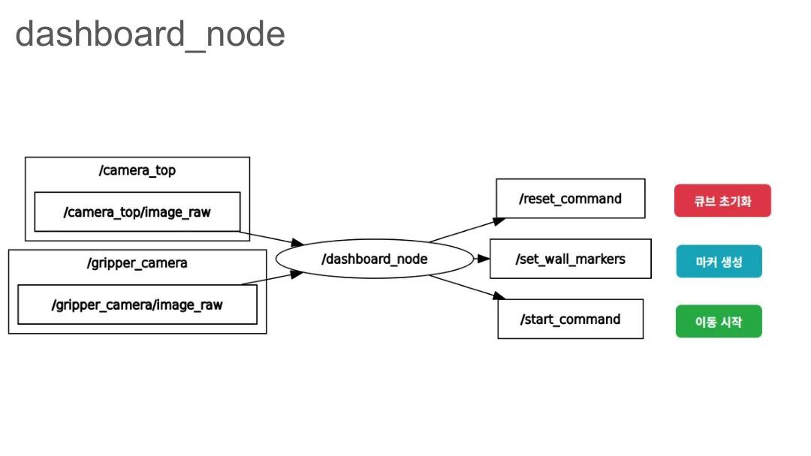
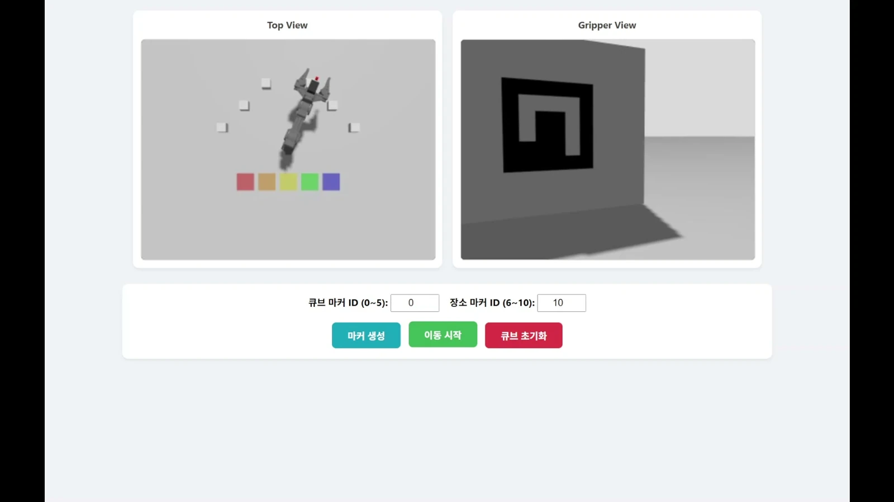
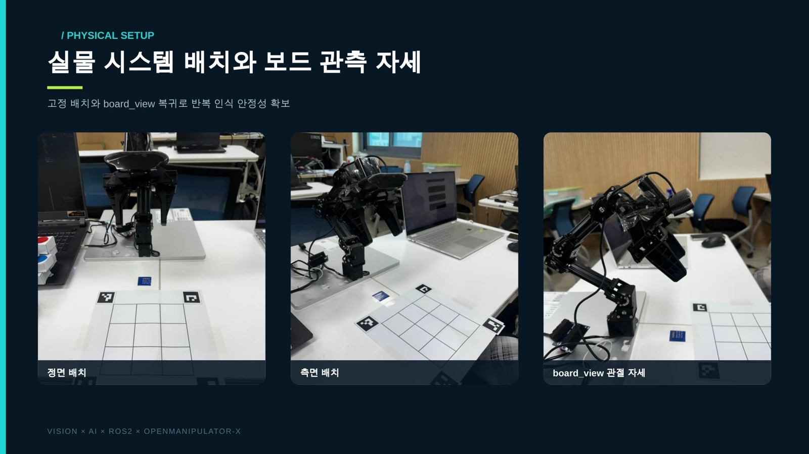
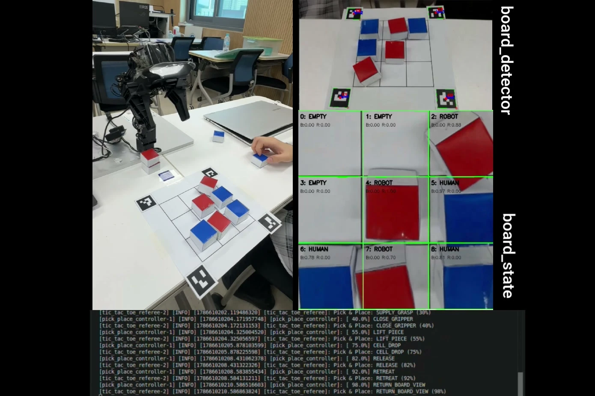
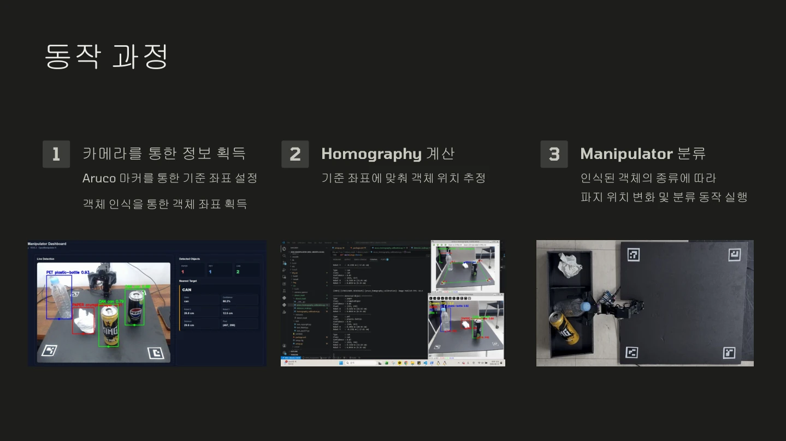
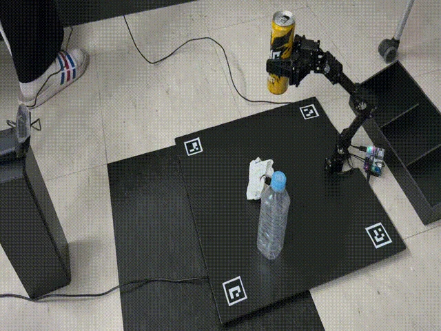
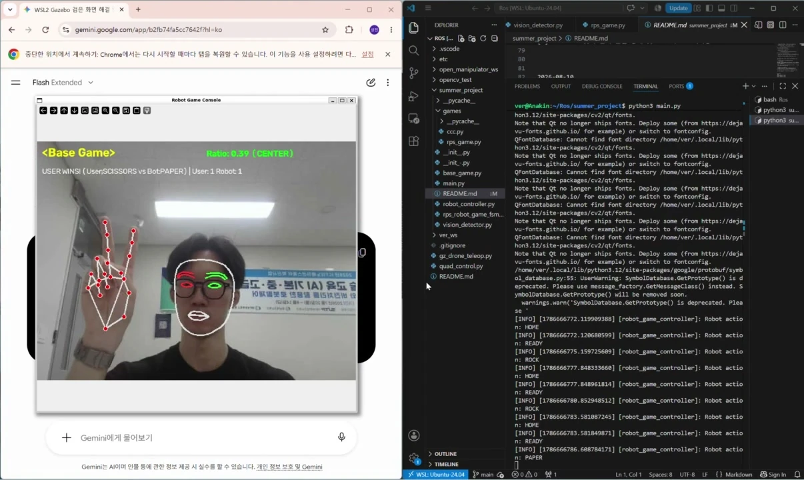
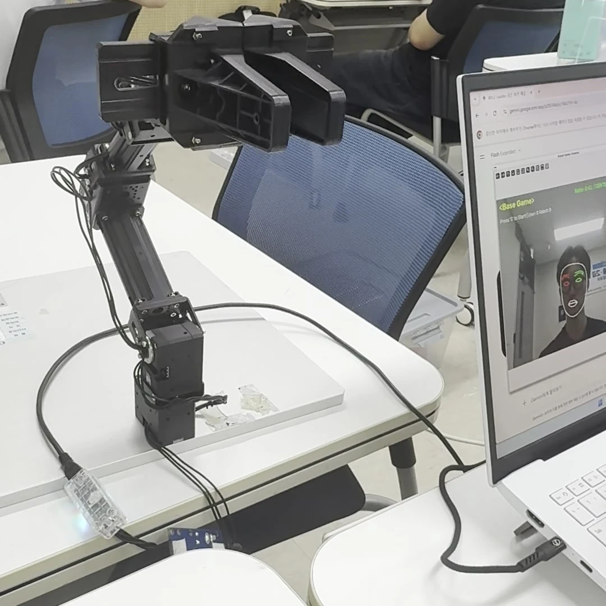

# 공주대 매니퓰레이터 · 같은 로봇팔, 네 가지 프로젝트

## 교육 개요

**ROS와 비전 처리를 활용한 로봇팔 제어**는 2026 ICT이노베이션스퀘어 확산사업의 프로젝트 중심 교육입니다. 지역 AI·SW 실무 인재 양성을 위해 ROS 로봇 제어, 컴퓨터 비전, 로봇팔 통합 프로젝트를 학습했습니다.

- 교육 운영: 대한상공회의소 충남인력개발원 천안기술교육센터 · ICT이노베이션스퀘어 확산사업팀
- 실제 장소: 국립공주대학교 천안캠퍼스 제1공학관
- 기간: 2026.07.20–08.14, 총 160시간, 평일 09:00–18:00 대면 실습
- 강의 수행: 최수길. 천안기술교육센터의 외주 교육 의뢰를 받아 강의 및 팀 프로젝트 지도 진행

국립공주대학교는 방학특강 형태로 참여했습니다. 대학 공식 안내에 따르면 과학기술정보통신부·정보통신산업진흥원이 지원하고 세종테크노파크·대한상공회의소 충남인력개발원이 사업을 운영합니다.

출처: [공식 교육과정 안내](https://ict-is.cbist.or.kr/education/view.do?educationKey=419) · [국립공주대학교 사업 참여 안내](https://startup.kongju.ac.kr/bbs/KNU/2113/428353/artclView.do). 공식 모집 안내는 장소를 “천안기술교육센터/국립공주대학교 천안캠퍼스”로 표기합니다. 제1공학관의 실제 수업 진행과 외주 수행 관계는 담당 강사 최수길의 현장 확인을 반영했습니다.

프로젝트 기간: 2026.08.10–08.14 · 강사: 최수길

공주대 매니퓰레이터 과정의 교육생들은 같은 로봇팔을 서로 다른 문제에 연결했다. 번호를 읽고 물체를 옮기는 로봇, 사람과 틱택토를 두는 로봇, 재활용품을 분류하는 로봇, 몸짓으로 미니게임을 진행하는 로봇까지. 네 팀이 직접 정한 주제와 구현 과정을 소개한다.

## 수업 소개

2026년 7월 20일부터 ROS2 Jazzy의 통신 구조, OpenManipulator-X 제어, MoveIt·Gazebo, OpenCV·ArUco·YOLO를 실습했다. 8월 10~14일에는 팀별 프로젝트를 진행하며 인식·판단·제어를 하나의 동작으로 연결하고 결과를 문서와 발표로 정리했다.

MADAM 대표 활동 이전에 진행한 교육 경험을 정리한 기록입니다.

## 1조 · ArUco ID 기반 Pick and Place

### ArUco ID로 골라 옮기는 로봇팔

팀 구성: 이동헌(조장) · 주동건 · 이서현 · 이호영

상단·그리퍼 카메라의 영상과 마커 생성·이동·초기화 명령을 연결한 구조. 출처: [1조 발표자료 7쪽](https://docs.google.com/presentation/d/1QUFMRrnHLzvYb9o2nvBDHGcFmhemkZrwfRGsW1nHXsU/edit).

작업 공간을 내려다보는 화면과 그리퍼가 바라본 마커를 함께 보여주는 이동 시연. 출처: [이동_1 시연영상 · 00:03.6](https://github.com/ACUBCU/ROS_Team1/blob/main/p1/video/이동_1.mp4).

여러 큐브 가운데 원하는 물체만 골라 원하는 곳으로 옮길 수 있을까? 1조는 큐브와 목적지를 ArUco 마커의 번호로 구분하고, 로봇팔이 선택한 큐브를 집어 배치하는 시스템을 만들었다. 물체를 알아보는 비전과 팔을 움직이는 제어에 웹 대시보드를 더해, 사용자가 작업을 지시하고 진행 상황을 살펴볼 수 있도록 구성했다.

작업 공간을 내려다보는 카메라와 그리퍼에 달린 카메라의 영상을 대시보드에서 함께 보여준다. 사용자가 큐브 ID와 목적지 ID를 지정하면 로봇은 접근, 파지, 들어 올리기, 배치 순서로 움직인다. 작업을 다시 시험할 수 있도록 큐브 재생성과 월드 초기화 기능도 연결했다.

이동헌은 일정·문서 관리와 코드 통합을, 주동건은 마커 생성·인식을 맡았다. 이서현은 대시보드를, 이호영은 매니퓰레이터 제어를 담당했다. 인식·제어·화면을 각각 개발한 뒤 하나의 작업 흐름으로 통합한 점이 이 프로젝트의 핵심이다.

**구현 내용:** 기술서와 발표자료에는 마커 식별, 두 카메라의 영상 표시, 대상·목적지 지정, Pick & Place와 환경 초기화를 연결한 시뮬레이션 결과가 정리되어 있다.

**남은 과제:** 발표자료는 정해진 좌표로만 이동할 수 있다는 점, 대시보드 사용 시 시뮬레이션 속도 저하, 예외 처리 부족을 한계로 제시한다. 위치가 바뀐 물체에 대응하는 동적 파지는 후속 과제로 남았다.

[팀 저장소](https://github.com/ACUBCU/ROS_Team1) · [계획서](https://github.com/ACUBCU/ROS_Team1/blob/main/PLAN.md) · [기술서](https://github.com/ACUBCU/ROS_Team1/blob/main/TECH.md) · [발표자료](https://docs.google.com/presentation/d/1QUFMRrnHLzvYb9o2nvBDHGcFmhemkZrwfRGsW1nHXsU/edit) · [시연 영상 모음](https://github.com/ACUBCU/ROS_Team1/tree/main/p1/video)

## 2조 · 비전 기반 자율 틱택토 시스템

### 사람의 수를 읽고 응수하는 틱택토 로봇

팀 구성: 권신용(조장) · 곽정미 · 이명연 · 주영찬 · 박미진

로봇·게임판의 정면과 측면 배치, 게임판을 관측하는 관절 자세. 출처: [2조 발표자료 8쪽](https://canva.link/9rw1bpriaxepf4e).

실물 말 배치, 카메라 영상, 아홉 칸의 인식 상태와 실행 로그를 함께 담은 통합 시연. 출처: [최종 시연영상 · 00:56.0](https://drive.google.com/file/d/1oJynvYWrBIj5i1TeHX7bQebhxGBpYKjZ/view).

2조는 사람과 로봇이 실제 게임판을 사이에 두고 틱택토를 두는 시스템을 만들었다. 사람이 파란 말을 놓으면 카메라가 바뀐 칸을 읽고, 로봇은 Minimax 알고리즘으로 다음 수를 선택해 빨간 말을 놓는다. 손으로 입력한 명령 대신 실제 보드의 변화가 로봇의 다음 행동을 이끈다.

네 모서리의 ArUco 마커로 게임판의 원근을 보정하고, 각 칸의 색상으로 빈칸·사람 말·로봇 말을 구분했다. 심판 로직은 한 번에 한 수만 바뀌었는지 확인하고 승패와 무승부를 판정한다. 로봇이 움직인 뒤에도 카메라로 말의 배치를 다시 확인해 다음 차례로 넘어가도록 했다.

팀은 실제 배치 오차를 줄이기 위해 제어 방식을 바꾸었다. 처음 계획한 TF·MoveIt 기반 동적 좌표 제어 대신, 로봇과 보드의 위치를 고정하고 아홉 칸의 관절 자세를 기록·재생했다. 말의 크기와 그리퍼 설정도 조정하며 반복 가능한 실물 게임에 집중했다.

권신용은 게임 AI, 곽정미는 게임판 비전 인식, 이명연은 좌표 추정·변환, 주영찬은 Pick & Place, 박미진은 Gazebo 환경과 디지털 트윈 구성을 맡았다. 각 기능을 통합하는 과정에서 계획의 범위를 조정하고 최종 시연 목표를 구체화했다.

**구현 내용:** 최종 기술서에는 사람의 수 인식부터 AI 수 선택, 실물 말 배치, 비전 재확인과 게임 종료까지 통합 검증한 결과가 기록되어 있다. 최종 코드는 feature/integration 브랜치에 있다.

**남은 과제:** Gazebo 디지털 트윈은 모델과 일부 코드까지 구현했으며 최종 통합 시연에서는 제외했다. 기록 자세 방식은 로봇이나 게임판의 위치가 달라지면 다시 교시해야 한다.

[최종 통합 코드](https://github.com/sbeetle1003-stack/team2/tree/feature/integration) · [계획서](https://docs.google.com/document/d/1ujhqk1tdocbYJao8EDuLnZ8Bm_JgyH2_NuoS8eUxt3c/edit) · [최종 기술서](https://docs.google.com/document/d/1Z4MBXgkKojT1f3sGWWhpxneNh8m8rO2g-URWXvf2Gks/edit) · [발표자료 · Canva](https://canva.link/9rw1bpriaxepf4e) · [시연 영상 모음](https://drive.google.com/drive/folders/1AAGy-i4upjIirfMzzVO9x_sENu5Rv3MT)

## 3조 · YOLO 기반 폐기물 분류 시스템

### 재활용품을 보고 집어 분류하는 로봇팔

팀 구성: 오우진(조장) · 윤형식 · 장혜원 · 김헌주

YOLO 대시보드, 호모그래피 좌표 변환, 로봇팔 분류 결과를 정리한 발표 화면. 출처: [3조 발표자료 7쪽](https://docs.google.com/presentation/d/1Z1Nf_0DqVaJlsp2mPHWhU2YdWcUossxMBBOqAX5fKXo/edit).

ArUco 작업판 위의 캔을 집어 올리는 순간. 페트병·종이와 분류함도 함께 보인다. 출처: [실험영상 2번 GIF · 00:03.9](https://docs.google.com/presentation/d/1Z1Nf_0DqVaJlsp2mPHWhU2YdWcUossxMBBOqAX5fKXo/edit).

3조는 작업판 위의 종이, 페트병, 캔을 카메라로 구분하고 로봇팔로 집어 종류별 위치에 옮기는 프로젝트를 진행했다. YOLO가 물체를 알아보는 데서 그치지 않고, 화면 속 위치를 로봇이 도달할 수 있는 작업 좌표로 바꾸는 문제에 집중했다.

처음에는 RGB-D 카메라로 거리를 측정하려 했지만 신뢰도 문제를 만나 RGB 카메라와 ArUco 기준점 방식으로 전환했다. 작업판의 네 마커로 영상과 작업 좌표 사이의 관계를 계산하는 호모그래피를 적용하고, 인식한 물체 중 로봇 원점에서 가장 가까운 대상을 선택했다.

실물 실험에서는 거리별 좌표 오차를 보정하고 물체 종류에 따라 잡는 높이와 내려놓는 위치를 달리했다. 집은 물체가 주변 재활용품을 건드리지 않도록 먼저 위로 들어 올리는 안전 자세도 적용했다. 최종 제어는 MoveIt 경로 계획 대신 팔과 그리퍼의 ROS2 액션을 직접 호출하는 방식이다.

오우진은 기록·문서와 매니퓰레이터 동작을, 윤형식은 좌표 보정과 안전 제어를 맡았다. 장혜원은 영상 처리·객체 인식 최적화를, 김헌주는 카메라·인식 모델과 객체 좌표 검출을 담당했다. 인식 모델과 실제 하드웨어 사이의 오차를 반복 실험으로 줄여 나간 과정이 돋보인다.

**구현 내용:** 최종 기술서와 발표자료에 재질 인식, 좌표 변환, 대상 선택과 실물 Pick & Place를 연결한 결과가 정리되어 있다. 웹 대시보드에는 영상, 인식 목록과 목표 좌표를 표시하도록 구성했다.

**남은 과제:** 최종 동작은 사용자 입력으로 가장 가까운 물체 한 개를 처리하는 방식이다. 모든 물체의 연속 자동 분류, 깊이 기반 3차원 좌표 계산과 정밀 충돌 회피는 후속 개선 과제다.

[팀 저장소](https://github.com/sangden020-cpu/team3) · [계획서](https://github.com/sangden020-cpu/team3/blob/main/1.%20%ED%94%84%EB%A1%9C%EC%A0%9D%ED%8A%B8%20%EA%B3%84%ED%9A%8D%EC%84%9C.md) · [최종 기술서](https://github.com/sangden020-cpu/team3/blob/main/2.%20%ED%94%84%EB%A1%9C%EC%A0%9D%ED%8A%B8_%EA%B8%B0%EC%88%A0%EC%84%9C.md) · [발표자료](https://docs.google.com/presentation/d/1Z1Nf_0DqVaJlsp2mPHWhU2YdWcUossxMBBOqAX5fKXo/edit)

## 4조 · 비전 기반 체험형 미니게임 로봇

### 가위바위보와 참참참으로 만나는 로봇

팀 구성: 김동호 · 이상진 · 김병준

손의 가위 모양과 얼굴 랜드마크를 인식하고, 승패·점수와 로봇 제어 로그를 표시하는 화면. 출처: [사람·로그 시연영상 · 00:15.8](https://docs.google.com/file/d/1z8R2YxtQGkTd4si2RM5ckBHutOwiZjxQ/preview).

게임 화면 옆에서 관절 자세를 출력하는 실물 로봇팔. 세로 영상에서 로봇과 화면이 있는 영역을 발췌했다. 출처: [로봇 시연영상 · 00:18.6](https://docs.google.com/file/d/1bdaFhjHnZwvMS_Yh3ce89T9AL-gJHJk3/preview).

4조는 사람이 로봇과 가위바위보, 참참참을 즐기는 체험형 이벤트를 주제로 삼았다. 물체를 옮기는 작업 대신 사람의 손 모양과 고개 방향을 읽어 게임을 진행하는 인간–로봇 상호작용에 초점을 맞췄다.

공개 코드에서는 OpenCV로 카메라 영상을 받고 MediaPipe의 손·얼굴 랜드마크로 제스처와 방향을 판별한다. 키보드로 게임을 선택하고 시작하면 카운트다운, 사용자 입력 판정, 점수 갱신을 거쳐 다음 게임을 준비한다. 가위·바위·보와 좌·우에 대응하는 로봇 자세는 ROS2 관절 궤적 명령으로 전달한다.

비전, 게임 로직, 로봇 제어를 파일과 클래스로 나누어 두 게임이 같은 카메라와 로봇 제어부를 사용하도록 구성했다. 개발 기록에는 비전 필터 조정, 관절 자세 보정과 게임 시나리오 통합 테스트 과정이 남아 있다.

최종 발표자료 기준으로 김동호는 메인 시스템과 상태 머신, 멀티게임 프레임워크·화면 통합을 맡았다. 이상진은 MediaPipe 기반 손·얼굴 인식과 이동 평균 필터를, 김병준은 ROS2 관절 제어와 게임별 로봇 자세 매핑·하드웨어 연동을 담당했다.

**구현 내용:** 최종 발표자료와 코드에서 두 게임의 비전 인식·카운트다운·승패 판정·점수 표시와 관절 제어 구성을 확인했다. 발표자료는 사람·로그 화면과 로봇 동작을 나눈 시연 영상 링크를 제공하며, 8월 14일 최종 시스템 시연 테스트와 버그 수정 과정을 기록한다.

**남은 과제:** 초기 계획의 YOLO 활용과 경품·쿠폰 전달 구상은 최종 발표의 핵심 구현 범위와 구분했다. 최종 발표는 MediaPipe와 관절 제어를 연결한 멀티게임에 집중하며, 경품 자동 전달의 완성 근거는 확인되지 않았다.

[팀 저장소·계획서](https://github.com/icsal1206-ops/summer_project) · [기술서](https://github.com/icsal1206-ops/summer_project/blob/main/technical%20book.md) · [개발 기록](https://github.com/icsal1206-ops/summer_project/blob/main/daily_report) · [게임 구현 코드](https://github.com/icsal1206-ops/summer_project/blob/main/main.py) · [시연 영상 · 사람·로그](https://docs.google.com/file/d/1z8R2YxtQGkTd4si2RM5ckBHutOwiZjxQ/preview) · [시연 영상 · 로봇](https://docs.google.com/file/d/1bdaFhjHnZwvMS_Yh3ce89T9AL-gJHJk3/preview)

## 보는 것에서, 움직이는 것까지

네 팀의 공통 과제는 카메라가 본 정보를 로봇의 다음 행동으로 바꾸는 일이었다. 마커 식별, 게임 규칙, 재질 분류, 사람의 몸짓처럼 입력은 달랐지만, 인식 결과를 판단하고 실제 동작과 연결하는 과정은 같았다. 계획을 그대로 밀어붙이기보다 좌표 오차와 처리 속도, 하드웨어 제약을 확인하고 구현 범위를 조정한 경험까지가 이번 프로젝트의 결과다.

## 자료 확인 범위

[교육생 공유 슬라이드](https://docs.google.com/presentation/d/1u1cTo7-lzOgn1OTffYmj8k5heEegl7OFczK4jscYZt8/edit)와 각 팀 원문을 대조했습니다. 로봇을 재실행한 검증은 아닙니다. 2조 발표자료는 제공된 PDF 18쪽을 확인했고, 4조는 제공받은 「4조_발표자료_공주대_하계프로젝트.pdf」 12쪽을 텍스트 추출·렌더링으로 확인했습니다. 최종 발표 기준 팀원은 김동호·이상진·김병준이며 초기 공유 슬라이드와 차이가 있어 최종 발표를 우선했습니다. 시연 영상 링크는 PDF에서 추출했습니다. 후속 이미지 작업에서는 팀별 발표 PDF와 로컬 시연영상·GIF의 장면을 확인하고 팀마다 2장을 추가했습니다. 캡션에 쪽수·시점을 표기했습니다.
