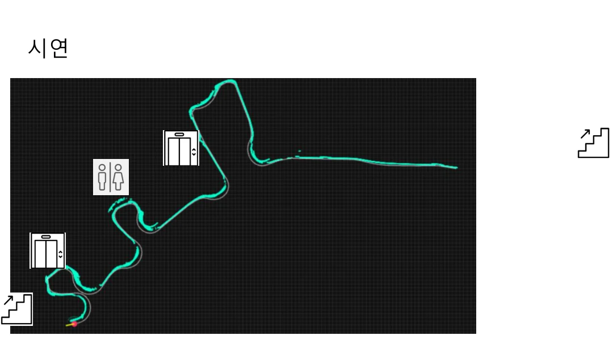
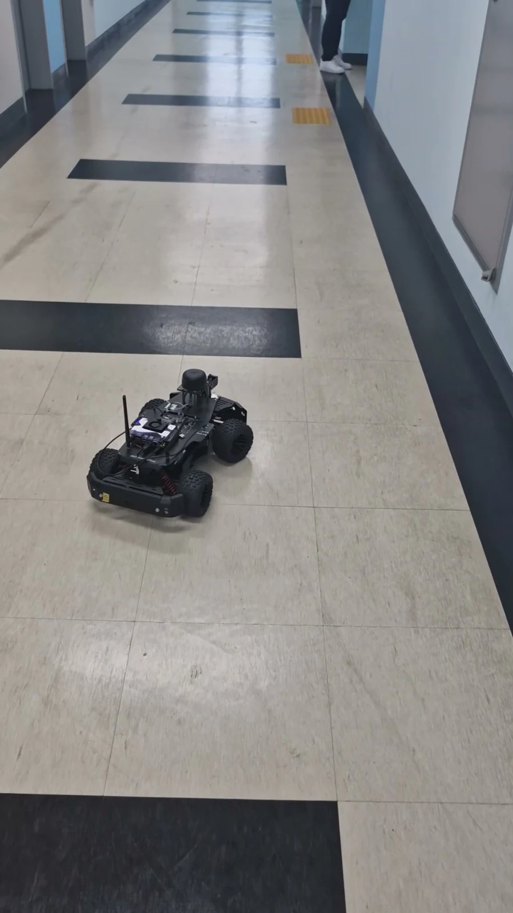
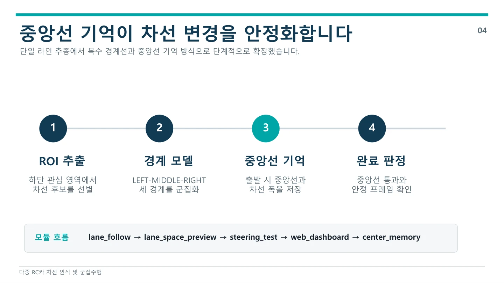
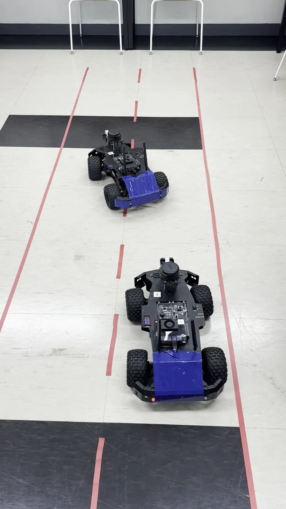
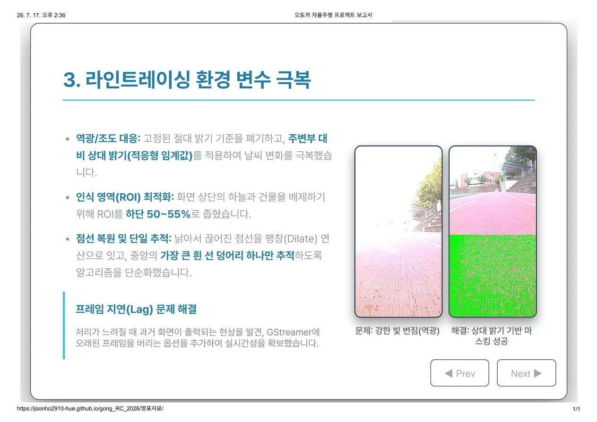
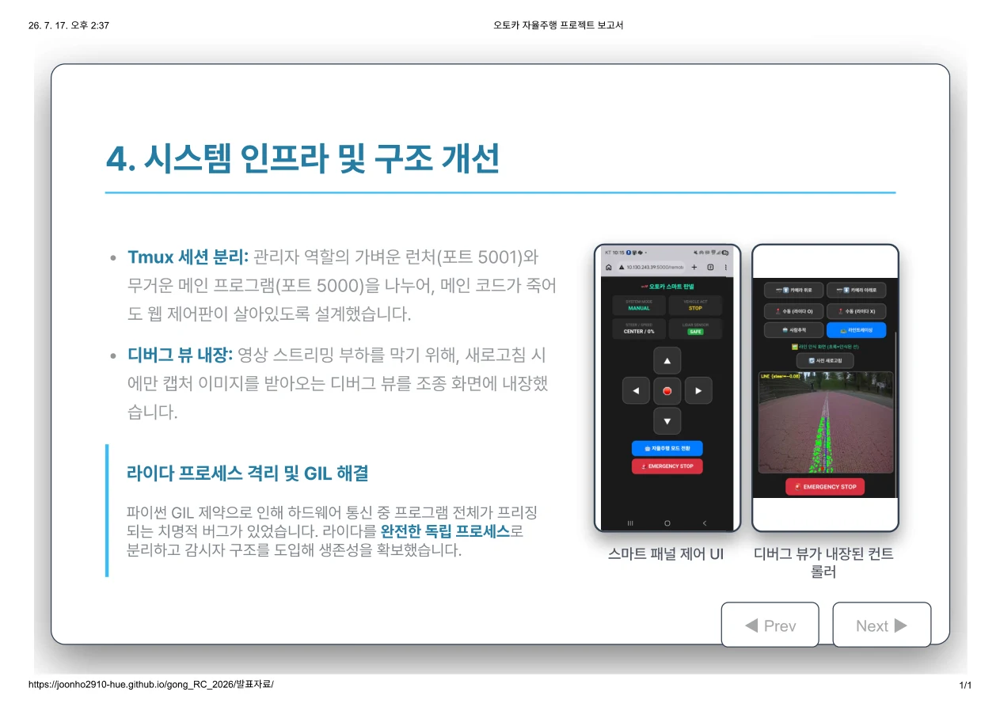
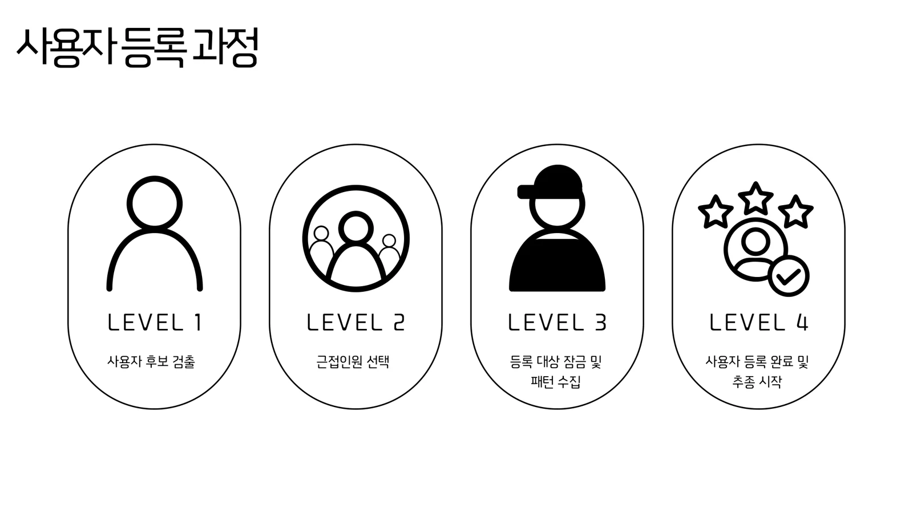
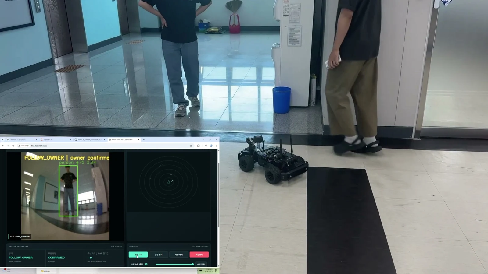
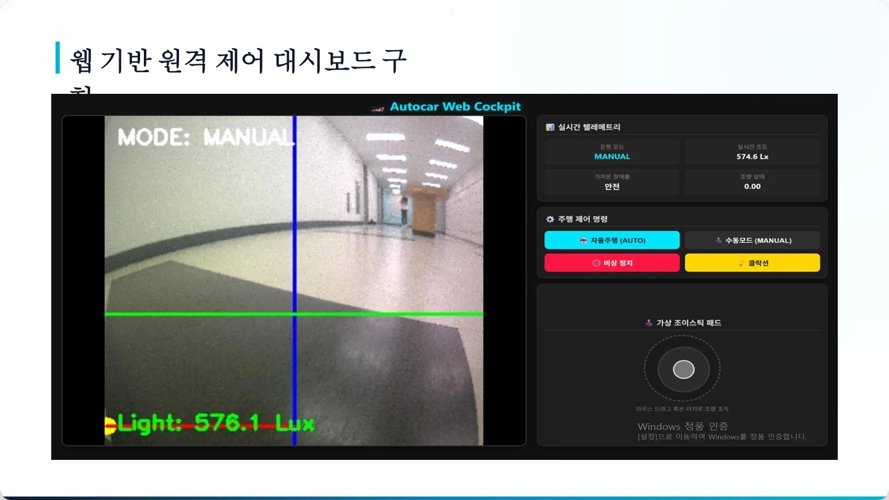
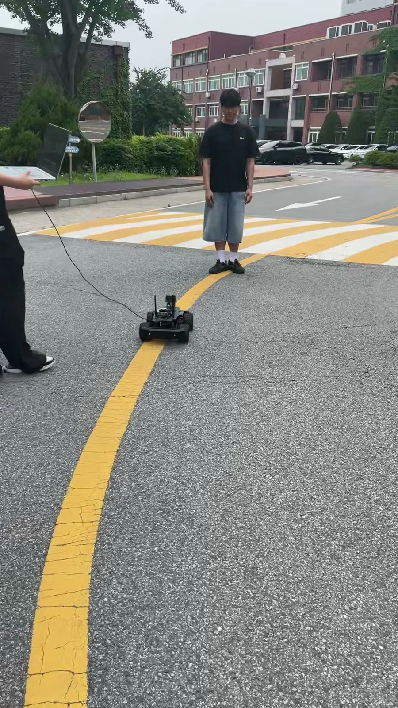

# 작은 RC카, 다섯 가지 자율주행

같은 RC카로도 풀고 싶은 문제는 달랐다. 복도를 지도에 옮기고, 앞차를 따라 차선을 바꾸고, 사람이나 흰 선을 추종하고, 등록한 사용자를 기억하고, 장애물 앞에서 멈추는 차량까지. 다섯 팀이 센서와 비전으로 만든 자율주행 프로젝트를 소개한다.

## 교육 개요

  ICT 이노베이션스퀘어 확산사업 · 2026  RC카 활용 자율주행 구현  지역 AI·SW 실무 인재 양성을 위한 ICT이노베이션스퀘어 확산사업의 방학 교육입니다. 센서와 카메라로 주변을 읽고, 인식 결과를 실제 RC카의 조향·주행으로 연결하는 프로젝트를 진행했습니다.    교육 운영  대한상공회의소 충남인력개발원 천안기술교육센터 · ICT이노베이션스퀘어 확산사업팀    교육 장소  국립공주대학교 천안캠퍼스 대면 실습 교육    교육 기간·규모  2026.06.22–07.17 · 총 160시간 평일 09:00–18:00    강의 수행  최수길 · RC카 제어·비전·AI 실습 팀 프로젝트 지도 및 결과 발표    국립공주대학교가 참여한 ICT이노베이션스퀘어 디지털교육 과정입니다. 대학 공식 안내에 따르면 사업은 과학기술정보통신부·정보통신산업진흥원이 지원하고, 세종테크노파크·대한상공회의소 충남인력개발원이 운영합니다.   공식 교육과정 안내 ↗  국립공주대학교 사업 참여 안내 ↗

## 1조 · 벽을 따라 달리며 공간을 그리는 RC카

이동헌 · 신동수

1조는 RC카가 복도를 탐색하며 주변 공간을 화면에 그리는 프로젝트를 만들었다. LiDAR로 오른쪽 벽과의 거리를 읽고, 벽을 따라 이동하면서 관측한 점과 차량의 이동 경로를 웹 화면에 쌓았다. 사람이 직접 그린 평면도 대신 주행 중 모은 센서 정보로 공간의 윤곽을 표현하려는 시도다.

차량은 후진·방향 정렬·벽 추종 상태를 오가며 길을 찾는다. 자이로와 모터 속도로 이동량을 추정하고, LiDAR 관측값을 좌표로 바꾸어 Canvas 격자에 표시했다. 카메라로 계단 등 주행하기 어려운 구간을 구분하는 분류 모델도 별도로 학습·실험했다.

이동헌은 LiDAR 자율주행, 코드 통합과 프로젝트 관리를 맡았고, 신동수는 데이터 수집·전처리, 모델 학습·평가와 이동량 추정을 담당했다. 센서로 읽은 거리와 실제 움직임을 같은 좌표계로 연결하는 과정이 팀의 핵심 과제였다.

**구현 내용:** 복도에서 오른쪽 벽을 따라 이동하는 실차 시연과, 이동 경로·관측점을 표시한 공간 투영 결과를 남겼다.

**남은 과제:** 회전 구간에서 위치 오차가 누적되고 유리벽을 놓치는 문제가 있었다. 카메라 분류기의 주행 통합은 안정화하지 못했으며, 오른쪽 벽만 관측하는 방식에는 미탐색 영역이 남는다.

[팀 저장소](https://github.com/ACUBCU/RCcar_2026/tree/main/autocar/final_p)

복도 주행 결과에 계단·엘리베이터 등 주변 지점을 함께 표시한 발표 화면. — 1조 발표자료 17쪽

차량, 벽면과 복도 바닥이 함께 보이는 주행 시연 장면. — 1조 시연영상 · 00:48.4

## 2조 · 차선을 바꾸고 앞차를 따르는 RC카

주영찬(조장) · 박재혁 · 이명연 · 권신용

2조는 한 대의 차선 주행을 여러 대의 움직임으로 확장했다. 선두 차량이 카메라로 차선을 읽고 오른쪽 차로에서 왼쪽 차로로 이동하면, 뒤따르는 차량도 그 흐름을 이어가는 군집주행을 주제로 삼았다.

OpenCV로 차선 후보를 추출하고, 차로 중심과 차량의 차이를 조향 명령으로 바꾸었다. 차선을 넘는 순간 경계가 흔들리는 문제에는 직전에 본 중앙선과 차로 폭을 잠시 기억하는 방식을 적용했다. 선을 놓치거나 차선 변경이 오래 지속되면 계속 달리지 않고 멈추도록 했다.

주영찬과 박재혁은 주행·선두 및 후미 알고리즘을, 이명연은 LED와 화면 구성을, 권신용은 통신·백엔드와 통합을 맡았다. 최종 영상은 선두 차량과 후미 차량 한 대가 라인 추종에서 차선 변경으로 이어지는 장면을 보여준다.

**구현 내용:** 선두 1대와 후미 1대로 차선 주행·왼쪽 차선 변경·추종을 연결했다. 중앙선 기억과 인식 실패 시 정지 조건을 함께 구성했다.

**남은 과제:** 양방향 차선 변경과 세 대 전체의 통합 시나리오는 후속 과제다. 대시보드·깜빡이·비상정지는 발표자료에 소개되지만 최종 주행영상에 함께 담기지는 않았다.

[팀 저장소](https://github.com/jyber9616-web/RC_team2)

경계 모델에서 중앙선 기억, 완료 판정까지 이어지는 제어 흐름. — 2조 발표자료 4쪽

테이프로 만든 두 차로에서 선두가 이동하고 뒤 차량이 따라가는 장면. — 2조 시연영상 · 00:07.2

## 3조 · 사람과 흰 선을 따라가는 오토카

이준호(조장) · 김주형 · 이서현 · 이현준

3조는 사람을 따라가는 AUTO 모드와 운동장의 흰 선을 따라가는 LINE 모드를 한 차량에 담았다. 스마트폰 화면에서 모드를 바꾸고 직접 조종하며, 차량이 무엇을 보고 있는지 확인할 수 있도록 만들었다.

사람 추종에는 Jetson Nano에서 실행하는 YOLOv3-tiny와 TensorRT를 사용했다. 흰 선 추종은 주변보다 밝은 영역을 찾는 OpenCV 처리로 구성하고, 화면 아래쪽만 분석해 하늘·건물의 영향을 줄였다. 끊어진 선을 연결하고 오래된 카메라 프레임을 버리는 등 실제 주행에서 드러난 인식 지연도 조정했다.

이준호·김주형·이서현·이현준은 인식, 센서 처리와 웹 조종을 하나의 시스템으로 통합했다. LiDAR 통신이 전체 프로그램을 멈추게 하는 문제에는 센서 처리를 별도 프로세스로 분리했고, 무거운 주행 프로그램과 가벼운 웹 실행기를 나누었다. 차선 인식 결과는 필요할 때 캡처해 확인하도록 구성했다.

**구현 내용:** 사람 추종·흰 선 추종과 스마트폰 조종 화면을 구현했다. LINE 모드에서는 장애물을 만나면 정지하고, 장애물이 사라진 뒤 다시 출발하도록 범위를 조정했다.

**남은 과제:** 바닥 로고를 선으로 오인하는 문제와 정밀 위치 추정은 해결하지 못했다. 장애물 우회 후 정확한 경로 복귀와 재부팅 뒤 자동 복구도 후속 과제로 남았다.

[팀 저장소](https://github.com/britams/2026autocarteamrepository)

실제 트랙 영상과 선을 추출한 화면을 함께 비교한 발표자료. — 3조 발표자료 4쪽

수동 조종, 주행 모드 전환, 비상정지와 인식 결과 확인을 모은 화면. — 3조 발표자료 5쪽

## 4조 · 등록한 사용자를 기억하고 따라가는 RC카

고태원 · 김정연 · 이연우 · 오시원 · 장운호

4조는 여러 사람 가운데 등록한 사용자만 따라가는 RC카를 만들었다. 단순히 화면에서 가장 크게 보이는 사람을 따라가는 대신, 처음 선택한 사람의 옷 색상과 패턴을 기억하고 이후 관측한 후보와 비교하는 데 초점을 맞췄다.

카메라로 사람을 찾고 여러 프레임에서 외형 특징을 모아 등록한다. 이후 추적 정보와 외형 유사도를 바탕으로 대상을 판단하고, LiDAR 거리 정보를 주행과 안전 정지에 연결했다. 사용자를 놓치면 카메라 방향을 바꾸어 다시 찾고, 판단이 불확실하면 멈추도록 구성했다. 웹 대시보드에서는 인식 영상과 차량 상태를 함께 살펴볼 수 있다.

이연우는 인식·센서 융합과 시스템 구성을, 고태원은 모터·조향 제어를 맡았다. 장운호는 사용자 등록·Bluetooth 통신, 오시원은 LiDAR 안전 제어·사용자 소실 시 탐색, 김정연은 테스트·로그와 발표를 담당했다.

**구현 내용:** 실물 차량과 인식 화면을 함께 촬영해 사용자 등록·추종 과정을 시연했다. 외형 비교, 카메라 추적과 안전 정지를 연결한 사용자 중심 이동 로봇을 구성했다.

**남은 과제:** 옷차림·조명 변화와 가림에 대한 대응이 중요하다. 다양한 사람·환경에서의 재식별 성능과 Bluetooth 연결을 포함한 전체 안전 조건은 추가 검증이 필요하다.

[팀 저장소](https://github.com/jungyeon220/AutoCar_Owner_Follow)

후보 검출, 근접 인원 선택, 외형 수집, 등록 완료로 이어지는 과정. — 4조 발표자료 7쪽

사람을 따라가는 차량과 화면 속 대상 표시를 함께 확인하는 장면. — 4조 시연영상 · 00:27.3

## 5조 · 차선 주행에 정지·경고·조명을 더한 RC카

홍기호(조장) · 서정대 · 한정우 · 김상엽

5조의 RC Smart Drive는 선을 따라 달리는 기능에 주변 상황에 대응하는 기능을 더했다. 카메라로 노란 선을 읽어 조향하고, LiDAR로 앞의 장애물을 감지하면 멈추며 음성으로 상태를 알린다. 어두워지면 조명을 켜는 기능도 함께 구성했다.

HSV 색상 범위로 선을 분리하고 그 중심 위치를 PD 조향 제어에 연결했다. 차량이 좌우로 크게 흔들리자 영상 처리 영역, 속도와 제어값을 조정했다. 조도 센서값은 NumPy로 실행하는 경량 신경망에 넣어 밝기를 추정하고 LED 제어에 활용했다. 영상·센서·주행과 소리 재생을 나누어 경고음 때문에 제어가 멈추지 않도록 했다.

홍기호는 프로젝트 관리와 자율주행 로직을, 서정대는 하드웨어·센서와 주행 시험을 맡았다. 한정우는 백엔드·AI·음성 및 모드 제어, 김상엽은 대시보드 화면을 담당했다. 발표에서는 원격 조종 화면도 소개했으며, 최종 결과의 중심은 노란 선 주행과 장애물 대응이었다.

**구현 내용:** 야외 노란 선을 따라가는 주행을 시연하고, 전방 장애물 정지·음성 알림·조도 기반 점등 기능을 정리했다. 차량의 흔들림을 줄이기 위한 조향 보정 과정을 남겼다.

**남은 과제:** 차선 색상과 조명 조건에 영향을 받으며, 장애물을 스스로 우회해 경로로 돌아오는 기능은 후속 과제다. 웹 조종 화면과 전체 주행 기능을 하나로 묶은 장시간 검증도 필요하다.

[팀 저장소](https://github.com/jeongu0569-ui/2026_knu_rc_report)

카메라 영상, 수동 모드, 조도 정보와 조종 입력을 배치한 화면. — 5조 발표자료 9쪽

차량의 주행 경로와 전방 장애물 상황을 함께 보여주는 시연 장면. — 5조 시연영상 · 00:25.0

## 인식한 것을, 다음 움직임으로

다섯 팀의 공통 과제는 센서가 읽은 정보를 다음 움직임으로 연결하는 일이었다. 벽·차선·사람처럼 기준은 달랐지만, 실제 차량에서는 처리 지연과 조향 오차, 대상 소실과 장애물 대응을 함께 다뤄야 했다. 잘 달리는 순간뿐 아니라 멈춰야 하는 조건을 정하고, 계획을 실물에서 가능한 범위로 조정한 경험이 이번 프로젝트의 결과다.

## 자료와 작성 기준 — 편집 문서 전용

- 공개 HTML에는 이 절을 넣지 않는다. 사업 원문과 원본 영상은 웹사이트 저장소에 복제하지 않는다.
- [수업 저장소](https://github.com/freshmea/gong_rc_2026), [교육생 공유 슬라이드](https://docs.google.com/presentation/d/1NwCyi3hQ3WKvkgapCUH2Z7pcHDgDb3h2Jr1VzPnHE7E/edit), [사업 문서·산출물](https://github.com/freshmea/bindsoft1/tree/main/2.%20교육/9.%20인력개발원/천안인력개발원/3.%202026_RC카%20수업/프로젝트%20산출물)을 대조했다.
- 과정명·기간·160시간·운영기관은 공식 교육 안내(educationKey=412), 사업 지원·운영은 대학 공지를 기준으로 했다. 운영계획안의 강사는 최수길이다. RC 과정의 건물명은 별도로 확인되지 않아 캠퍼스까지만 표기했다.
- 최종 발표·기술서를 계획서보다 우선한다. 팀원은 공유 슬라이드와 제출 문서 기준이다. 하드웨어를 재실행하거나 성능을 독립 측정하지 않았다. 학생 개인정보 중 이름 외 생년월일·주소·연락처는 사용하지 않는다.
- 1조: PLAN/TECH, 발표 19쪽, 시연영상. 완성 SLAM이나 카메라 기반 계단 회피 성공으로 확대하지 않는다.
- 2조: 최종 기술서·발표 7쪽·시연영상. 선두+후미 1대가 영상 확인 범위. 3대 시나리오 및 미촬영 통합 기능을 시연 완료로 서술하지 않는다.
- 3조: 최종 기술서·종합 보고서·발표 PDF 6쪽·공개 코드. 주행 영상 대신 선 인식과 휴대폰 제어가 식별 가능한 발표 PDF 4·5쪽을 사용한다. 개별 역할은 명확한 근거가 없어 세분화하지 않는다.
- 4조: 최종 기술서·발표 9쪽·시연영상·autocar_follow 코드. OSNet/DeepSORT 등 초기 계획의 모델명을 최종 적용 기술로 단정하지 않는다. Bluetooth는 역할과 설계에 있으나 전체 실차 안전 시나리오 검증은 별개다.
- 5조: 최종 기술서·발표 14쪽·시연영상·0716code.py. 발표 9쪽에는 대시보드가 있고 기술서에서는 웹 통합을 후속으로 다룬다. 따라서 화면 소개와 최종 주행 제어를 구분하며 대시보드가 없다고도 쓰지 않는다.

### 이미지 추출 기록

원본 경로: `D:/bindsoft/2. 교육/9. 인력개발원/천안인력개발원/3. 2026_RC카 수업/프로젝트 산출물/`. PPTX는 PowerPoint로 PDF 내보내기 후 해당 페이지를 렌더링했다. 영상은 ffmpeg로 캡처했다. WebP는 최대 1600px로 비율을 유지했으며 내용을 합성하지 않았다.

- `team1-map.webp`: 1조 발표자료 17쪽; 중간 추출 파일 `t1-p17.png`.
- `team1-wall-demo.webp`: 1조 시연영상 · 00:48.4; 중간 추출 파일 `v1-4.jpg`.
- `team2-lane-logic.webp`: 2조 발표자료 4쪽; 중간 추출 파일 `t2-p4.png`.
- `team2-platoon-demo.webp`: 2조 시연영상 · 00:07.2; 중간 추출 파일 `v2-4.jpg`.
- `team3-line-vision.webp`: 3조 발표자료 4쪽; 중간 추출 파일 `t3-p4.png`.
- `team3-phone-control.webp`: 3조 발표자료 5쪽; 중간 추출 파일 `t3-p5.png`.
- `team4-registration.webp`: 4조 발표자료 7쪽; 중간 추출 파일 `t4-p7.png`.
- `team4-owner-demo.webp`: 4조 시연영상 · 00:27.3; 중간 추출 파일 `v4-6.jpg`.
- `team5-dashboard.webp`: 5조 발표자료 9쪽; 중간 추출 파일 `t5-p9.png`.
- `team5-road-demo.webp`: 5조 시연영상 · 00:25.0; 중간 추출 파일 `v5-6.jpg`.
