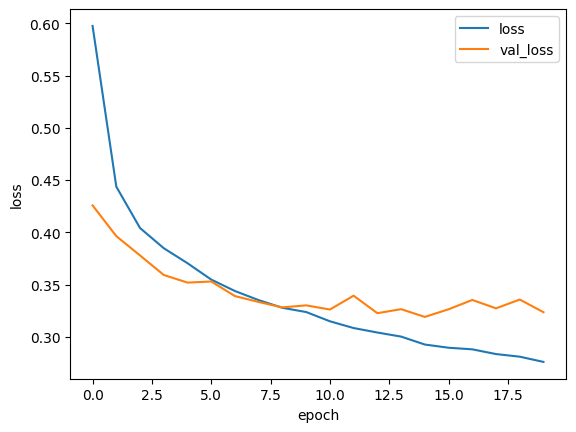
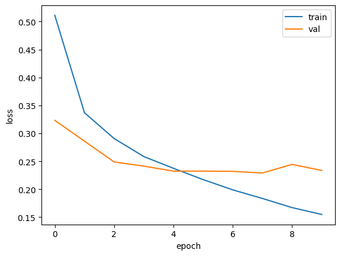
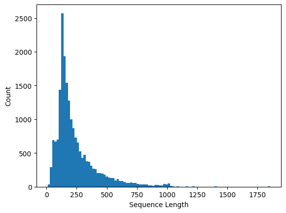
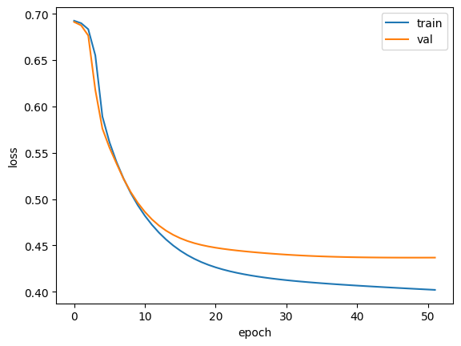
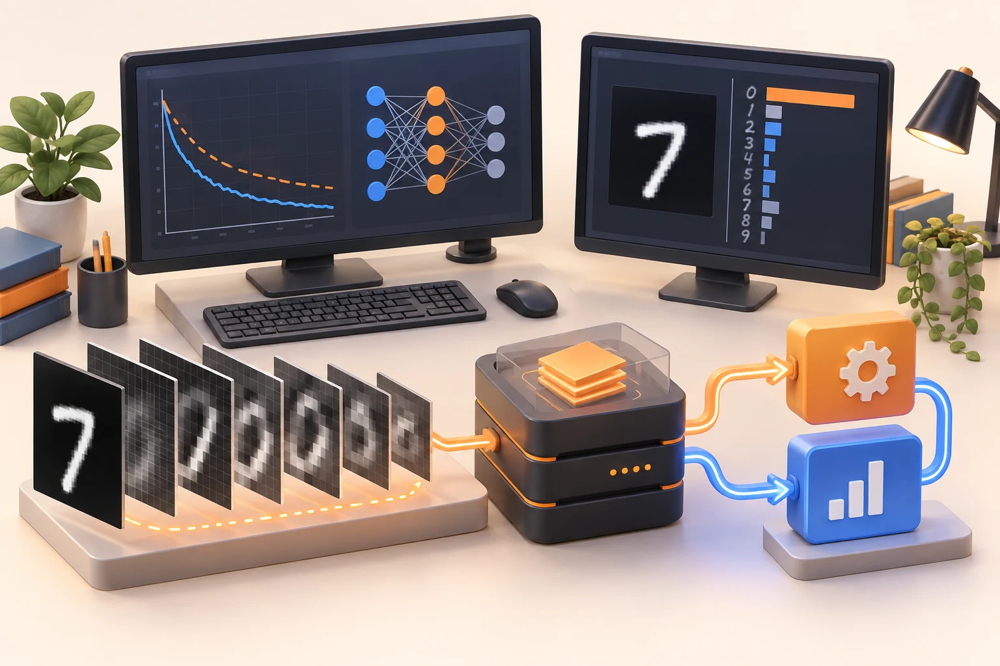

# 딥러닝, 학습한 모델을 프로그램의 한 부분으로 연결하기

2025.06.13–06.20 · 고려대학교 세종캠퍼스 · 기록이 있는 6일, 첫날은 오전 4교시

딥러닝 과목은 신경망의 학습 과정에서 이미지·순차 데이터 처리, 프로그램 간 모델 호출로 확장됐다. 이 기간에는 프로젝트 작업과 개발 보조 AI 도구 활용도 함께 기록돼 있다. 내부 계획서와 실제 진행 내용의 차이가 커, 아래 글은 강사 저장소의 날짜별 기록을 우선하고 예제 코드를 대조해 작성했다.

## 06.13 오전 | 신경망이 학습하는 과정을 나누어 보기

첫날의 공개 기록은 1~4교시다. 퍼셉트론과 신경세포, 딥러닝의 개념을 소개하고 TensorFlow·Keras, 손실 함수, 순전파·역전파와 optimizer를 설명했다. 하루 8교시를 모두 같은 내용으로 진행했다고 확대하지 않는다. [1]

이전 과목에서 모델을 선택하고 결과를 평가했다면, 이번에는 예측을 만들고 손실을 계산하며 파라미터를 갱신하는 학습 과정을 살폈다. Adam·SGD·RMSprop은 이 갱신 방법을 비교하는 설명 범위였다. 어떤 optimizer가 항상 가장 낫다는 결론을 내리는 수업으로 표현하지 않는다.

강사 저장소의 Keras 노트북은 신경망 구성과 학습을 확인하는 참조다. 본문에서는 저장된 출력 수치를 다시 측정한 결과처럼 제시하지 않고, 입력·모델·손실·학습의 연결을 읽는 자료로 사용한다. [2]

### 손실 곡선 두 개를 함께 읽는 출발점

첫 그래프는 Keras 노트북에 저장된 학습 손실과 검증 손실이다. 초반에는 두 값이 함께 내려가지만 뒤로 갈수록 학습 손실은 계속 줄고 검증 손실은 비슷한 범위에서 흔들린다. 이 모양은 “더 오래 학습하면 항상 더 낫다”는 생각을 점검하게 한다. 세로축은 정확도가 아니라 손실이므로 숫자의 의미부터 구분해야 한다.

순전파는 현재 파라미터로 예측을 만들고, 손실은 예측과 목표의 차이를 수치로 표현한다. 역전파로 얻은 기울기를 optimizer가 파라미터 갱신에 사용한다. 학습 곡선은 이 반복의 기록이며, 학습 데이터에 맞춘 정도와 별도 자료에서의 변화가 같은 방향으로 움직이는지 살펴보는 자료다.

a21_keras2.ipynb에 저장된 곡선입니다. 이번에 모델을 재학습한 결과가 아니며 세로축은 손실입니다. [근거 자료](https://github.com/freshmea/kuBig2025/blob/856a133a87d232a8ec714687139644f01f0a6cb9/ml_dl_python/a21_keras2.ipynb)

## 06.16 오전 | 학습을 저장하고 멈추며 이미지로 확장하기

다음 수업일에는 dropout을 복습하고 체크포인트 저장과 EarlyStopping을 다뤘다. 모델 학습은 오래 실행하는 것만으로 끝나지 않는다. 어느 상태를 보관하고 어떤 기준으로 종료할지 정하는 것도 실험의 일부라는 관점을 살폈다. [1]

이어 CNN의 합성곱층과 풀링층, Conv2D·MaxPooling2D를 사용하는 이미지 분류를 실습했다. argmax로 예측 범주를 선택하고 함수형 API를 이용해 중간 값을 살펴보는 내용도 기록돼 있다. 입력 영상을 모델에 넣고 마지막 숫자만 읽는 단계에서 내부 구조를 관찰하는 단계로 범위를 넓혔다. [3]

OpenCV에서 다뤘던 이미지 배열과 필터 경험이 여기서 다시 연결된다. 다만 손으로 설정한 영상처리 규칙과 데이터에서 학습한 신경망의 파라미터는 구분해야 한다. 두 과목의 유사한 용어를 같은 작업으로 설명하지 않고, 입력을 수치 데이터로 다룬다는 공통 기반 위에서 읽는다.

### 모델 저장 시점과 마지막 실행 시점은 다를 수 있다

CNN 곡선에서도 뒤쪽에 학습 손실과 검증 손실의 간격이 넓어진다. 체크포인트는 정한 기준의 모델 상태를 보관하고, EarlyStopping은 개선이 멈췄을 때 반복을 종료하는 데 사용한다. 어느 지표를 감시했는지, 저장된 모델과 메모리에 남은 마지막 모델이 같은지 확인해야 이후 추론 결과를 해석할 수 있다.

합성곱층과 풀링층을 지나는 동안 이미지의 공간 크기와 채널 수가 바뀐다. 마지막 출력에서 argmax는 가장 큰 값의 위치를 고를 뿐, 입력을 올바르게 전처리했는지까지 보장하지는 않는다. 중간 층의 값과 모델 구조를 살핀 기록은 출력 숫자만 보는 습관에서 한 단계 더 들어가는 실습이었다.

a22_convolustion.ipynb의 저장 출력입니다. 최종 epoch와 선택할 모델 상태가 같아야 하는 것은 아닙니다. [근거 자료](https://github.com/freshmea/kuBig2025/blob/856a133a87d232a8ec714687139644f01f0a6cb9/ml_dl_python/a22_convolustion.ipynb)

## 06.16 오후–06.17 오전 | 순차 데이터와 메모리 제약

오후에는 RNN과 IMDB 데이터 분석을 다뤘다. one-hot encoding 방식에서 메모리 초과가 발생해 설정을 줄였다는 기록이 있다. 기록의 숫자 200이 어떤 전체 실험 조건을 의미하는지까지 확대 해석하지 않고, 표현 방식과 입력 규모가 메모리 사용에 영향을 주어 조정이 필요했다는 사실을 남긴다. [1]

이후 embedding 방식으로 처리하고 LSTM의 게이트와 상태를 설명했다. 다음 날에는 LSTM 실습과 custom LSTM, 양방향 LSTM을 다뤘다. 순서가 있는 입력을 처리하는 방식과 같은 문제를 다른 모델 구성으로 표현하는 방법을 살핀 흐름이다. [4]

GRU와 dropout, 순환층을 두 겹으로 구성하는 실습도 이어졌다. 이를 긴 입력에서 항상 좋은 결과를 보장하는 기술로 설명하지 않는다. 모델의 형태, 입력의 표현, 학습 자원의 제약을 함께 보며 선택지를 넓히는 과정이었다.

### 문장 길이 분포가 메모리 문제와 만나는 지점

IMDB 노트북의 히스토그램은 시퀀스 길이가 모두 같지 않고 긴 쪽으로 꼬리가 이어짐을 보여 준다. 배치로 처리하려면 길이를 맞추는 규칙이 필요하고, 너무 긴 입력을 어디까지 유지할지도 정해야 한다. 이 선택은 저장할 값의 개수와 함께 정보 손실에도 영향을 준다.

one-hot 표현에서는 단어 하나가 어휘 크기만큼의 벡터가 된다. embedding은 토큰 인덱스를 학습 가능한 밀집 표현에 연결한다. 6월 16일 메모리 초과 기록은 이 두 표현을 추상적 개념만으로 다룬 것이 아니라 실행 가능한 크기와 연결해 살핀 사례다. 뒤의 LSTM 곡선은 별도 노트북의 저장 결과로, 앞선 CNN과 동일 조건의 성능 대결로 비교하지 않는다.

a23_rnn.ipynb의 IMDB 시퀀스 길이 분포입니다. 개인의 문장 내용 없이 집계 그래프만 사용했습니다. [근거 자료](https://github.com/freshmea/kuBig2025/blob/856a133a87d232a8ec714687139644f01f0a6cb9/ml_dl_python/a23_rnn.ipynb)

a24_lstm_gru.ipynb의 저장 출력입니다. 다른 모델 그래프와 데이터·학습 조건을 통일한 비교 실험은 아닙니다. [근거 자료](https://github.com/freshmea/kuBig2025/blob/856a133a87d232a8ec714687139644f01f0a6cb9/ml_dl_python/a24_lstm_gru.ipynb)

## 06.17 | 모델을 별도 프로세스에서 호출하기

이날은 ZeroMQ를 이용한 서버·클라이언트 실습이 중요한 연결점이었다. Python과 C++ 예제를 작성하고, 모델을 서버에서 불러와 요청을 받아 추론하는 구조를 살폈다. 네트워크 과목의 요청·응답과 Python·C++의 데이터 처리가 딥러닝 모델 호출로 이어졌다. [1]

zmq_server_dl.py는 저장한 LSTM 모델을 불러와 입력 숫자열을 처리하고 예측 결과를 응답한다. 실제 예제는 ipc:// 경로에 바인딩하므로, 이를 서로 다른 컴퓨터 사이에 배포한 서비스라고 설명하지 않는다. 같은 호스트의 프로세스를 나누어 연결한 구조를 확인하는 자료다. [5]

OpenCV 쪽 model_server.py는 받은 이미지 바이트를 배열로 만들고 크기 변환·정규화를 거쳐 CNN에 전달한다. 반면 zmq_image_server.py는 이미지를 받아 표시하고 수신 완료를 응답하는 예제다. 파일 이름에 server나 예측이라는 문자열이 있다고 모두 모델 추론을 수행하는 것은 아니므로 실제 코드를 구분해 연결했다. [6]

### 모델 호출에서 먼저 맞춰야 하는 데이터 계약

이미지 추론 서버는 받은 바이트를 400×400 배열로 해석한 다음 28×28로 줄이고 255로 나누어 모델에 넣는다. 호출하는 쪽이 다른 크기나 채널 구조로 데이터를 보내면 같은 바이트도 기대한 입력으로 해석되지 않는다. 연결에 성공했다는 사실과 모델에 맞는 데이터가 전달됐다는 사실은 다르다.

LSTM 서버 역시 임의의 자연어 문장을 바로 이해하는 웹 서비스가 아니다. 숫자 토큰열을 받아 길이를 맞춰 저장된 모델에 넣는 예제다. 토큰을 만든 규칙과 모델을 학습할 때 사용한 규칙이 일치해야 한다. C++·Python 프로그램을 연결하는 수업의 핵심은 언어를 넘는 호출 자체와 더불어 크기·자료형·전처리·응답 형식을 맞추는 데 있었다.

## 06.18 | 분류·검출·모델 활용의 차이를 살펴보기

18일에는 GoogLeNet 분류와 SSD 얼굴 검출, YOLO 구조와 YOLOv5 실습을 다뤘다. 카메라 입력을 사용하고 COCO 클래스, 사용자 데이터 준비와 라벨링, 환경과 설정 파일 변경을 설명했다. 모델이 이미지를 한 범주로 분류하는 일과 영상 속 대상의 위치를 찾는 일은 서로 다른 출력 문제다. [1]

YOLOv5 사용자 데이터 학습에 관한 안내가 기록되어 있지만, 모든 교육생이 모델을 완성해 특정 정확도를 달성했다고 볼 근거는 없다. 이 글은 데이터와 라벨을 준비하고 설정을 바꾸는 학습 범위로 설명한다. 얼굴 영상이나 실제 교육생의 카메라 캡처는 수록하지 않았다.

오후 기록에는 DQN의 튜닝·확장·응용이 포함돼 있다. 저장소에는 CartPole 예제 노트북이 있지만, 설명에 등장한 Atari까지 동일하게 구현·학습을 마쳤다고 확대하지 않는다. 설명한 주제와 확인 가능한 코드 예제를 구분하는 것이 이 과목 기록의 기준이다. [7]

### 분류의 한 결과와 검출의 여러 결과

분류는 입력 이미지에 대한 범주를 고르는 형태로 시작하지만, 객체 검출은 위치와 범주를 함께 반환한다. 여러 상자가 나올 때 점수와 중복 결과를 어떻게 다룰지도 필요하다. 카메라 입력을 모델에 연결하는 부분에서는 영상 크기 변경과 모델 출력 좌표를 원래 화면으로 돌리는 처리도 함께 읽어야 한다.

사용자 데이터 학습은 이미지 폴더만 바꾸는 작업이 아니다. 클래스 이름과 라벨의 번호, 좌표 표기, 학습·검증 분리, 설정 파일이 서로 맞아야 한다. 6월 18일 기록은 이 준비와 환경 설정까지 다룬 흐름을 보여 준다. 공개 글에는 사람 얼굴이 들어간 카메라 화면 대신 이러한 입력·출력 구조를 설명하는 자료를 사용했다.

## 06.19 | 프로젝트 작업과 생성 모델의 개념

19일 오전은 프로젝트 시간으로 기록되어 있다. 이를 추가 신경망 이론 수업으로 채우지 않고, 배운 도구를 프로젝트에 연결하는 작업 시간으로 남긴다. 개별 팀의 구현 내용과 성과는 별도의 프로젝트 기록에서 다룰 범위다. [1]

오후에는 Autoencoder와 VAE를 설명했다. 입력을 잠재 표현으로 바꾸고 다시 복원하는 구조, 재구성 손실과 VAE의 KL 발산이 기록의 주요 항목이다. TensorBoardX 설치와 시각화도 이어졌다. 학습 결과를 최종 출력만으로 보지 않고 과정과 구조를 관찰하는 도구로 연결했다.

생성 모델이라는 이름만으로 특정 생성형 서비스나 대형 모델을 직접 구축했다고 해석하지 않는다. 실제 수업 기록과 VAE 노트북에서 확인할 수 있는 개념·실습 범위에 한정한다. [8]

### 복원하는 모델과 분류하는 모델의 목표 차이

Autoencoder는 입력을 압축된 표현으로 바꾼 뒤 다시 복원하는 구조로 읽을 수 있다. 분류처럼 범주 하나를 맞히는 출력과는 목표가 다르다. VAE에서는 잠재 표현을 확률적으로 다루는 방식과 재구성 손실 외의 항을 함께 살피므로, 단순히 중간층을 작게 만든 모델로 설명하면 중요한 차이를 놓친다.

이후 프로젝트에서 모델을 활용할 때도 “AI 기능이 있다”는 말보다 어떤 입력을 받고 어떤 결과를 돌려주는지가 먼저다. 요청·응답 코드, 데이터 준비, 모델 저장, 결과 표시를 나누어 보면 각 부분의 문제를 따로 확인할 수 있다. 3월의 C에서 시작한 장기 과정이 모델을 하나의 소프트웨어 구성요소로 다루는 단계까지 이어진 연결점이다.

## 06.20 | 개발 보조 AI 도구와 수업의 마무리

마지막 날에는 인공지능 적용 실습과 VS Code 설정, 자동완성·커밋 메시지 가이드, Copilot·agent·MCP 활용이 기록돼 있다. 모델을 학습하는 내용과 개발 도구로 AI를 사용하는 내용은 목적이 다르므로 같은 성과로 합산하지 않는다. 이 글은 2025년 당시의 활용 수업을 기록하며 현재 제품의 기능이나 설정 방법을 안내하는 문서가 아니다. [1]

내부 딥러닝 계획서에는 실제 기록과 다른 주제·일정이 포함돼 있다. TTS·STT 등 계획서에만 있는 항목을 완료한 수업으로 채우지 않았고, 날짜별로 확인 가능한 진행 내용만 본문에 반영했다. 첫날의 오후나 상세 기록이 없는 시간을 추정해 수업 시간 수를 부풀리지도 않았다.

이 과목의 연결점은 학습한 모델을 다른 코드와 함께 사용하는 구조다. 데이터 준비와 평가, 영상 입력, 프로그램 간 요청·응답, 개발 도구 사용이 하나의 장기 과정 안에서 만났다. 이후 7월 15일까지 이어진 과정 전체의 프로젝트 활동은 별도 기록으로 남겨야 하며, 여기서는 6월 20일까지 확인되는 과목 수업의 범위를 마무리한다.

## 참조 자료

- [1] [날짜별 딥러닝 수업 기록](https://github.com/freshmea/kuBig2025/blob/856a133a87d232a8ec714687139644f01f0a6cb9/doc/dl.md): 실제 날짜별 내용과 첫날 4교시 범위를 확인하는 기본 자료.
- [2] [Keras 신경망 노트북](https://github.com/freshmea/kuBig2025/blob/856a133a87d232a8ec714687139644f01f0a6cb9/ml_dl_python/a20_kerasdeep.ipynb): 신경망 구성과 학습을 다룬 자료.
- [3] [CNN 실습 노트북](https://github.com/freshmea/kuBig2025/blob/856a133a87d232a8ec714687139644f01f0a6cb9/ml_dl_python/a22_convolustion.ipynb): 이미지 분류와 합성곱층 실습.
- [4] [LSTM·GRU 실습 노트북](https://github.com/freshmea/kuBig2025/blob/856a133a87d232a8ec714687139644f01f0a6cb9/ml_dl_python/a24_lstm_gru.ipynb): 순차 데이터 모델 구성의 참조.
- [5] [LSTM 모델 호출 서버](https://github.com/freshmea/kuBig2025/blob/856a133a87d232a8ec714687139644f01f0a6cb9/ml_dl_python/dl_module/zmq_server_dl.py): ipc 경로의 요청·응답과 모델 예측 코드.
- [6] [이미지 추론 서버](https://github.com/freshmea/kuBig2025/blob/856a133a87d232a8ec714687139644f01f0a6cb9/opencv/part7/model_server.py): 수신 배열의 크기 변환·정규화·CNN 예측.
- [7] [CartPole 강화학습 예제](https://github.com/freshmea/kuBig2025/blob/856a133a87d232a8ec714687139644f01f0a6cb9/ml_dl_python/a26_gym_cartpole_v1.ipynb): DQN 설명과 구분해 확인할 수 있는 실제 예제 범위.
- [8] [VAE 실습 노트북](https://github.com/freshmea/kuBig2025/blob/856a133a87d232a8ec714687139644f01f0a6cb9/ml_dl_python/a27_vae.ipynb): 생성 모델의 구조와 학습을 다룬 자료.

공개 참조는 강사 저장소의 동일한 리비전(856a133)에 고정했습니다. 내부 대조 자료: 딥러닝 활용 강의계획서(2025.06.12). 계획서와 진행 기록의 주제·일정 차이가 커 실제 doc/dl.md를 우선했습니다. 6월 13일 오후와 계획서에만 있는 TTS·STT 등의 완료를 추정하지 않았습니다.

교육생 이름·계정·얼굴·연락처·개인별 평가 및 제출물 링크는 수록하지 않았습니다. 강사 코드는 당시 실습의 참고 자료이며, 새로 실행하거나 성능·안정성을 검증한 결과가 아닙니다. 대표 이미지는 AI 생성이며 본문 그림의 출처·재현 여부는 각각의 캡션에 표시했습니다.

## 시각자료

- [학습한 모델을 사용하는 프로그램으로](../../assets/img/projects/ku-deep-learning-2025/ku-deep-learning-2025-01.svg) — 모델 정확도나 운영 서비스의 성능을 나타내지 않습니다.
- [입력의 구조에 따라 모델을 살펴보기](../../assets/img/projects/ku-deep-learning-2025/ku-deep-learning-2025-02.svg) — 이미지→CNN, 순차 데이터→RNN의 두 예시 경로를 비교한 그림입니다.
- [추론을 별도 프로세스에 요청하기](../../assets/img/projects/ku-deep-learning-2025/ku-deep-learning-2025-03.svg) — 원격 배포 실적이 아닌 저장소의 로컬 IPC 예제 구조입니다.
- [후반 수업의 범위를 나누어 기록하기](../../assets/img/projects/ku-deep-learning-2025/ku-deep-learning-2025-04.svg) — 2025년 당시 기록이며 현재 제품 기능이나 프로젝트 완성도를 뜻하지 않습니다.

## 대표 이미지와 보완 기록

AI 생성 일러스트. 실제 수업 사진이 아닙니다. 이미지 출처·프롬프트·재현 방법은 [보완 명세](ku-course-image-manifest-2025.md)를 참조하세요.
