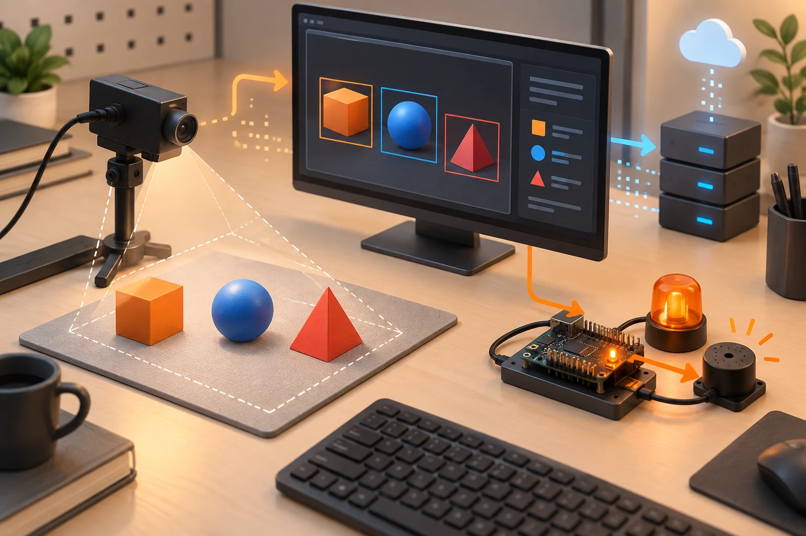
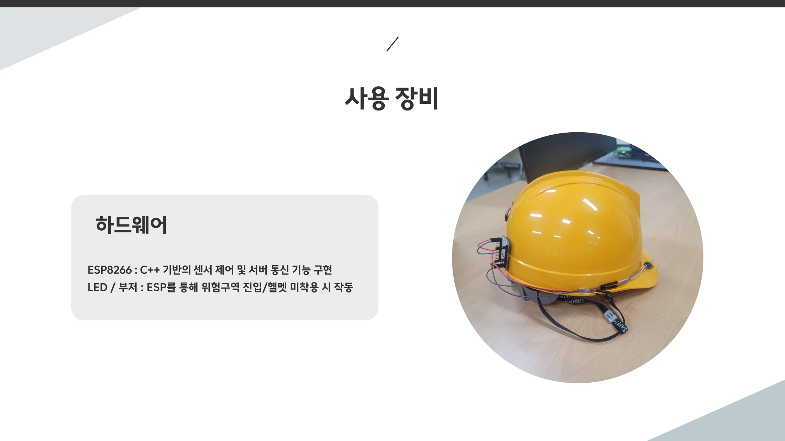

# 최종 프로젝트, 영상과 AI를 서비스의 동작으로 연결하기

2025.06.25–07.15 · 고려대학교 세종캠퍼스 · 집중 프로젝트 운영과 최종 발표

장기 과정의 마지막에는 영상 입력, 모델 처리, 통신, 데이터 저장, 사용자 화면을 하나의 흐름으로 묶었다. 팀별 사전 준비 시점은 서로 다르지만, 운영 기록에서 집중 프로젝트 시작은 6월 25일, 과정 최종 발표는 7월 15일로 확인된다. 이 글은 해당 운영 기간을 중심으로 세 가지 구현 사례를 정리하며, 교육생의 이름·계정·얼굴과 고유 팀명은 공개하지 않는다.

## 운영 기간 | 사전 준비와 집중 개발, 과정 종료를 구분

6월 25일 기록에는 파이널 프로젝트 시작, 일정과 마일스톤 수립이 적혀 있다. 이후 팀별 진행 점검과 기술 상담, 카메라 연동과 발표 준비 지원으로 이어진다. 7월 15일에는 과정 마무리 프로젝트 최종 발표와 평가·피드백이 확인된다. [1]

팀 기술서의 수행 기간은 서로 다르다. 일부는 5월 26일부터 7월 18일까지, 다른 자료는 6월 19일부터 7월 15일까지로 적혀 있다. 이를 전체 교육 기간으로 그대로 사용하지 않고, 팀 문서의 준비·정리 범위와 실제 과정 운영의 종료일을 구분했다. 본문의 마무리 날짜는 사용자가 확인한 과정 종료와 운영 기록이 일치하는 7월 15일이다.

최종 단계에는 영상과 모델 자체뿐 아니라 실행 환경과 프로그램 사이의 연결을 검토하는 시간이 필요했다. 선행 과목에서 각각 배운 기능이 하나의 사용 흐름으로 이어지는지가 이번 사례를 읽는 중심 관점이다.

## 사례 1 | 영상의 검출 결과를 장치 경고로 전달

현장 모니터링 사례의 기술서에는 카메라 영상에서 사람과 안전모 착용 상태를 검출하고, 지정한 영역의 진입을 판단하며, 이벤트를 저장하고 장치로 알리는 구성이 기록돼 있다. OpenCV·YOLOv5·추적 로직·GStreamer·Flask와 ESP8266의 연결이 주요 요소다. [2]

영상에서 후보를 검출하는 일과 경고를 결정하는 일은 같은 단계가 아니다. 검출·추적 결과를 영역 조건과 결합한 뒤, 경고 이벤트를 통신으로 전달하고 LED나 부저가 반응하도록 연결해야 한다. 웹 화면과 데이터베이스는 현황을 확인하고 기록을 남기는 별도의 역할을 맡는다.

기술서에는 처음 고려한 Jetson Nano를 성능 문제로 PC로 대체했다는 변경도 남아 있다. 이 부분은 계획한 하드웨어 이름보다 실제 실행 조건에 맞춰 구성을 조정한 사례로 읽을 수 있다. 실제 산업 현장의 사고 예방 효과나 인증된 안전 장치의 성능을 입증한 결과는 아니며, 얼굴 등록 이미지와 개인 식별 데이터는 이 글에 옮기지 않았다.

## 사례 2 | 이미지 업로드부터 합성 결과 반환까지

가상 시착 사례는 사용자 이미지와 의류 이미지를 처리하고 합성 결과를 웹에서 확인하는 흐름을 다뤘다. 기술서에는 OpenPose 기반 키포인트 처리와 CP-VTON-Plus, Python·OpenCV·Flask, 웹 인터페이스가 포함돼 있다. 학습한 영상·모델 도구를 요청과 응답을 갖는 애플리케이션으로 묶은 사례다. [3]

서비스의 관점에서는 모델 호출 전후도 구현 대상이다. 입력 이미지를 받고 처리에 필요한 형태로 준비하며, 처리된 결과 파일을 구분하고, 사용자 화면으로 돌려주는 단계가 이어진다. 모델이 만들어 낸 한 장의 결과만으로 전체 프로그램의 동작을 설명할 수 없는 이유다.

제출 문서는 협업과 통합·예외 처리도 수행 범위로 적고 있다. 이 글은 실제 사용자의 신체 사진이나 얼굴, 계정과 저장소 화면을 재게시하지 않고 데이터 흐름만 도식화했다. 합성 이미지가 실제 착용감이나 치수 적합성을 검증한다는 의미로도 사용하지 않는다.

## 사례 3 | 영상의 관절 좌표를 피드백과 기록으로 연결

자세 피드백 사례는 ESP32-CAM의 영상과 MediaPipe 기반 관절 좌표, Flask 화면과 SQLite 기록을 연결하는 구성이었다. 기술서에는 각도 계산과 상태 표시, 음성 안내, 이력과 통계가 주요 기능으로 정리돼 있다. [4]

이 사례에서 읽을 수 있는 흐름은 영상 수신, 좌표 추출, 계산과 조건 판단, 피드백, 기록이다. 각 단계의 자료형과 갱신 시점이 다르므로 카메라 프레임이 들어온 사실과 분석 결과가 준비된 사실, 사용자에게 안내한 사실을 구분해 다뤄야 한다.

문서의 교정·평가라는 용어를 의료적 진단이나 치료 효과의 검증으로 확대하지 않는다. 교육용 영상 분석과 피드백 시스템을 구현했다는 범위로 설명한다. 실제 영상, 사용자 ID와 점수, 개인별 자세 이력은 공개하지 않았으며 화면 도해에도 실제 사람을 사용하지 않는다.

## 멘토링의 초점 | 모델을 고르는 일에서 전체 흐름 점검으로

운영 기록에는 진행 상황과 기술적 문제의 점검, 영상 파이프라인 구성 지원, 원격 접근 방법 조사와 발표 준비가 남아 있다. 같은 주간 문서에 다른 교육·업무 내용도 함께 있으므로, 이를 모두 이번 과정의 실적으로 합치지 않고 프로젝트와 명시적으로 관련된 범위만 사용했다. [1]

세 사례는 모델과 출력이 달랐지만 입력의 유효성, 처리 결과의 전달, 저장과 표시라는 공통 구조를 갖는다. 현장 모니터링은 이벤트와 장치 반응, 가상 시착은 입력 파일과 결과 파일, 자세 피드백은 좌표와 시간에 따른 상태를 연결한다. 감독·멘토링의 관점에서 결과 화면과 함께 확인해야 할 연결 지점이다.

이는 앞선 수업의 흐름과도 이어진다. C·임베디드에서 장치를 제어하고, 라즈베리파이와 네트워크에서 프로그램의 실행·통신을 다뤘으며, Python·OpenCV·머신러닝·딥러닝에서는 데이터를 처리하고 모델을 사용했다. 공개 강사 자료는 이러한 학습 배경을 확인하는 근거로 연결하며, 팀별 구현 성능의 증거로 대신하지 않는다. [5]

## 07.15 | 결과 발표와 장기 과정의 마무리

7월 15일 최종 발표는 여러 달 동안 배운 기술을 팀의 문제에 맞게 연결한 결과를 설명하는 자리였다. 운영 기록에는 발표 평가와 피드백, 과정 성과 정리가 남아 있다. 공개 글에는 평가 점수와 개인별 취업·면접 결과를 포함하지 않고 개발 과정과 시스템 구성을 남긴다. [1]

이 포스트의 기술 설명은 제출 문서와 발표 자료, 운영 기록을 대조한 기록이다. 현재 서비스가 운영 중인지, 모델이 새 데이터에서도 같은 성능을 내는지, 당시 하드웨어가 재현되는지까지 확인한 것은 아니다. 기대 효과와 구현 보고, 실제 검증 결과를 서로 바꾸어 쓰지 않았다.

3월의 첫 코드에서 7월의 통합 결과까지 이어진 과정은 기술 항목을 차례로 듣는 일정만은 아니었다. 단계마다 장치·데이터·프로그램·모델 사이의 연결이 늘어났고, 마지막에는 그 연결을 다른 사람이 이해하도록 문서와 발표로 정리했다. 과목별 수업 기록과 세 번의 프로젝트 기록을 함께 읽으면 그 확장 과정을 따라갈 수 있다.

## 참조 자료

- [1] 운영 기록 · 6월 27일·7월 18일 주간 업무일지 (내부 보관·비공개): 6월 25일 집중 프로젝트 시작과 7월 15일 최종 발표를 대조했습니다. 6월 말–7월 초 멘토링 기록도 참조했습니다.
- [2] 현장 모니터링 사례 · 프로젝트 기술서 (내부 보관·비공개): 영상 검출·영역 판단·웹·DB·ESP8266 알림과 Jetson Nano에서 PC로의 변경 기록을 참조했습니다.
- [3] 가상 시착 사례 · 프로젝트 기술서 (내부 보관·비공개): 입력 이미지·OpenPose·CP-VTON-Plus·Flask·웹 반환 흐름과 통합 작업을 참조했습니다.
- [4] 자세 피드백 사례 · 프로젝트 기술서 (내부 보관·비공개): 문서상 6월 19일–7월 15일. ESP32-CAM·MediaPipe·웹 표시·SQLite 이력의 역할을 참조했습니다.
- [5] [선행 수업 · 딥러닝 강사 기록](https://github.com/freshmea/kuBig2025/blob/856a133a87d232a8ec714687139644f01f0a6cb9/doc/dl.md): 모델 학습과 호출, 영상·개발 도구 활용의 교육 배경. 프로젝트의 성능 검증 자료가 아닙니다.

원본 문서 전체는 공개하지 않습니다. 개인정보가 없는 일부 장표와 장비 사진만 발췌했습니다. AI 이미지·직접 제작 도해·원본 발췌를 캡션에 구분합니다.

## 시각자료

- [모델의 결과가 서비스의 동작이 되기까지](../../assets/img/projects/ku-final-project-2025/ku-final-project-2025-01.svg)
- [영상의 판단을 장치 알림으로](../../assets/img/projects/ku-final-project-2025/ku-final-project-2025-02.svg)
- [이미지를 받고 결과 이미지를 돌려주기](../../assets/img/projects/ku-final-project-2025/ku-final-project-2025-03.svg)
- [관절 좌표에서 피드백과 기록으로](../../assets/img/projects/ku-final-project-2025/ku-final-project-2025-04.svg)

## 보완한 사례 해설

### 모델 출력과 경고 이벤트의 간격

프레임에서 검출한 결과를 그대로 부저에 연결하기보다, 어느 영역의 어떤 조건을 경고로 삼을지 정하는 처리가 중간에 필요하다. 웹 표시와 이력 기록은 같은 사건을 다른 방식으로 사용하는 기능이다. 기술서의 PC 전환도 이 전체 흐름이 실행 가능한 환경을 찾은 조정으로 읽힌다. 이번 글에서는 얼굴 등록 화면 대신 알림을 받는 장치 사진으로 결과물의 한 부분을 보여 준다.

### 파일을 주고받는 흐름까지 포함한 모델 활용

가상 시착은 모델의 결과 이미지뿐 아니라 업로드한 입력과 처리한 출력을 구분하는 애플리케이션 작업을 포함한다. 입력을 준비하는 코드, 합성을 호출하는 코드, 반환할 파일을 선택하는 코드가 서로 맞아야 사용자가 한 번의 요청으로 결과를 확인할 수 있다. 계획한 기대 효과보다 실제 기술서의 입력·처리·반환 구조를 중심으로 정리한 이유다.

### 좌표의 변화와 사용자 피드백의 연결

관절 좌표에서 계산한 각도와 화면에 표시한 상태, 음성 안내와 DB 이력은 서로 다른 형태의 데이터다. 한 프레임의 분석 결과를 어떤 상태로 묶어 기록할지 정해야 시간에 따른 변화를 설명할 수 있다. 자료는 이러한 피드백 시스템의 구성을 보고하지만 임상 평가를 제공하지는 않으므로, 공개 글에서는 교육용 분석과 기록 구조로 범위를 명확히 했다.

## 추가 시각자료

AI 생성 이미지. 실제 작품 사진이 아닙니다.

현장 모니터링 사례 발표자료 12쪽. 사람이 없는 장비 사진과 구성 설명을 사용했습니다. 인증된 안전 장비의 성능 증거가 아닙니다. [2]

