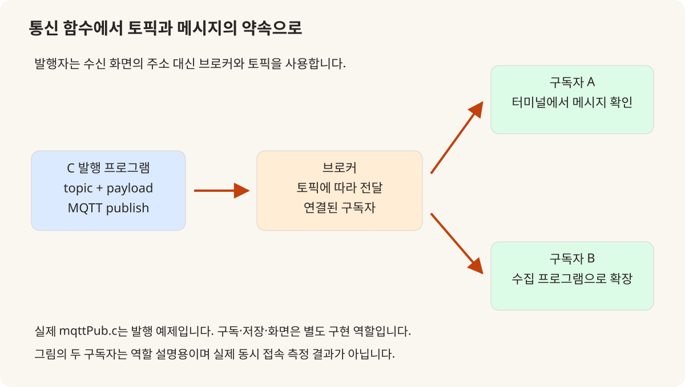
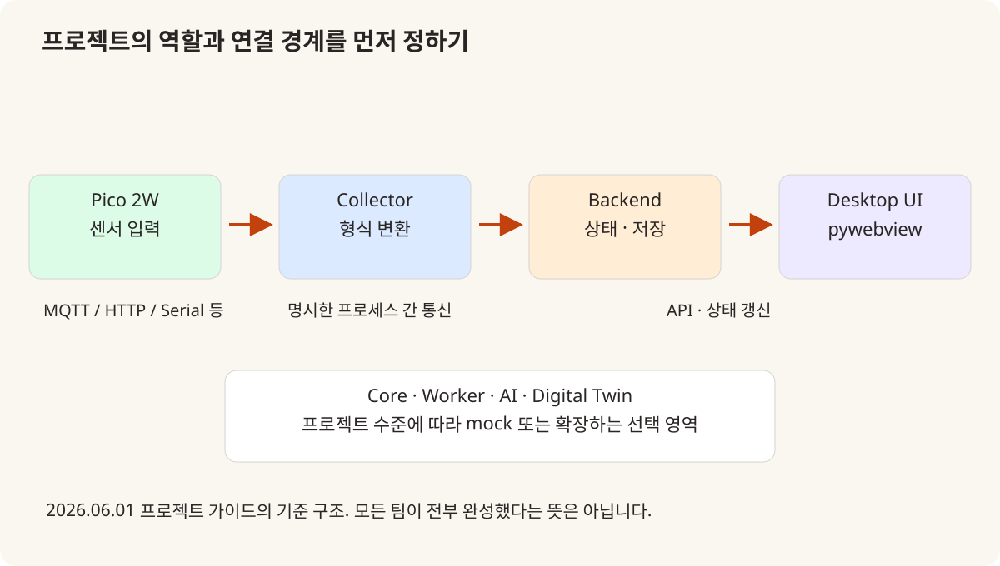
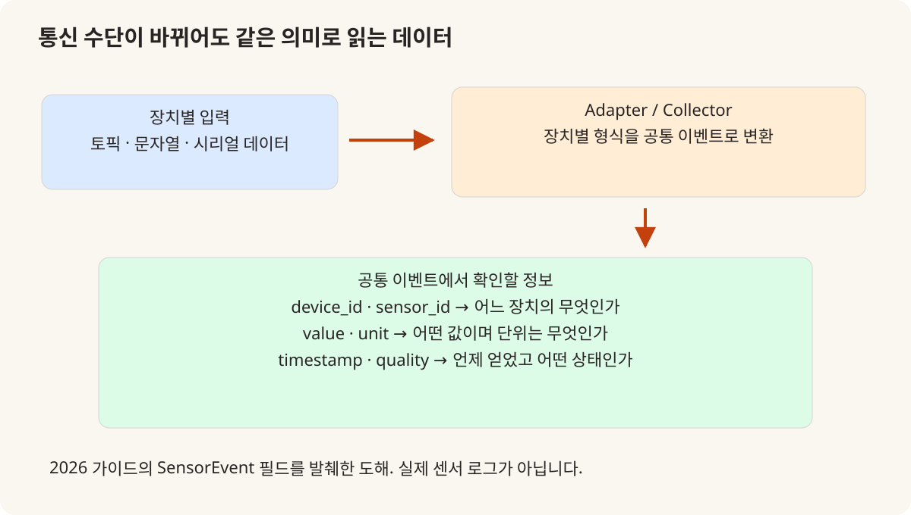

# 2026년의 변화: MQTT를 앞당기고 IoT 프로젝트의 연결 규칙을 명시하다

2026.03.19–06.01 · 수업 기록·프로젝트 가이드 비교

2025년에도 장치와 서버를 연결하고 여러 프로세스를 사용하는 프로젝트가 있었다. 2026년의 변화는 그 경험을 없던 기술의 도입처럼 다시 포장하는 데 있지 않다. MQTT를 C 기초 단계에 배치하고, Pico 2W와 pywebview를 프로젝트의 공통 구성으로 정하며, 데이터의 의미와 프로세스 경계를 가이드에 더 명시한 변화를 실제 자료로 비교한다.

## 2025년과 2026년 비교

| 항목 | 2025 | 2026 |
|---|---|---|
| 통신을 만나는 시점 | 2025.05.01 TCP/IP 수업 말미에 MQTT 등 여러 기술 소개 | 2026.03.19 C 수업에서 MQTT 설치·publisher 작성·CMake 링크 |
| 장치의 선택 | 2025년 프로젝트의 ATmega128·ESP8266·라즈베리파이 등 사례별 구성 | 2026년 2차 가이드는 Pico 2W를 중심 장치로 고정 |
| 프로세스 분리 | 2025년 2차 운영 기록에도 최소 3개 프로세스·ZeroMQ 등장 | Collector·Backend·UI의 경계와 연결 방법을 가이드에 명시 |
| 화면의 선택 | 사례별 Tkinter·Pygame·웹 화면 | pywebview 데스크톱 대시보드를 공통 조건으로 제시 |
| 새 기술 목록의 해석 | 당시 실제 기록·결과물별로 범위를 확인 | RAG·Digital Twin·추가 어댑터는 선택 확장이며 완료 성과와 구분 |

## 비교의 기준 | 2025년에 이미 있었던 통합을 먼저 인정하기

2025년 첫 프로젝트는 C·ATmega128·UART·MySQL을 연결했고, 두 번째 프로젝트는 여러 언어와 프로세스, TCP·ZeroMQ와 GUI를 다뤘다. 5월 23일 운영 요약에도 최소 세 프로세스와 IPC가 명시돼 있다. 따라서 프로세스를 나누거나 센서 값을 DB에 저장하는 방식 자체를 2026년의 신규 도입으로 설명하지 않는다. [1]

두 해 모두 개별 기술을 팀의 시스템으로 연결하는 과정이었다. 비교할 지점은 어떤 기술을 언제 만나게 했는지, 프로젝트마다 선택하던 부분 중 무엇을 공통 조건으로 정했는지, 서로 연결할 데이터에 어떤 약속을 적었는지다. 기능 이름의 증가보다 수업과 프로젝트 사이의 연결이 달라진 부분을 중심으로 살폈다.

2026년에는 날짜별 수업 기록, 실행 가능한 강사 예제, 6월 1일의 프로젝트 가이드가 서로 다른 종류의 근거다. 가이드에 등장한 모든 라이브러리가 실제 수업에서 구현됐거나 모든 팀이 사용했다는 뜻은 아니다. 아래 설명은 각각을 수업·예제·설계 조건으로 구분한다.

## 03.19 | C 기초 단계에서 MQTT 메시지를 보내 보기

2025년 TCP/IP 기록에서 MQTT는 5월 1일 Redis·HTTP·WebSocket 등과 함께 소개 목록에 등장한다. 반면 2026년 3월 19일에는 MQTT 설명과 설치, publisher 예제 작성, CMake 라이브러리 추가가 교시별로 적혀 있다. 통신을 접하는 시점을 앞당겼고, 소개 항목을 C 프로그램의 외부 라이브러리 사용과 연결한 변화다. [2][3]

network/mqttPub.c는 명령행 인자로 broker·client_id·topic·message를 받고 Paho C 클라이언트로 연결해 발행한다. 문자열 데이터를 만드는 C 코드와 다른 프로그램에 전달하는 동작이 만난다. 브로커 주소는 연결할 서버, client_id는 연결을 구분할 값, topic은 수신 대상을 분류할 경로이므로 서로 같은 의미로 설명하면 안 된다. [4]

이 예제의 확인 범위는 발행 쪽이다. 저장소 안내는 구독 예제 추가를 확장 과제로 제시한다. 코드의 “전송 완료” 출력만으로 수신 프로그램이나 DB·화면까지 확인했다고 말할 수 없고, 해당 단계는 따로 점검해야 한다. 실제 센서 장치나 브로커를 이번 글에서 재구동한 결과로 제시하지 않는다.

강사 발행 예제와 수업 안내에 근거한 직접 제작 도해. 구독자 두 개는 개념 설명이며 실제 부하 시험이 아닙니다. [4]

## 03.27 | Pico 2W는 리눅스 라즈베리파이와 다른 역할

3월 27일 ATmega128 진행 기록에는 서보·PIR 센서 뒤에 Pico 2W 보드 설명과 실습이 있다. 2025년 라즈베리파이 수업은 리눅스 실행 환경과 프로그램·장치 제어를 다뤘으므로, 이름에 Raspberry Pi가 들어간다는 이유로 같은 수업이라고 묶기 어렵다. 여기서는 2026년 가이드에서 Pico 2W가 맡는 센서 장치 역할을 기준으로 비교한다. [5][6]

6월 1일 가이드는 실제 또는 가상 센서 입력을 Pico 2W 중심으로 설계하도록 하고, 다른 보드는 보조 또는 확장 옵션으로 둔다. 프로젝트마다 출발 하드웨어가 크게 달라지는 대신 공통 입력 장치 축을 정한 셈이다. 다만 가이드는 MQTT·HTTP·UART 등 하나 이상의 연결을 허용하므로, 모든 팀의 모든 센서가 MQTT로 연결됐다고 표현하지 않는다. [7]

보드가 데이터를 보내는 것과 PC가 그 데이터를 저장·시각화하는 역할은 별개다. pywebview 데스크톱 화면이 Pico 2W 안에서 실행되는 것처럼 설명하지 않고, 장치와 수집 프로그램, 화면이 서로 어떤 정보를 주고받는지 구분한다. 이 구분이 다음 단계의 역할 분리와 연결된다.

## 06.01 가이드 | 프로세스의 수보다 책임과 접점을 명시하기

2차 프로젝트 가이드는 단일 프로세스로 모든 일을 처리하지 말고 collector·backend·ui의 역할을 분리하도록 명시한다. 기준 구조에서는 장치 어댑터와 수집 프로그램이 입력을 받아 백엔드로 넘기고, 화면은 API와 실시간 갱신 경로로 상태를 표시한다. C++·Python core와 worker 등은 프로젝트 수준에 따라 확장하는 영역이다. [7]

이 구성이 의미 있는 이유는 팀원이 다른 부분을 맡아도 접점이 보이기 때문이다. 수집 프로그램은 어떤 이벤트를 내보내는지, 백엔드는 어떤 상태를 저장하고 제공하는지, 화면은 무엇을 요청하고 표시하는지 설명할 수 있어야 한다. 프로세스 세 개를 실행했다는 숫자만으로 이 책임 분리가 자동으로 성립하는 것은 아니다.

2025년에도 여러 프로세스와 ZeroMQ가 있었으므로 새로운 개념의 최초 도입이라기보다, 통합 경험을 반복 가능한 기준 구조로 더 명확히 적었다는 차이가 있다. 가이드의 FastAPI·WebSocket은 권장 구조이고, 5월 28일 수업의 Flask·SSE와는 자료의 목적이 다르다는 점도 함께 남긴다.

2026-06-01 가이드의 필수 역할과 선택 확장을 재구성한 도해. 모든 팀의 구현 완료를 뜻하지 않습니다. [7]

## 데이터 계약 | 센서 값을 숫자 하나로 보내지 않기

가이드의 SensorEvent는 event_id·device_id·sensor_id·value·unit·timestamp·quality 같은 필드를 정의한다. 수신한 숫자만으로는 어느 장치에서 무엇을 언제 측정했는지 알기 어렵다. 값과 의미를 함께 전달하는 공통 형식이 있으면 장치별 통신 방식이 달라져도 백엔드와 화면이 해석할 기준을 유지할 수 있다. [7]

예를 들어 온도 26.4라는 숫자를 받더라도 단위와 센서 종류, 측정 시각이 빠지면 서로 다른 입력을 같은 칸에 표시할 수 있다. 도해는 이 필드들의 역할을 설명하기 위한 것이며 실제 교육생 장치 ID나 센서 로그를 옮긴 것이 아니다. 원본 가이드의 예시 값도 운영 중인 시설의 측정값으로 제시하지 않는다.

여기서 변화는 JSON이라는 형식을 처음 배웠다는 데 있지 않다. 프로젝트 시작 단계에 공통 이벤트의 필드와 의미를 맞추자는 기준이 명시됐다는 점이다. 데이터가 도착했는지 다음으로, 받은 데이터를 같은 뜻으로 해석하는지를 검토하도록 질문이 구체화됐다.

SensorEvent에서 장치·값·단위·시각·상태 필드를 발췌했습니다. 실제 식별값과 로그는 사용하지 않았습니다. [7]

## 문서와 점검 | 실행 순서와 실패 지점을 남기는 자료

2026년 저장소에는 온보딩 체크리스트, 문제 해결 가이드, 실습 제출 템플릿, 프로젝트 마일스톤과 평가 루브릭이 함께 있다. 루브릭은 기능·코드·연동 이해도뿐 아니라 문서화와 재현 가능성을 별도 항목으로 두고, 다른 사람이 저장소의 실행 순서를 따라갈 수 있는지를 확인하도록 한다. 이는 해당 기준 문서의 내용이며 교육생 평가 점수는 공개하지 않는다. [8]

MQTT 예제 안내도 빌드에 필요한 라이브러리와 broker·topic을 구분하고, 전송 실패를 네트워크 문제와 라이브러리 문제로 나누어 보도록 안내한다. 실제 장치 프로젝트에서는 전원·배선·빌드·메시지·저장·표시가 각각 다른 실패 지점이 된다. 이런 문서를 기능 소개 옆에 둔 것은 작동하는 결과와 그 결과를 설명·재현하는 절차를 함께 준비한 변화로 읽을 수 있다.

2025년에도 Jira와 문서·발표가 있었으므로 문서화가 처음 시작됐다고 말하지 않는다. 2026년 자료에서 확인되는 차이는 수업 예제부터 프로젝트 제출과 점검까지 연결하는 보조 문서가 더 명시적으로 정리돼 있다는 것이다. 문서가 존재한다는 사실만으로 모든 팀이 동일하게 적용했다는 결론도 내리지 않는다.

## 변화의 범위 | 핵심 구조와 선택 확장을 나누기

가이드에는 RAG, 운영 assistant, Digital Twin, Modbus·Matter 등의 확장 아이디어도 등장한다. 그러나 필수 장치·화면·역할 분리와 이런 선택 영역은 구분돼 있다. 목차에 기술 이름이 있다는 이유만으로 모두 강의하거나 구축한 성과로 소개하면 실제 과정의 범위를 벗어난다. [7]

C·C++ 문법, ATmega128의 기본 입출력, SQL과 OpenCV의 주요 기초는 두 해 사이에 겹치는 부분이 많다. pywebview·SSE와 MQTT의 앞당겨진 실습, Pico 2W 중심 프로젝트 조건처럼 근거가 뚜렷한 변화는 별도 글로 다루고, 반복되는 과목은 2025년의 상세 기록과 2026년 전체 개요를 연결해 읽도록 했다.

이 글의 결론은 2026년 과정이 모든 면에서 더 새롭다는 평가가 아니다. 센서에서 화면까지의 통합을 더 이른 시점부터 연습하고, 장치·상태·프로세스·문서의 약속을 구체적으로 적었다는 변화다. 실제 팀별 적용 결과는 이미 공개한 2026년 중간 프로젝트 기록에서 확인할 수 있으며, 직접 지도하지 않은 최종 프로젝트까지 이 글에 포함하지 않는다.

## 참조 자료

- [1] [2025년 2차 프로젝트 기록](ku-project-2-2025.html): 내부 2025-05-23 운영 기록과 팀 문서의 차이를 대조한 공개 글.
- [2] [2025년 TCP/IP 진행 기록](https://github.com/freshmea/kuBig2025/blob/856a133a87d232a8ec714687139644f01f0a6cb9/doc/tcpip.md): 5월 1일 마지막 교시의 MQTT 등 소개 목록.
- [3] [2026년 C 진행 기록](https://github.com/freshmea/kuBig2026/blob/09a06e6c945d4ecc62b783ddab5b7c4e729f3f93/doc/c_programming.md): 3월 19일 MQTT 설치·발행 예제·라이브러리 링크.
- [4] [2026년 MQTT 발행 코드](https://github.com/freshmea/kuBig2026/blob/09a06e6c945d4ecc62b783ddab5b7c4e729f3f93/network/mqttPub.c): 실제 명령행 인자와 Paho publish. 같은 폴더 README는 구독을 확장 과제로 구분.
- [5] [2026년 ATmega128 진행 기록](https://github.com/freshmea/kuBig2026/blob/09a06e6c945d4ecc62b783ddab5b7c4e729f3f93/doc/atmega128.md): 3월 27일 Pico 2W 설명·실습.
- [6] [2025년 라즈베리파이 진행 기록](https://github.com/freshmea/kuBig2025/blob/856a133a87d232a8ec714687139644f01f0a6cb9/doc/raspberry_pi.md): 리눅스 기반 실습의 비교 기준.
- [7] [2026-06-01 2차 프로젝트 가이드](https://github.com/freshmea/kuBig2026/blob/09a06e6c945d4ecc62b783ddab5b7c4e729f3f93/doc/2nd_project.md): 필수 구성·역할 분리·SensorEvent·선택 확장. 완료 보고서와 구분.
- [8] [2026년 프로젝트 평가 루브릭](https://github.com/freshmea/kuBig2026/blob/09a06e6c945d4ecc62b783ddab5b7c4e729f3f93/doc/프로젝트_평가_루브릭.md): 실행 문서·설계 이유·연동 이해도의 기준. 개인별 평가 결과는 제외.
