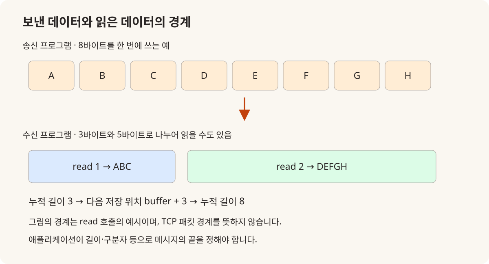
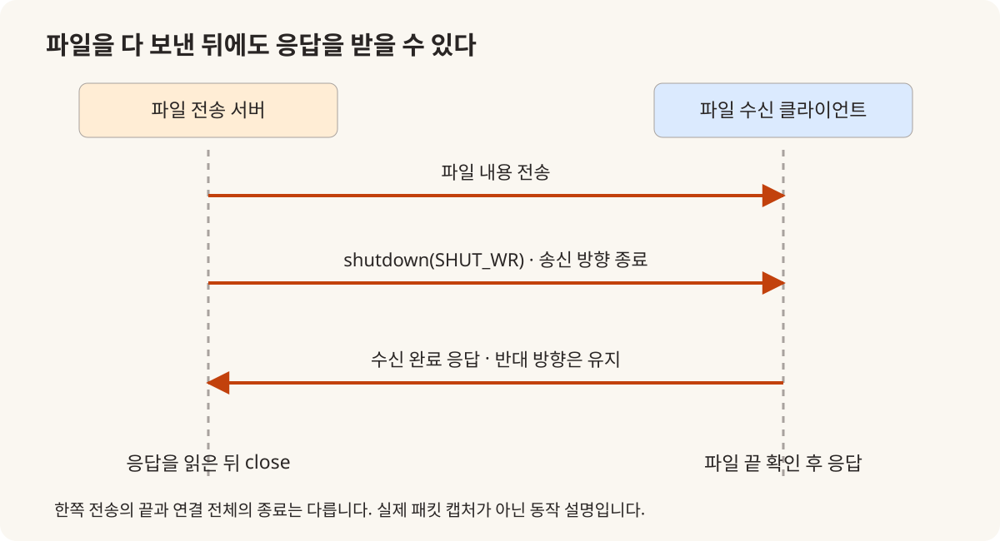
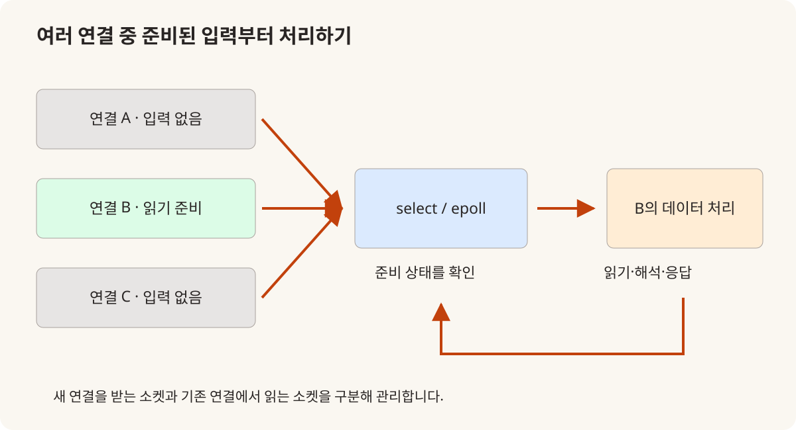
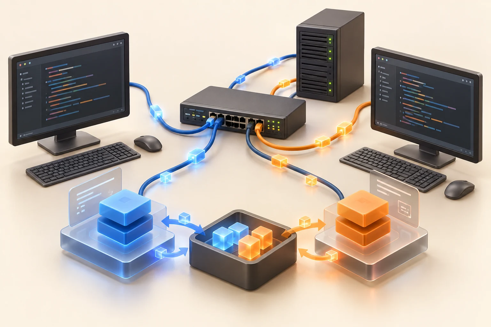

# TCP/IP, 데이터를 보내는 코드에서 여러 연결을 다루는 서버까지

2025.04.28–05.02 · 고려대학교 세종캠퍼스 · 수업 기록이 있는 5일

C++ 후반 과목에서 자료구조와 여러 작업의 실행을 다룬 뒤, 다음 수업에서는 프로그램과 프로그램 사이로 시선을 옮겼다. 같은 컴퓨터 안의 프로세스가 정보를 주고받는 IPC에서 시작해 TCP·UDP, 여러 접속을 처리하는 서버까지 확장했다. 3월부터 7월 15일까지 이어진 장기 개발자 과정에서, 앞서 배운 데이터 처리와 장치 제어를 통신으로 연결하는 단계였다.

## 04.28 | 같은 컴퓨터 안에서 데이터를 주고받기

첫날은 네트워크 함수 목록보다 IPC의 의미를 먼저 살폈다. 공유메모리를 만들고 여러 프로세스가 같은 데이터를 다루는 예제를 작성한 뒤, 세마포어를 적용하는 경우와 적용하지 않은 문제 상황을 비교했다. C++ 과목에서 다룬 공유 자원의 접근 문제를 프로세스 사이의 문제로 다시 만난 셈이다. [1]

이후 pipe와 이름 있는 파이프인 FIFO, 메시지 큐를 차례로 작성했다. 각각을 별도 실습으로 다루며 데이터를 어디에 두고, 누가 읽고 쓰며, 두 프로그램이 어떤 약속으로 만나는지 확인하는 구성이었다. 공유메모리와 메시지 전달 방식을 한 가지 방법처럼 설명하지 않고, 통신 수단마다 프로그램의 연결 방식이 달라진다는 점에 초점을 맞췄다.

오후에는 TCP 서버와 클라이언트를 작성했다. Ninja 설정과 ss -tulpn 명령도 기록에 남아 있다. 코드가 빌드되는지뿐 아니라 프로세스가 어떤 포트에서 대기하는지 확인하면서, 프로그램 내부의 흐름과 운영체제에서 보이는 연결 상태를 함께 읽는 연습으로 이어졌다. 공유메모리·세마포어 예제는 당시 수업 구조를 확인하는 참조로 연결했다. [2]

### 공유하는 값과 접근 순서를 함께 설계하기

공유메모리는 데이터를 두 프로세스가 함께 볼 수 있게 하지만, 계산 순서까지 보장해 주지는 않는다. 예를 들어 같은 값을 읽은 두 작업이 각각 1을 더하고 저장하면 두 번의 증가가 한 번으로 남을 수 있다. 세마포어 예제를 읽을 때는 공유 영역을 얻는 코드와 그 영역을 수정하는 임계 구역을 따로 표시해 보는 것이 좋다. 수업에서 세마포어가 있는 예와 없는 예를 함께 다룬 이유를 이 차이로 설명할 수 있다.

pipe·FIFO·메시지 큐에서는 데이터를 공유 위치에 직접 쓰는 대신 전달하는 경로가 전면에 나온다. 읽는 쪽이 아직 준비되지 않았을 때 무엇을 기다리는지, 어느 프로세스가 끝났을 때 자원을 정리하는지가 달라진다. 첫날의 흐름은 통신 API 암기보다 데이터의 위치, 대기 조건, 자원 수명이라는 세 가지 기준을 만들어 가는 과정으로 읽힌다.

## 04.29 | 에코 프로그램으로 송신과 수신의 차이를 확인하기

둘째 날에는 주소 변환 함수 inet_addr·inet_pton·inet_ntoa를 살펴보고 에코 서버와 클라이언트를 작성했다. 보낸 문자열이 돌아오는 단순한 프로그램이지만, 서버 주소와 포트, 연결 요청, 읽기와 쓰기라는 통신의 기본 순서가 모두 들어 있다. 처음 작성한 두 프로그램을 서로 맞물려 실행하면서 송신 측과 수신 측의 역할을 구분했다. [1]

이날 기록에서 중요한 부분은 수신한 메시지의 전체 길이를 다루도록 코드를 수정한 시간이다. TCP는 바이트 스트림이므로 한 번 보낸 데이터가 한 번의 읽기로 모두 도착한다고 가정할 수 없다. 따라서 단순히 출력이 나오는지를 넘어, 어느 만큼 읽었고 어느 만큼 더 기다려야 하는지를 프로그램 상태로 표현하는 문제가 등장했다.

계산 요청을 보내는 op_server·op_client 실습과 UDP 에코 예제도 이어졌다. TCP와 UDP를 기능 목록으로 비교하는 데서 그치지 않고, 요청과 응답을 구성하고 메시지 경계를 관찰하는 예제로 연결했다. 다만 연결한 echo_client.c에는 수신 길이 변수의 초기화 등 점검할 부분이 남아 있어, 완성된 통신 라이브러리로 소개하지 않는다. 당시의 학습 의도와 코드 검토 지점을 함께 읽는 자료다. [3]

### 에코 예제로 읽는 수신 루프의 상태

아래 8바이트 그림은 TCP의 특성을 설명하기 위한 가상 입력이다. 첫 읽기에서 ABC만 얻었다면 다음 읽기는 버퍼의 네 번째 위치부터 이어 받아야 한다. 필요한 길이에 도달하기 전에 문자열을 출력하면 내용이 잘리거나 아직 채우지 않은 영역을 읽을 수 있다. 한편 반환값 0은 상대의 정상적인 송신 종료이므로, 더 읽으면 채워질 것이라 생각하고 계속 반복해서는 안 된다.

당시 echo_client.c를 보면 recv_len을 누적하는 의도는 드러나지만 요청마다 0으로 초기화하는 부분과 버퍼의 누적 위치를 지정하는 부분이 빠져 있다. 원본을 완성 코드로 복사하기보다 “기대 길이·누적 길이·이번에 읽은 길이”를 서로 다른 상태로 추적하면 4월 29일 수신 길이 수정 수업의 쟁점이 구체적으로 보인다. 이 글에서는 원본을 고쳐 당시 결과인 것처럼 제시하지 않고 해당 검토 지점을 설명한다.

8바이트를 3+5바이트로 읽는 가상 예시입니다. read 호출의 경계와 메시지 경계가 다를 수 있으므로 누적 길이와 다음 저장 위치를 관리합니다. [근거 자료](https://github.com/freshmea/kuBig2025/blob/856a133a87d232a8ec714687139644f01f0a6cb9/network/tcp_udp/echo_client.c)

## 04.30 | 파일 전송의 종료와 프로세스의 종료를 다루기

셋째 날은 파일 전송 서버와 클라이언트에서 half-close를 다루는 것으로 시작했다. 데이터를 다 보낸 시점과 연결 전체를 닫는 시점을 구분하는 과정이었다. 파일처럼 여러 번에 나누어 전송할 수 있는 대상을 다루면, 내용뿐 아니라 끝을 알리는 방식도 프로그램의 약속에 포함된다. [1][4]

이어 소켓 내부 정보와 버퍼 크기를 확인하고 DNS, gethostbyname·getaddrinfo를 살펴봤다. 입력받은 주소 문자열이 실제 접속 대상으로 이어지는 과정을 넓혀 보는 시간이었다. 날짜별 기록에는 소켓 옵션을 확인하는 info.c도 남아 있어, 화면에 보이는 결과와 내부 설정을 함께 조사하는 흐름을 확인할 수 있다.

오후에는 fork로 만든 자식 프로세스와 좀비 프로세스, wait·waitpid, signal·sigaction을 다뤘다. 여러 클라이언트를 처리하는 echo_mpserver.c와 echo_mpclient.c를 작성하면서, 접속을 받아들이는 것과 종료된 작업을 정리하는 것이 모두 서버의 책임임을 살폈다. 통신 수업이 운영체제에서 배운 프로세스 관리와 연결되는 지점이다.

### 파일 끝을 알린 뒤 확인 응답을 받는 순서

file_server.c의 흐름은 fread로 파일 일부를 읽고 write로 보내는 반복, shutdown(SHUT_WR), 클라이언트 응답 읽기, 자원 정리로 이어진다. SHUT_WR은 이 소켓에서 더 보낼 데이터가 없음을 알리면서 수신 방향을 남겨 둔다. 데이터를 보내자마자 close로 모든 방향을 끝내는 것과 구별해야 하는 이유다.

같은 날 이어진 fork·waitpid·sigaction은 연결의 수명에서 프로세스의 수명으로 관심을 넓힌다. 자식 프로세스가 작업을 마친 것과 부모가 종료 상태를 회수한 것은 별개의 단계다. 네트워크 프로그램을 읽을 때 연결·파일·프로세스 각각의 생성과 종료를 짝지어 보면 정상 출력 뒤에 남는 자원을 찾는 데 도움이 된다.

file_server.c의 SHUT_WR 뒤에 read가 이어지는 의도를 그렸습니다. 실제 패킷 캡처가 아닌 코드 흐름 설명입니다. [근거 자료](https://github.com/freshmea/kuBig2025/blob/856a133a87d232a8ec714687139644f01f0a6cb9/network/tcp_udp/file_server.c)

## 05.01 | 여러 입력을 기다리는 구조로 바꾸기

5월 1일에는 전날 시작한 select 기반 파이프 예제를 디버깅하고 배열과 함수로 정리했다. 이후 select를 사용하는 에코 서버와 클라이언트를 작성했다. 여러 입력을 다루는 문제를 각각의 작업을 늘리는 방법뿐 아니라, 준비된 입출력을 확인하는 구조로도 접근한 것이다. [1]

send·recv, readv·writev를 소개하고 소켓을 표준 입출력과 연결하는 fileno·fdopen, 버퍼와 fflush도 살폈다. 같은 연결을 다루더라도 사용하는 입출력 계층에 따라 출력이 전달되는 시점과 확인해야 할 상태가 달라진다. 수업의 범위는 소켓 생성에서 데이터가 실제로 전달되는 과정의 관찰로 확장됐다.

멀티캐스트와 브로드캐스트 실습에서는 일부 환경에서 수신되지 않는 상황이 기록돼 있다. 당시 메모는 방화벽을 가능성으로 적었지만 원인이 확정됐다는 자료는 없다. 그래서 이 글에서도 방화벽 문제를 해결했다고 단정하지 않는다. 네트워크 실습에서는 동일한 코드 외에 각 실행 환경을 함께 점검해야 했다는 운영 기록으로 남긴다.

### 화면 출력과 전송 완료를 혼동하지 않기

표준 입출력의 버퍼와 소켓의 버퍼는 서로 다른 층이다. fdopen으로 소켓을 FILE 스트림처럼 다룰 때 fprintf를 호출했다고 즉시 상대가 읽는다고 단정할 수 없다. fflush를 확인하는 수업은 “내 코드가 출력했다”와 “상대에게 전달될 데이터가 하위 계층으로 내려갔다”를 구분하는 계기가 된다.

운영 기록에서 일부 멀티캐스트 수신이 되지 않았다는 대목도 같은 관점으로 읽을 수 있다. 실행 여부, 바인딩 주소·포트, 참여할 네트워크 인터페이스, 수신 대기 상태를 각각 확인해야 한다. 당시 기록이 원인을 확정하지 않았으므로 해결 성공담으로 바꾸지 않되, 프로그램 바깥의 조건도 실습에 영향을 준 실제 사례로 남길 가치가 있다.

## 05.01–05.02 | epoll과 스레드로 접속 처리 방식을 비교하기

1일 후반에는 epoll을 설명하고 파이프 서버 예제를 작성했다. 다음 날 첫 시간에는 에코 서버의 파일 디스크립터 설정 오류를 디버깅했다. 이벤트를 등록하는 대상과 실제로 데이터를 읽을 대상을 구별하는 일이 코드 한 줄의 수정으로 끝나지 않고 서버 흐름의 이해와 연결됐다. [1][5]

5월 2일에는 스레드 기본 예제에서 채팅 서버로 넘어갔다. 멀티스레드 에코 서버와 클라이언트를 작성하고 서버에 구조체를 추가하는 수정도 진행했다. 여러 연결의 정보를 어떤 자료구조에 담고, 각 실행 흐름에 어떤 값을 전달하며, 공유 목록을 언제 보호할지 살펴볼 수 있는 구성이다. [6]

저장소의 서버 예제는 교육 당시 작성한 코드다. 이를 현재의 운영 서버에 바로 적용 가능한 완성품이나 성능 검증 결과로 제시하지 않는다. 수업 기록에는 디버깅 과정도 포함돼 있으며, 코드에는 초기화·경계 검사·스레드 인자 수명처럼 추가 검토할 부분이 있다. 이 포스트의 목적은 그 과정을 포함한 학습 흐름을 설명하는 데 있다.

### 이벤트 루프와 스레드에서 달라지는 관리 단위

select·epoll 방식에서는 여러 연결의 준비 상태를 모아 보고, 읽을 수 있는 연결에 대해 일을 수행한다. 아래 그림의 B는 데이터가 준비된 연결의 예일 뿐 우선순위가 높은 고객을 뜻하지 않는다. 새 접속을 받는 서버 소켓의 이벤트인지 이미 연결된 클라이언트 소켓의 이벤트인지 구분하는 것이 처리의 출발점이다.

스레드 채팅 서버로 바뀌면 연결 정보를 다른 실행 흐름에 넘기는 방식이 중요해진다. 반복문 안의 같은 변수 주소를 여러 스레드에 전달하면 수신 시점에 값이 바뀔 수 있다. 연결마다 고유한 상태를 마련하는 문제와 여러 연결이 공유하는 목록을 보호하는 문제를 나누어 읽으면, 마지막 날 구조체를 추가한 기록이 단순한 문법 연습을 넘어선다는 점이 드러난다.

연결마다 스레드를 만드는 구조와 구별해 읽을 입출력 준비 상태 확인의 예입니다. 성능 비교 결과는 아닙니다. [근거 자료](https://github.com/freshmea/kuBig2025/blob/856a133a87d232a8ec714687139644f01f0a6cb9/network/multiProcess/echo_epollserv.c)

## 수업의 범위 | 구현한 기술과 소개한 기술을 구분하기

5월 1일 마지막 시간에는 Redis·MQTT·HTTP·WebSocket·gRPC 등 여러 통신 기술을 함께 정리했다. 그러나 이름이 수업 기록에 등장한다는 이유만으로 모든 기술을 별도 서비스로 구현하거나 배포했다고 볼 수는 없다. 이 글의 중심은 실제 작성 기록이 있는 IPC, TCP·UDP 소켓, select·epoll, 프로세스·스레드 예제에 둔다. [1]

마지막 날에는 2차 프로젝트와 최종 프로젝트의 팀 구성, 평가가 기록돼 있다. 이후 프로젝트에서는 어떤 데이터를 보내고 어떻게 해석할지 팀이 설계해야 한다. 이번 5일의 실습은 그 설계를 위해 통신 경로, 연결 상태, 작업 종료, 공유 데이터의 관리라는 질문을 경험하는 단계였다.

과정 감독 관점에서도 코드의 정답만 확인하기 어려운 과목이었다. 같은 소스라도 접속 주소·포트·프로세스 상태·실행 환경에 따라 결과가 달라질 수 있었기 때문이다. 개인별 평가나 교육생 계정을 공개하지 않고, 당시 기록에 남은 구현과 점검의 흐름을 중심으로 정리했다.

## 참조 자료

- [1] [날짜별 TCP/IP 수업 기록](https://github.com/freshmea/kuBig2025/blob/856a133a87d232a8ec714687139644f01f0a6cb9/doc/tcpip.md): 5일의 진행 내용과 디버깅·평가 기록.
- [2] [공유메모리와 세마포어](https://github.com/freshmea/kuBig2025/blob/856a133a87d232a8ec714687139644f01f0a6cb9/network/ipc/shm_semaphore.c): 프로세스 간 데이터 공유를 다룬 강사 예제.
- [3] [TCP 에코 클라이언트](https://github.com/freshmea/kuBig2025/blob/856a133a87d232a8ec714687139644f01f0a6cb9/network/tcp_udp/echo_client.c): 읽기 길이를 다루는 수업 코드. 변수 초기화 등 추가 검토가 필요합니다.
- [4] [파일 전송 서버](https://github.com/freshmea/kuBig2025/blob/856a133a87d232a8ec714687139644f01f0a6cb9/network/tcp_udp/file_server.c): 파일 전송과 연결 종료를 다룬 예제.
- [5] [epoll 에코 서버](https://github.com/freshmea/kuBig2025/blob/856a133a87d232a8ec714687139644f01f0a6cb9/network/multiProcess/echo_epollserv.c): 이벤트 등록과 접속 처리를 살펴보는 코드.
- [6] [스레드 채팅 서버](https://github.com/freshmea/kuBig2025/blob/856a133a87d232a8ec714687139644f01f0a6cb9/network/multiProcess/chat_serv.c): 여러 연결과 공유 상태를 다룬 실습 코드.

공개 참조는 강사 저장소의 동일한 리비전(856a133)에 고정했습니다. 내부 대조 자료: TCP/IP 네트워크 프로그래밍 강의계획서(2025.04.28). 5월 1일 수신 문제의 원인은 기록에서 확정되지 않았습니다. 마지막 날 일부 교시의 빈 기록을 별도 수업 내용으로 채우지 않았습니다.

교육생 이름·계정·얼굴·연락처·개인별 평가 및 제출물 링크는 수록하지 않았습니다. 강사 코드는 당시 실습의 참고 자료이며, 새로 실행하거나 성능·안정성을 검증한 결과가 아닙니다. 대표 이미지는 AI 생성이며 본문 그림의 출처·재현 여부는 각각의 캡션에 표시했습니다.

## 시각자료

- [프로그램 사이로 데이터를 보내기](../../assets/img/projects/ku-network-2025/ku-network-2025-01.svg) — 각 방식의 구현 범위는 날짜별 수업 기록을 기준으로 구분합니다.
- [보낸 횟수와 읽는 횟수는 다를 수 있다](../../assets/img/projects/ku-network-2025/ku-network-2025-02.svg) — 8바이트와 수신 분할은 설명용 예시이며 실제 패킷 측정값이 아닙니다.
- [여러 연결을 처리하는 세 가지 관점](../../assets/img/projects/ku-network-2025/ku-network-2025-03.svg) — 성능 순위가 아닌 수업에서 비교한 처리 구조를 나타냅니다.
- [통신 프로그램을 점검하는 순서](../../assets/img/projects/ku-network-2025/ku-network-2025-04.svg) — 실제 수업에서 수신 불일치와 fd 설정을 점검한 흐름을 재구성했습니다.

## 대표 이미지와 보완 기록

AI 생성 일러스트. 실제 수업 사진이 아닙니다. 이미지 출처·프롬프트·재현 방법은 [보완 명세](ku-course-image-manifest-2025.md)를 참조하세요.
