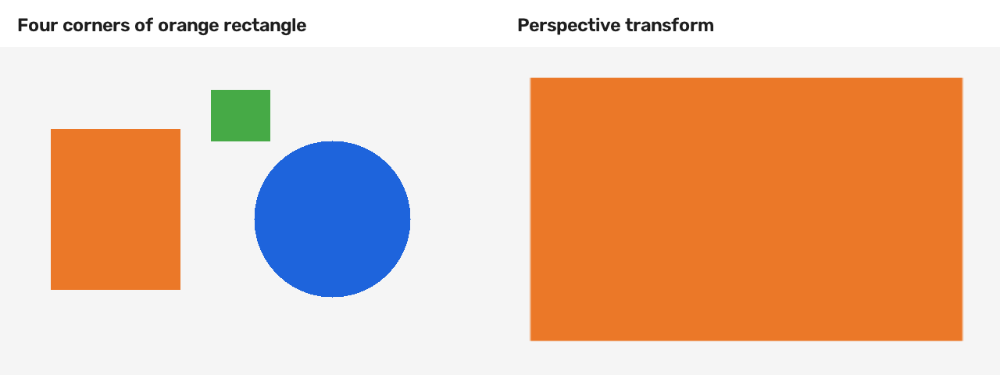
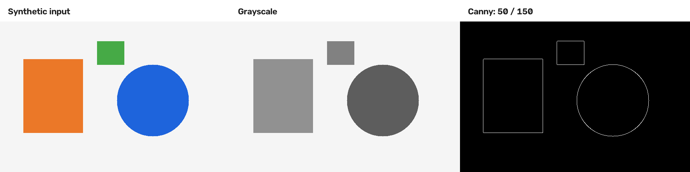
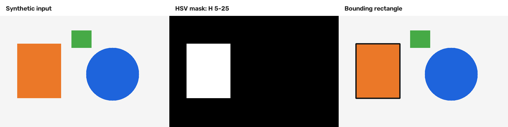
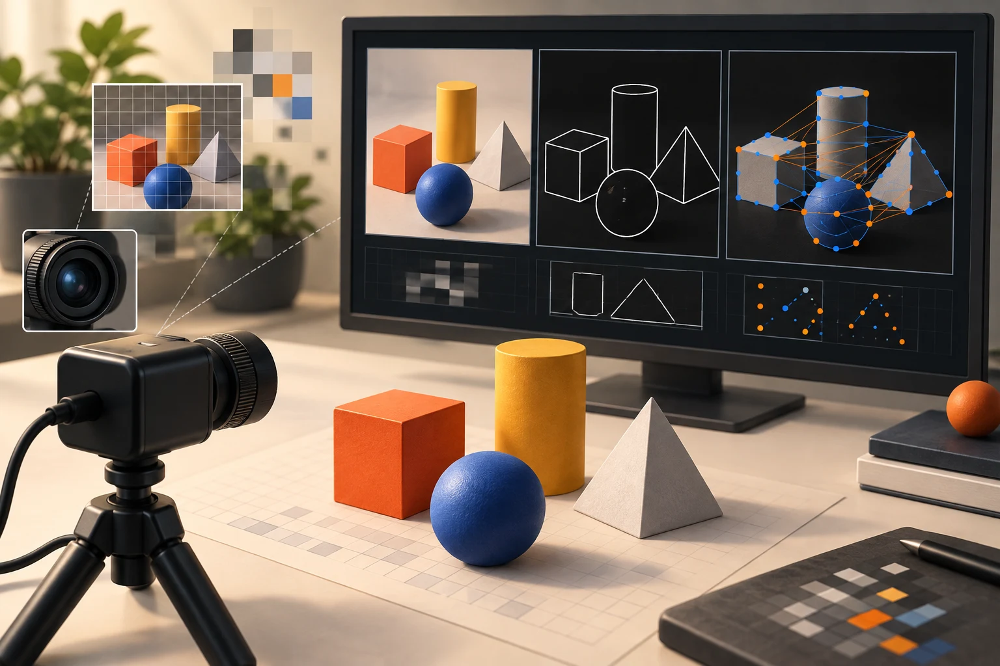

# OpenCV, 한 장의 이미지에서 카메라 속 특징을 찾기까지

2025.05.27–06.02 · 고려대학교 세종캠퍼스 · 수업 기록이 있는 5일

OpenCV 과목은 C++로 다뤄 온 자료구조와 실행 흐름을 이미지에 적용하는 시간이었다. 파일을 열어 화면에 보여 주는 첫 프로그램에서 시작해 픽셀 값과 필터, 좌표 변환, 색상과 윤곽, 특징점 매칭까지 이어졌다. 장기 과정의 앞부분에서 배운 언어와 장치 입출력이 카메라 프레임이라는 새로운 데이터에서 만났다.

## 05.27 | 이미지를 배열과 타입으로 이해하기

첫날에는 OpenCV의 활용 분야와 환경 설정을 소개한 뒤 빛, 샘플링, 양자화와 이미지 입출력을 다뤘다. imread·imshow·namedWindow·waitKey를 사용하고, 이미지를 읽는 옵션과 JPEG 저장 옵션을 살폈다. 파일이 열렸다는 결과에 더해 어떤 형식과 채널로 읽었는지가 이후 처리에 영향을 준다는 점을 확인하는 단계였다. [1]

Point·Size·Rect·Scalar와 InputArray·OutputArray를 거쳐 Mat의 생성과 속성, at·ptr을 통한 데이터 접근, 복사와 할당을 다뤘다. 이미지의 rows·cols·channels·type을 읽는 것은 화면의 내용을 수치 데이터의 구조로 설명하는 출발점이다. Mat 연산 예제는 픽셀 자료와 C++ 객체의 연결을 확인할 수 있는 참조로 남아 있다. [2]

마지막에는 VideoCapture와 VideoWriter로 동영상 재생·저장을 살폈다. 한 장의 이미지를 다루는 코드가 반복되는 프레임 처리로 확장되는 지점이다. 정지 이미지에서 가능했던 작업도 영상에서는 읽기, 처리, 표시, 종료 조건을 반복 흐름 안에 배치해야 했다.

### 사진을 배열로 읽는 첫 단계

Mat의 rows·cols·channels·type을 살피는 일은 영상처리 전체의 출발점이다. 화면에는 같은 크기로 보여도 채널 수나 원소 타입이 다르면 연산 방식과 필요한 메모리가 달라진다. ROI로 일부 영역을 선택하거나 복사본을 만들 때도 픽셀 저장 공간을 공유하는지 새로 만드는지 확인해야 한다.

이전 C++ 과정의 객체·복사 개념이 실제 이미지에서 드러나는 지점이다. 단순 할당과 clone처럼 별도 픽셀 저장 공간을 만드는 동작을 구분하면, 한 영상을 고쳤는데 다른 변수로 표시한 화면까지 바뀌는 상황을 해석할 수 있다. 입출력 함수만 익히는 첫날이 아니라 데이터를 담는 구조를 이해하는 첫날이었다.

## 05.28 | 화면에서 조작하고 결과를 확인하기

둘째 날에는 영상 읽기 오류 처리와 release, 저장 코덱을 살펴본 뒤 선·원·사각형·타원을 그렸다. putText와 FreeType을 이용한 한글 출력 래퍼도 작성했다. 수업은 이미지를 입력받는 단계에서, 처리한 정보를 영상 위에 표시하는 단계로 나아갔다. [1]

마우스 콜백과 트랙바를 연결하면서 사람이 화면을 조작하면 처리 결과가 바뀌는 구조를 실습했다. 마우스로 선을 그리고 필터 값을 조절하는 예제는 입력 이벤트와 프레임 처리의 관계를 살펴보기에 적합하다. 이후 임계값을 바꿔 가며 결과를 비교하는 실습에도 이 도구를 다시 사용했다.

FileStorage로 XML·YAML 파일을 저장하고 웹캠을 설정한 뒤 카메라 영상 위에 사각형을 그렸다. 입력 장치, 프로그램의 상태, 표시 결과를 한 화면에서 확인하는 흐름이다. 웹캠 영상이나 얼굴 사진은 이 포스트에 옮기지 않고, 익명화가 필요한 장면 대신 수업 구조를 재구성한 도해를 사용했다.

### 마우스와 트랙바가 실험 도구가 되는 이유

마우스 콜백은 화면 좌표와 이벤트를 코드로 가져오고, 트랙바는 처리 파라미터를 실행 중 바꿀 수 있게 한다. 값을 바꿀 때마다 다시 컴파일하는 대신 같은 장면에서 결과의 변화를 비교할 수 있다. 5월 28일의 그리기와 UI 입력 수업이 이후 Canny 임계값 조절로 이어지는 연결이다.

FileStorage로 설정을 저장하는 내용도 재현과 관련된다. 필터의 값, 선택한 영역, 입력 파일 같은 조건을 남겨야 다른 실행에서 비슷한 결과를 비교할 수 있다. VideoCapture로 읽은 프레임이 비었는지 확인하고 종료할 때 자원을 해제하는 일은 이 실험을 반복 가능한 프로그램으로 만드는 기본 조건이다.

## 05.29 오전 | 밝기·대비·시간을 수치로 관찰하기

마스크 연산을 복습하고 TickMeter를 이용해 처리 시간을 다뤘다. 같은 처리를 적용해도 프레임마다 어느 정도 시간이 필요한지 관찰하는 맥락이다. 이 글에는 실제 측정 로그가 없으므로 특정 FPS나 실시간 성능 수치를 제시하지 않는다. [1]

밝기와 대비 조절, 히스토그램 스트레칭과 평활화, 히스토그램 그래프 작성이 이어졌다. 영상을 더 밝게 보이게 하는 조작을 단순한 화면 효과로 보지 않고 값의 분포가 어떻게 바뀌는지 살펴보는 단계였다. 픽셀 값의 범위와 자료형에 따른 결과도 함께 고려해야 했다.

이 흐름은 뒤의 이진화와 색상 추출로 이어진다. 같은 임계값을 사용해도 조명과 입력 영상의 분포가 달라지면 결과가 달라질 수 있기 때문이다. 밝기 조절과 히스토그램은 결과를 꾸미는 기능뿐 아니라 후속 처리의 입력 조건을 이해하는 도구였다.

### 변환 전후에 무엇이 보존되는지 비교하기

밝기·대비 조절은 픽셀 값의 분포를 바꾸고, 블러와 미디언 필터는 이웃 픽셀을 사용해 결과를 만든다. 경계가 부드러워지는 효과와 작은 잡음이 사라지는 효과를 같은 말로 설명하지 않고, 원본에서 어떤 정보를 유지하려는지 먼저 정해야 한다. tickMeter는 이 처리 구간의 시간을 관찰하는 도구로 연결된다.

원근 변환 비교 그림은 이번에 만든 도형 영상의 주황색 사각형 네 꼭짓점을 새로운 좌표에 대응시킨 결과다. 화면의 한 부분이 확대되는 모습으로 좌표 변환을 확인할 수 있다. 실제 5월 29일 카메라 실습의 성과 사진은 아니지만, warpPerspective가 내용을 새로 인식하는 함수가 아니라 좌표 대응에 따라 영상을 다시 배치하는 함수라는 점을 보여 준다.

새로 그린 도형 입력에 getPerspectiveTransform·warpPerspective를 적용한 편집용 재현입니다. 수업의 카메라 장면이나 교육생 결과가 아닙니다. [근거 자료](https://github.com/freshmea/kuBig2025/blob/856a133a87d232a8ec714687139644f01f0a6cb9/opencv/part4/30_perspective.cpp)

## 05.29 오후 | 필터와 좌표 변환을 구분하기

오후에는 convolution의 원리와 filter2D, blur·GaussianBlur를 다뤘다. bilateralFilter와 medianBlur도 이어졌다. 이름이 서로 다른 필터를 차례로 실행하는 데서 끝내지 않고, 주변 픽셀의 정보를 이용해 어떤 결과를 만드는지 비교하는 흐름으로 구성됐다. [1][3]

같은 날 affineTransform·warpAffine, perspectiveTransform·warpPerspective를 이용한 카메라 예제도 작성했다. 필터가 값의 관계를 다루는 작업이라면 좌표 변환은 영상의 위치와 형태를 다시 대응시키는 작업이다. 두 종류의 처리를 구분하면 결과가 달라졌을 때 어느 단계의 설정을 확인해야 하는지도 나누어 볼 수 있다.

강사 예제에는 실습 당시의 파일 경로와 장치 설정이 들어 있다. 따라서 자료를 현재 환경에서 실행하려면 경로·입력 파일·카메라를 다시 설정해야 한다. 이 글은 예제를 현재 장치에서 재실행한 결과가 아니라 당시 교육 범위를 설명한다.

### Canny 결과와 색상 마스크는 다른 질문의 답

첫 비교는 같은 입력을 회색조로 바꾸고 임계값 50·150으로 Canny를 적용했다. 내부가 단색인 물체도 경계에서 밝기 변화가 나타나기 때문에 윤곽이 남는다. 이 그림만으로 물체의 이름이나 종류를 알아낸 것은 아니다. 카메라와 트랙바 예제는 이런 변화가 장면과 임계값에 따라 어떻게 달라지는지 관찰하는 실습이었다.

두 번째 비교는 HSV의 색상 범위로 주황색 영역을 골라 이진 마스크를 만들고 경계 사각형을 표시했다. 여기서 흰 영역은 선택 조건을 만족하는 픽셀이다. 잡음 제거, 연결 영역 분리, contour 탐색과 사각형 계산은 그다음 단계다. 색을 추출했다는 결과와 특정 물체를 안정적으로 추적한다는 결과를 분리해 보면 5월 30일 수업의 순서를 이해하기 쉽다.

도형 입력을 cvtColor로 변환한 뒤 Canny(50,150)를 실행했습니다. 이번 재현은 Python API를 사용하며 당시 C++ 예제의 카메라 실행을 검증한 것은 아닙니다. [근거 자료](https://github.com/freshmea/kuBig2025/blob/856a133a87d232a8ec714687139644f01f0a6cb9/opencv/part4/32_canny.cpp)

HSV 범위 H 5–25, S 120–255, V 100–255로 주황색 영역을 선택하고 contour의 사각형을 계산한 편집용 재현입니다. [근거 자료](https://github.com/freshmea/kuBig2025/blob/856a133a87d232a8ec714687139644f01f0a6cb9/opencv/part4/40_follow_color_paper.cpp)

## 05.30 | 색상과 경계에서 물체의 영역을 찾기

넷째 날에는 Sobel과 Canny, 트랙바를 연결한 카메라 예제로 경계 검출을 다뤘다. HoughLines·HoughLinesP·HoughCircles를 통해 직선과 원을 찾는 처리도 살폈다. 화면에서 사람이 알아보는 형태를 어떤 픽셀 조건과 기하학적 표현으로 다룰지 배워 가는 과정이었다. [1]

색상 공간 변환, 채널 분리·결합, inRange에 이어 threshold·adaptiveThreshold를 실습했다. 침식·팽창과 열기·닫기 등 형태학 연산, 연결 성분과 윤곽선도 함께 다뤘다. 색이나 밝기로 후보 영역을 고르고 그 영역을 정리하고 표시하는 여러 단계가 연결됐다.

마지막에는 inRange를 이용해 색상 물체를 따라가는 사각형 예제를 작성했다. 강사 저장소의 40_follow_color_paper.cpp는 이 실습을 확인하는 자료다. 이를 모든 물체와 조명에서 동작하는 범용 추적기로 표현하지 않고, 색상 조건을 이용한 수업 예제로 구분한다. [4]

### 특징점 매칭에서 사각형 표시까지

49_matching.cpp는 ORB 특징점을 찾고 Hamming 거리로 대응점을 비교한 다음, 일부 매칭으로 homography를 추정하고 기준 영상의 모서리를 현재 프레임으로 옮긴다. 검출·대응·기하 변환·표시가 연속된 처리라는 점이 핵심이다. 대응점 하나가 맞았다고 전체 물체의 위치가 확정되는 것은 아니다.

원본에는 매칭 개수가 충분한지 확인하기 전에 일정 개수를 선택하는 부분이 있어, 특징점이 적은 장면에서는 경계 검사가 중요하다. 카메라 입력이 바뀌면 기준 영상과의 대응도 달라진다. 예제의 최종 사각형만 보여 주기보다 그 사각형에 이르는 중간 단계와 실패 조건을 함께 읽는 것이 다음 머신러닝·검출 모델 활용으로 넘어갈 때 도움이 된다.

## 06.02 | 특징점을 매칭하고 다음 분석 단계로 넘어가기

마지막 날에는 Haar Cascade와 HOG, QR 코드와 ArUco를 소개·실습했다. 이어 Harris·FAST·GoodFeaturesToTrack, KeyPoint·Descriptor·DMatch를 살펴봤다. 이 도구들은 모두 영상을 다루지만 목적과 표현 방식이 같지는 않다. 검출 대상과 대응 관계를 어떤 정보로 설명할지 범위를 넓히는 시간이었다. [1]

ORB 특징점을 이용한 카메라 객체 추적 예제도 작성했다. 49_matching.cpp는 기준 영상과 현재 프레임의 특징을 추출하고 Hamming 거리 기반 매칭, 호모그래피, 외곽선 표시로 이어지는 구조다. 수업에서 다룬 자료형과 좌표 변환이 하나의 예제 안에 다시 연결된다. [5]

이 예제에는 매칭 개수와 입력 유효성 등을 추가 점검해야 하는 부분이 있어 안정성이 검증된 추적 시스템으로 제시하지 않는다. 수업은 선형 회귀 예제와 평가로 마무리됐다. 픽셀의 규칙을 직접 정하는 영상처리에서 데이터를 통해 관계를 추정하는 머신러닝으로 넘어가는 연결점이었다. [6]

## 수업 운영 | 결과 화면보다 처리 순서를 남기기

5일 동안 다룬 범위는 넓었지만 중심 흐름은 일관됐다. 데이터를 읽고 구조를 확인한 뒤 변환하고, 조건을 정해 후보를 추출하며, 결과를 영상 위에 표시했다. 화면에 사각형이 나타나는 최종 결과뿐 아니라 중간 단계의 입력과 출력을 읽는 습관이 다음 실습을 이해하는 기반이 됐다.

강의계획서의 일부 항목과 실제 날짜별 기록은 일치하지 않는다. 본문은 doc/opencv.md의 진행 기록을 우선했으며, 6월 5일의 pose·SAM 보충 내용은 뒤의 머신러닝 기간 기록에서 별도로 다룬다. 후속 딥러닝 과목의 YOLO 수업을 이번 5일의 성과로 합치지 않았다.

공개 참조는 강사의 수업 기록과 예제 코드다. 교육생을 식별할 수 있는 카메라 화면, 이름, 개인 저장소나 평가 자료를 본문에 싣지 않았다. 이미지 도해도 실제 검출 결과나 수업 촬영 사진으로 오인되지 않도록 설명용으로 표시한다.

## 참조 자료

- [1] [날짜별 OpenCV 수업 기록](https://github.com/freshmea/kuBig2025/blob/856a133a87d232a8ec714687139644f01f0a6cb9/doc/opencv.md): 5월 27일–6월 2일의 실제 진행 내용.
- [2] [Mat 기본 연산](https://github.com/freshmea/kuBig2025/blob/856a133a87d232a8ec714687139644f01f0a6cb9/opencv/part1/03_matOp.cpp): 영상 데이터 구조와 연산을 다룬 예제.
- [3] [카메라 필터 예제](https://github.com/freshmea/kuBig2025/blob/856a133a87d232a8ec714687139644f01f0a6cb9/opencv/part3/26_cam_filter.cpp): 프레임에 영상 필터를 적용하는 코드.
- [4] [색상 물체 영역 표시](https://github.com/freshmea/kuBig2025/blob/856a133a87d232a8ec714687139644f01f0a6cb9/opencv/part4/40_follow_color_paper.cpp): 색상 조건을 이용한 수업 예제.
- [5] [ORB 특징점 매칭](https://github.com/freshmea/kuBig2025/blob/856a133a87d232a8ec714687139644f01f0a6cb9/opencv/part5/49_matching.cpp): 기준 영상·카메라 프레임 대응과 외곽선 표시.
- [6] [선형 관계의 회귀 예제](https://github.com/freshmea/kuBig2025/blob/856a133a87d232a8ec714687139644f01f0a6cb9/opencv/part5/50_functionML.cpp): 영상처리에서 데이터 학습으로 넘어가는 연결 실습.

공개 참조는 강사 저장소의 동일한 리비전(856a133)에 고정했습니다. 내부 대조 자료: OpenCV 영상처리 프로그래밍 강의계획서(2025.05.06 작성). 계획서와 다른 부분은 실제 수업 기록을 우선했습니다. 6월 5일 pose·SAM 보충과 딥러닝 기간의 YOLO는 이 과목의 5일에 포함하지 않았습니다.

교육생 이름·계정·얼굴·연락처·개인별 평가 및 제출물 링크는 수록하지 않았습니다. 강사 코드는 당시 실습의 참고 자료이며, 새로 실행하거나 성능·안정성을 검증한 결과가 아닙니다. 대표 이미지는 AI 생성이며 본문 그림의 출처·재현 여부는 각각의 캡션에 표시했습니다.

## 시각자료

- [카메라의 한 프레임을 읽는 순서](../../assets/img/projects/ku-opencv-2025/ku-opencv-2025-01.svg) — 실제 촬영 영상 대신 처리 구조를 도식화했습니다.
- [픽셀 값과 좌표를 나누어 생각하기](../../assets/img/projects/ku-opencv-2025/ku-opencv-2025-02.svg) — 필터의 효과나 처리 속도를 측정한 결과 그림이 아닙니다.
- [색상으로 후보 영역을 찾기](../../assets/img/projects/ku-opencv-2025/ku-opencv-2025-03.svg) — 모든 환경에 적용되는 범용 추적기가 아닌 색상 조건 실습의 개념도입니다.
- [특징점에서 두 영상의 관계로](../../assets/img/projects/ku-opencv-2025/ku-opencv-2025-04.svg) — 입력·매칭 개수·추정 결과의 유효성 점검은 별도로 필요합니다.

## 대표 이미지와 보완 기록

AI 생성 일러스트. 실제 수업 사진이 아닙니다. 이미지 출처·프롬프트·재현 방법은 [보완 명세](ku-course-image-manifest-2025.md)를 참조하세요.
