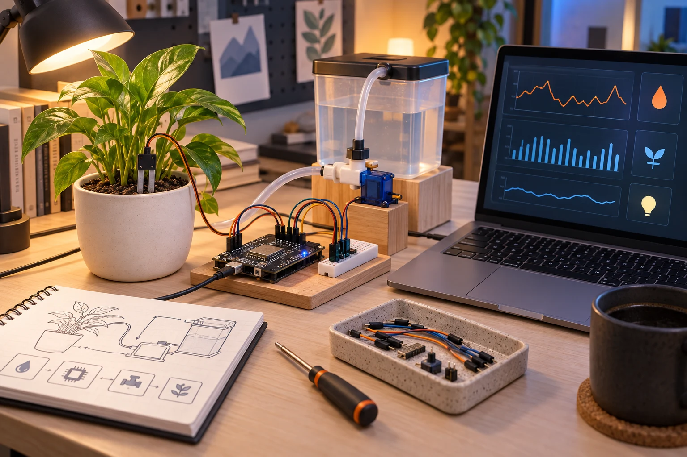
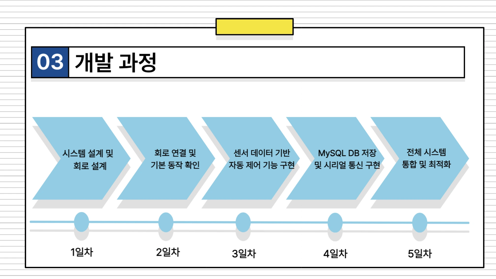
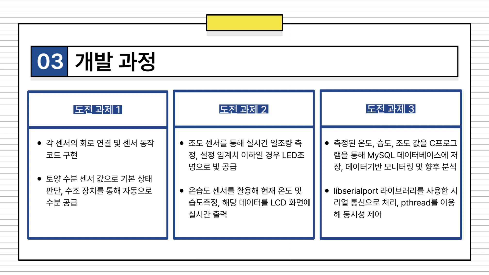

# 첫 번째 프로젝트, 센서 하나의 동작을 서비스의 흐름으로

2025.03.25–03.31 · 고려대학교 세종캠퍼스 · 주제 선정부터 발표까지의 기록

C와 임베디드 수업 다음에는 팀이 직접 문제를 정하고 기능을 연결하는 시간이 왔다. 센서 값을 읽거나 LED를 켜는 개별 실습에서, 장치의 상태를 저장하고 사용자가 확인하는 시스템으로 범위를 넓혔다. 이 글은 첫 번째 프로젝트의 계획서·기술서·발표 자료와 운영 기록을 대조해 세 가지 사례의 구조를 정리한다. 교육생과 팀을 식별하는 고유 이름은 기능 중심의 표현으로 바꿨다.

## 03.25 | 무엇을 만들지 정하고 역할을 나누기

3월 25일 운영 기록에는 프로젝트 주제 선정·설계와 코드 작성, Jira를 이용한 이슈 관리가 남아 있다. 전날 ATmega128의 센서·EEPROM·UART·인터럽트 통합 예제를 마친 뒤, 학습한 장치를 팀의 문제에 적용하는 단계로 넘어갔다. [1][5]

확인한 결과물은 환경을 관리하는 장치, 생활 공간의 자동화, 공용 기기의 사용 상태를 다루는 서비스로 나뉜다. 세 사례는 입력 센서와 출력 장치는 달랐지만 장치의 신호를 C 프로그램에서 처리하고 데이터베이스나 사용자 화면으로 연결한다는 공통점이 있었다.

역할 분담에는 장치 제어뿐 아니라 통신·데이터베이스·코드 통합·시험·발표가 포함됐다. 개인별 담당 이름이나 평가 대신 어떤 기능이 서로 만나야 하는지를 중심으로 읽었다. 팀 프로젝트의 결과는 독립된 코드 파일의 개수보다 그 사이에서 정보가 전달되는 방식에 달려 있었다.

## 사례 1 | 환경 측정과 급수·조명을 연결하기

환경 제어 사례는 온습도·조도·토양 수분을 읽고, LCD와 LED로 상태를 표시하며 서보모터로 급수 장치를 움직이는 구성이었다. 계획서와 기술서에는 ATmega128, C, MySQL을 연결하는 구조가 기록돼 있다. 발표 자료도 센서 제어, 시리얼 기반 기록과 명령 전달, 후속 확장이 가능한 구성을 주요 단계로 제시한다. [2]

이 사례에서 읽을 지점은 측정과 제어, 저장의 분리다. 토양 수분 값은 급수 동작의 조건이 되고, 조도는 조명 제어의 조건이 된다. 같은 측정 데이터라도 LCD에 표시하는 일과 데이터베이스에 남기는 일은 목적이 다르다. 이를 하나의 장치 동작으로 묶기 위해서는 값의 형식과 전달 시점을 맞춰야 했다.

기술서에는 libserialport와 pthread를 활용한 통신·처리 구성도 포함돼 있다. 이 글은 해당 구현 내용을 문서에 기록된 범위로 설명하며, 식물의 생장 개선이나 장기 급수 안정성을 실험으로 입증했다고 표현하지 않는다. 센서·제어·기록을 통합한 교육용 시제품이라는 점에 초점을 둔다.

## 사례 2 | 자동 제어와 수동 명령이 만나는 생활 공간

생활 공간 자동화 사례는 주변 밝기와 움직임을 바탕으로 조명을 제어하고 블라인드를 움직이며, 외부 날씨 정보를 표시하는 구성이었다. 발표 자료에는 조도 센서와 PIR 입력, ATmega128 처리, 모터·LED·LCD 출력이 구분돼 있다. UART 명령으로 자동·수동 모드를 바꾸고 개폐를 요청하는 흐름도 제시했다. [3]

외부 정보의 이동 경로도 중요했다. API로 받은 날씨 데이터를 MySQL에 저장하고, 다른 프로그램에서 조회해 시리얼 통신으로 보드의 LCD에 전달하는 구조다. 이는 ATmega128이 웹 API나 데이터베이스에 직접 접속한다고 설명할 수 없는 다단계 구성이다. PC 쪽 데이터 처리와 보드 쪽 표시의 역할을 나누어 이해해야 한다.

자료 사이에는 부품 명칭 차이가 있다. 계획서·기술서는 스텝 모터를, 발표 자료의 구성표는 DC 모터를 적고 있다. 따라서 이 글에서는 모터 기반 블라인드 제어라는 공통 범위로 서술한다. 초기 계획의 LED 매트릭스와 후속 자료의 LCD도 구분해, 계획한 모든 부품이 그대로 최종 구현됐다고 합치지 않았다.

## 사례 3 | 사용 승인과 장치 상태를 웹 화면으로 연결하기

공용 기기 사례는 사용 가능 여부를 웹에서 확인하고, 승인된 상태에서만 장치 입력이 작동하도록 구성하는 주제였다. 기술서에는 스위치의 시작 상태를 데이터베이스로 보내고 동작 완료 시 상태를 갱신하는 흐름이 기록돼 있다. 세탁기 사용 상황을 모형 장치와 웹 서비스로 연결한 교육용 시스템이다. [4]

통신의 연결에는 C 프로그램과 UART, MySQL, 웹 화면이 관여한다. 기기 상태가 바뀌었을 때 데이터베이스와 사용자가 보는 화면이 그 변화를 어떻게 반영하는지가 핵심 질문이다. 장치를 움직이는 코드와 화면을 만드는 코드가 각각 실행되는 것만으로 전체 서비스가 완성되는 것은 아니다.

계획서에는 알림과 사용자 관리 등 여러 목표가 들어 있지만, 본문은 기술서에서 확인할 수 있는 사용 승인·상태 전달·조회에 집중한다. 개인 계정, 실제 사용자 정보, 시연 영상 속 인물과 화면의 식별 정보는 수록하지 않았다. 로그인 보안이나 상용 기기 연동을 검증한 서비스로도 소개하지 않는다.

## 03.26–03.31 | 개별 구현을 통합하고 발표로 정리하기

3월 26~28일 운영 기록은 팀별 프로젝트 진행과 코드 작성으로 이어진다. 31일에는 발표 준비와 코드 정리, 팀별 발표가 확인된다. 일부 팀 자료에는 주말 작업 일정도 들어 있지만 이를 공식 교육일로 일괄 계산하지 않고, 25일부터 31일까지의 수행 기간과 운영 기록이 있는 날짜를 구분했다. [1]

계획서의 기능 목록과 후속 기술서·발표 자료를 비교하면 구현이 진행되면서 부품과 출력 방식, 기능의 표현이 달라진 것을 볼 수 있다. 감독 관점에서 살펴볼 지점은 이러한 차이를 숨기지 않고 어떤 구조가 결과물에 남았는지 확인하는 일이다. 각 사례의 설명도 기획 목적과 구현 보고를 구분해 정리했다.

이 글에서 영상 파일의 존재를 곧바로 모든 기능의 검증으로 간주하지는 않았다. 실제 장치를 다시 구동하거나 당시 코드를 재실행한 것이 아니라 제출 문서와 운영 기록을 바탕으로 구성과 수행 흐름을 설명한다. 교육생별 평가, 순위, 점수는 공개하지 않는다.

## 첫 통합 프로젝트의 의미 | 장치 밖으로 이어지는 데이터

세 사례를 나란히 놓으면 센서·판단·제어·저장·화면이 각각 다른 역할임이 드러난다. 환경 제어는 측정과 조건 판단을, 생활 공간 자동화는 자동 동작과 수동 명령을, 공용 기기 서비스는 사용 승인과 상태 공유를 강조했다. 같은 기초 도구로 서로 다른 시스템을 구성한 것이다.

앞선 수업에서 다룬 포인터·구조체·파일과 통신, 타이머·인터럽트는 프로젝트에서 기능 간 연결을 만드는 도구가 됐다. 이후 라즈베리파이와 네트워크 수업에서는 이러한 연결을 운영체제와 여러 프로세스, 소켓 통신으로 확장한다.

한 기술서에는 수행 연도가 2022년으로 적혀 있지만 계획서와 운영 기록, 다른 팀 자료는 2025년 3월 25~31일에 일치한다. 이 글의 연도는 대조한 실제 운영 기록을 따랐다. 공개 참조에는 이러한 판단의 근거와 자료의 공개 범위를 함께 남겼다.

## 참조 자료

- [1] 운영 기록 · 3월 28일·4월 4일 주간 업무일지 (내부 보관·비공개): 3월 25일 시작, 26~28일 개발, 31일 발표를 대조했습니다. 내부 보관 자료이며 개인별 평가·다른 업무는 제외했습니다.
- [2] 환경 제어 사례 · 계획서·기술서·발표 자료 (내부 보관·비공개): 2025년 3월 25일 계획서, 센서·통신·DB 구성 기술서, 발표 자료 3~4쪽을 참조했습니다. 기술서 연도 오기는 운영 기록과 대조했습니다.
- [3] 생활 공간 사례 · 계획서·기술서·발표 자료 (내부 보관·비공개): 발표 자료 11~14쪽의 입력·처리·출력과 UART 모드, API·DB·LCD 흐름을 확인했습니다. 모터 명칭의 차이는 본문에 남겼습니다.
- [4] 공용 기기 사례 · 계획서·기술서 (내부 보관·비공개): 계획의 알림·사용자 관리와 기술서의 승인·상태 전달·조회 범위를 구분했습니다.
- [5] [선행 수업 · ATmega128 강사 기록](https://github.com/freshmea/kuBig2025/blob/856a133a87d232a8ec714687139644f01f0a6cb9/doc/atmega128.md): 장치·UART·타이머·통합 실습의 교육 배경. 팀별 결과물 검증 자료는 아닙니다.

원본 문서 전체는 공개하지 않습니다. 개인정보가 없는 일부 장표와 장비 사진만 발췌했습니다. AI 이미지·직접 제작 도해·원본 발췌를 캡션에 구분합니다.

## 시각자료

- [장치에서 사용자 화면까지](../../assets/img/projects/ku-project-1-2025/ku-project-1-2025-01.svg)
- [환경을 측정하고 제어하는 사례](../../assets/img/projects/ku-project-1-2025/ku-project-1-2025-02.svg)
- [자동 제어와 외부 정보를 함께 다루기](../../assets/img/projects/ku-project-1-2025/ku-project-1-2025-03.svg)
- [기기의 사용 상태를 공유하기](../../assets/img/projects/ku-project-1-2025/ku-project-1-2025-04.svg)

## 보완한 사례 해설

### 제어와 기록을 분리해서 읽는 이유

발표 자료는 회로 연결과 센서 동작, 임계값에 따른 제어, C 프로그램의 시리얼 수신과 MySQL 저장을 서로 다른 과제로 나눈다. 토양 수분으로 급수를 판단하는 경로와 측정값을 이력으로 남기는 경로가 같지 않다는 뜻이다. 화면에 수치 하나가 보이는 것과 그 수치가 특정 시점의 기록으로 남는 것은 다른 기능이다. 각 단계가 어떤 입력을 받아 무엇을 내보내는지 대조하면 팀의 구현 범위를 구체적으로 읽을 수 있다.

### 명령을 전달하는 프로그램도 시스템의 일부

생활 공간 사례의 날씨 정보는 PC에서 API와 DB를 거쳐 보드로 전달된다. 따라서 네트워크 요청을 수행하는 프로그램, 저장된 값을 조회하는 프로그램, UART 문자열을 해석하는 보드 코드의 약속이 필요하다. 자동 제어와 수동 명령이 동시에 있을 때 어떤 동작을 선택할지도 설계의 일부다. 모터가 움직이는 장면만으로는 이 중간 처리까지 설명할 수 없어, 본문에서는 입력과 판단, 명령 전달을 나누어 정리했다.

### 발표에서 드러나는 통합의 단위

발표 자료의 개발 순서는 장치 연결에서 전체 흐름 점검으로 이어진다. 부품별 동작을 확인한 다음에도 측정값의 형식, 제어 조건, 저장 시점이 맞아야 한다. 이는 단순히 코드 파일을 한 폴더에 모으는 통합과 다르다. 다음 수업에서 운영체제와 소켓을 배울 때도 이 연결의 단위가 프로세스와 메시지로 바뀔 뿐, 입력·출력의 약속을 맞춘다는 질문은 남는다.

## 추가 시각자료

AI 생성 이미지. 실제 작품 사진이 아닙니다.

환경 제어 사례 발표자료 5쪽. 날짜별 실행 로그가 아닌 팀이 정리한 개발 순서입니다. [2]

같은 발표자료 6쪽. 센서 입력과 LCD·LED·급수, 시리얼·DB의 역할을 설명한 원본 장표입니다. [2]

