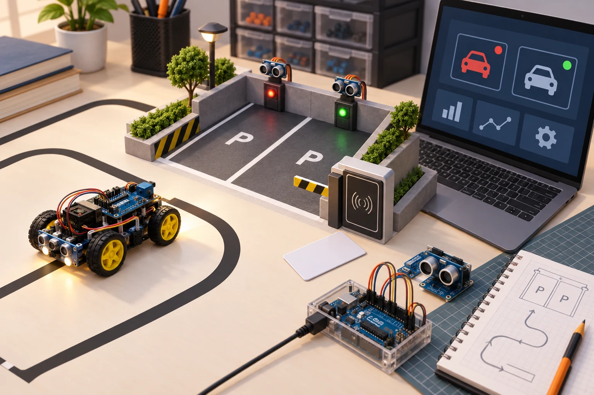
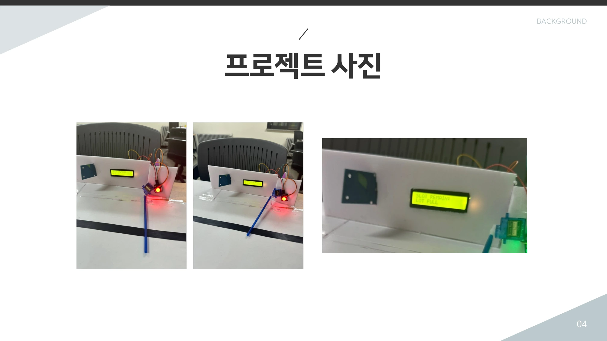
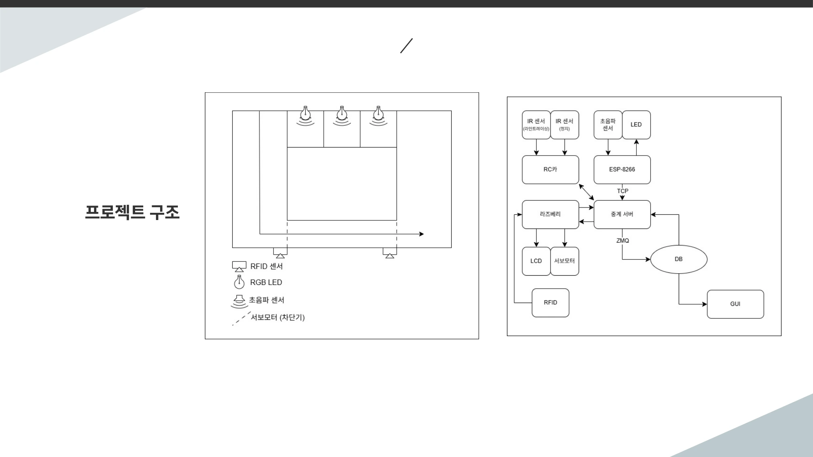

# 두 번째 프로젝트, 여러 장치와 프로그램의 상태를 맞추기

2025.05.16–05.26 · 고려대학교 세종캠퍼스 · 개발·발표·문서화 기간

두 번째 프로젝트는 라즈베리파이, C++ 후반, TCP/IP, Python 수업을 거친 뒤 진행됐다. 이번에는 장치와 데이터베이스의 연결을 넘어 여러 프로그램이 역할을 나누고 서로 메시지를 주고받는 구조가 중심에 놓였다. 아래 사례는 제출 기술서와 발표 자료에서 확인한 세 가지 시스템이며, 고유 팀명과 교육생 식별 정보는 제외했다.

## 05.16–05.26 | 시작과 발표, 마무리의 날짜를 나누기

5월 16일 주간 기록은 2차 프로젝트 시작을 명시한다. 19~23일 기록에는 연결·데이터 처리·통합 점검과 발표 준비가, 23일에는 발표·시연이 적혀 있다. 다음 주 26일에는 프로젝트 문서화와 코드 리뷰, 마무리가 확인된다. 그래서 이 글은 발표일 하나로 모든 활동을 축소하지 않고 16~26일의 흐름으로 설명한다. [1]

제출 기술서에서도 시작일은 사례에 따라 16일 또는 19일로 다르고 종료일은 26일로 적혀 있다. 또한 운영 요약의 팀 수와 보관된 자료 묶음의 수는 일치하지 않는다. 여기서는 전체 팀 수나 참가 인원을 단정하지 않고, 직접 확인한 세 사례만 다룬다.

이번 단계에서 중요한 질문은 데이터가 도착했는가뿐 아니라 여러 장치와 화면이 같은 상태를 보고 있는가였다. 입력 수집, 서버 판단, 저장, 표시를 별도 기능으로 나눈 뒤 메시지의 의미와 시점을 맞추는 문제가 프로젝트의 공통 과제가 됐다.

## 사례 1 | 주행 모형과 주차 공간의 상태 연결

주차 시스템 사례의 기술서는 라인트레이싱 RC카, 장애물 감지, 주차 공간 상태와 RFID 입출차 기록을 묶은 구성을 설명한다. ESP8266과 라즈베리파이, TCP·ZeroMQ, MySQL과 Tkinter가 각각 장치·통신·기록·표시 역할로 등장한다. [2]

문서에 따르면 RC카는 IR 센서로 라인을 따라가고 장애물 감지 시 정지한다. 주차 공간은 센서로 상태를 확인하고 서버의 판단 결과를 LED와 화면으로 표시한다. 입출차 이벤트는 RFID 정보와 시각을 기록하는 경로로 연결된다. 이동하는 모형과 고정된 주차 공간, 서버와 화면이 서로 다른 관찰 지점을 갖는 구조다.

이를 일반 도로의 자율주행이나 상용 주차관제 성능으로 확대하지 않는다. 이 프로젝트에서 읽을 수 있는 것은 모형 환경의 센서 입력과 상태 메시지, 데이터 기록을 연결한 교육용 구현이다. RFID UID와 실제 로그, 개인 식별 정보는 공개하지 않는다.

## 사례 2 | 입력과 게임 상태, 화면 갱신을 나누기

대전 게임 사례는 ESP8266·라즈베리파이와 자이로센서 입력, 서버의 게임 로직, Pygame 화면과 데이터 저장을 연결하는 구성이었다. 기술서에는 C·C++·Python과 SQLite, ZeroMQ가 명시돼 있고, 발표 자료는 게임 로직을 중앙에서 처리하는 구조를 제시한다. [3]

게임은 입력 이벤트를 받아 캐릭터의 이동이나 공격 상태를 바꾸고 그 결과를 화면에 반영한다. 두 사용자의 입력이 각각 도착하는 환경에서는 클라이언트가 보낸 행동과 서버가 판단한 결과를 구분해야 한다. 시작·진행·종료·초기화도 별도의 상태로 다룰 필요가 있다.

발표 자료에는 통신 지연과 손실 처리, 동시 접속 확장성 테스트 등이 후속 과제로 남아 있다. 따라서 자료에 적힌 실시간이라는 표현을 지연 시간 보장이나 대규모 서비스 검증으로 옮기지 않는다. 구현 보고와 남은 과제를 함께 보면 이번 프로젝트가 다룬 범위가 더 분명해진다.

## 사례 3 | 인증·착석·시간을 하나의 루틴으로 구성

학습 보조 사례는 RFID 인증과 터치 입력, FSR 기반 착석 감지를 이용해 루틴의 시작과 중단을 판단하는 구조다. LCD와 LED로 상태를 알리고, 서버와 MySQL에는 학습·휴식 시간 등의 기록을 남기도록 구성했다고 기술서에 적혀 있다. [4]

여기서 서로 다른 센서는 같은 질문에 답하지 않는다. RFID는 등록 여부를, FSR은 착석 상태를, 터치 입력은 사용자의 모드 선택을 나타낸다. 이를 구분해 읽으면 인증되었다는 사실을 곧바로 학습 중이라는 상태로 처리하지 않고, 여러 조건을 조합하는 구조를 살펴볼 수 있다.

통신 관련 문서에는 TCP 서버와 ZeroMQ 구성 표기가 함께 있지만 역할 기록에는 ZeroMQ 구현 시도라는 표현도 있다. 따라서 이 글은 ZeroMQ를 완성했다고 단정하지 않는다. 확실하게 확인되는 센서 조건과 피드백·기록의 구성, 문서상 남아 있는 통합 범위를 구분한다. 실제 집중력 향상 효과나 교육생의 개인 학습 기록은 다루지 않는다.

## 통합 단계 | 모듈 사이의 약속을 확인하기

주행·주차, 대전 게임, 학습 루틴은 화면에서 보이는 결과가 전혀 다르다. 그러나 각 사례에서 장치 입력은 메시지로 바뀌고, 서버나 제어 로직이 상태를 판단하며, 그 상태가 다시 화면이나 출력 장치에 전달된다. 기술 이름을 늘리는 것보다 이 경로가 서로 맞는지 확인하는 일이 중요했다.

운영 기록에는 ESP8266 연결, IPC, 데이터베이스 접근, GUI, 전체 통합과 시연 준비에 대한 지원이 남아 있다. 이를 모든 팀이 같은 라이브러리나 데이터베이스를 완성했다는 뜻으로 적용하지 않는다. 주차와 학습 보조의 MySQL, 게임의 SQLite처럼 실제 기술서에 적힌 구성을 사례별로 구분했다. [1]

첫 번째 프로젝트가 장치와 서비스의 연결을 경험하는 단계였다면 이번에는 기능을 여러 프로그램에 배치하고 그 사이의 상태를 맞추는 단계였다. 앞서 배운 소켓, 자료구조와 동시성, Python 환경 구성이 프로젝트 안에서 다시 쓰였다. 공개 강사 기록은 이러한 선행 학습을 확인하는 참조이며 교육생 결과물의 코드와는 구분한다. [5]

## 발표 이후 | 구현한 범위와 남은 과제를 설명하기

5월 23일 발표 기록 이후에도 26일 문서화와 코드 리뷰가 이어진다. 결과물을 보여 주는 일과 다른 사람이 구조를 이해할 수 있게 남기는 일은 서로 다른 작업이다. 발표 자료·기술서·계획서를 대조하면서 사용한 기술과 구현 상태의 표현을 맞추는 과정도 프로젝트의 일부로 볼 수 있다.

이 포스트에서는 성능 수치나 교육생별 성적을 제시하지 않는다. 자료에 기록된 기능을 설명하되 실제 장치를 다시 구동하거나 네트워크 부하 시험을 수행한 결과로 쓰지 않았다. 고유 프로젝트명 대신 기능 중심의 사례명을 사용하고, 개인 계정으로 연결되는 저장소·발표 링크는 공개 본문에서 제외했다.

프로젝트를 마친 뒤에는 OpenCV와 머신러닝·딥러닝 수업이 이어졌다. 데이터가 오가는 구조 위에 영상과 모델의 출력을 어떻게 얹을지가 다음 단계의 질문이었다. 최종 프로젝트에서는 그 연결이 영상 분석과 웹 서비스, 장치 피드백으로 확장된다.

## 참조 자료

- [1] 운영 기록 · 5월 16일·23일·30일 주간 업무일지 (내부 보관·비공개): 시작·발표·문서화 날짜를 대조했습니다. 팀 수의 불일치가 있어 전체 인원을 추정하지 않았습니다.
- [2] 주차 모형 사례 · 프로젝트 기술서 (내부 보관·비공개): 문서상 수행 기간은 5월 19~26일. 센서·RFID·TCP/ZMQ·MySQL·Tkinter의 역할을 참조했습니다.
- [3] 대전 게임 사례 · 기술서·발표 자료 (내부 보관·비공개): 5월 16~26일 수행 기록, 발표 자료 3쪽의 구조·목표와 15쪽의 후속 과제를 대조했습니다.
- [4] 학습 루틴 사례 · 프로젝트 기술서 (내부 보관·비공개): 5월 16~26일 수행 기록. 센서 조건과 표시·기록 기능을 확인하고 ZeroMQ 구현 상태의 표현 차이를 남겼습니다.
- [5] [선행 수업 · TCP/IP 강사 기록](https://github.com/freshmea/kuBig2025/blob/856a133a87d232a8ec714687139644f01f0a6cb9/doc/tcpip.md): 소켓·프로세스·스레드와 통신 구조의 학습 배경. 팀별 구현의 성능 증거와 구분합니다.

원본 문서 전체는 공개하지 않습니다. 개인정보가 없는 일부 장표와 장비 사진만 발췌했습니다. AI 이미지·직접 제작 도해·원본 발췌를 캡션에 구분합니다.

## 시각자료

- [서로 다른 프로그램이 같은 상태를 보려면](../../assets/img/projects/ku-project-2-2025/ku-project-2-2025-01.svg)
- [이동하는 모형과 주차 공간 연결](../../assets/img/projects/ku-project-2-2025/ku-project-2-2025-02.svg)
- [두 사용자의 행동을 서버 상태로](../../assets/img/projects/ku-project-2-2025/ku-project-2-2025-03.svg)
- [인증과 착석, 모드 선택을 구분하기](../../assets/img/projects/ku-project-2-2025/ku-project-2-2025-04.svg)

## 보완한 사례 해설

### 실물 사진과 서버 흐름도를 함께 보기

발표자료 사진에는 LCD, LED, 서보 차단기와 모형의 주행 경로가 보인다. LCD는 남은 공간 또는 만차 상태를 표현하고 차단기는 물리적 출입 동작을 맡는다. 화면의 색이 바뀌는 것과 실제 장치가 반응하는 것은 서로 다른 출력이므로, 공간 센서의 판단이 각각의 출력으로 어떻게 전달되는지 구조도와 함께 읽어야 한다. 사진은 결과물의 구성을 보여 주지만 통신 손실률이나 장시간 동작을 측정한 자료는 아니다.

### 입력 요청과 확정된 게임 상태를 나누기

게임 클라이언트가 보낸 이동·공격 요청은 서버가 관리하는 게임 상태에 반영된 뒤 화면에 나타난다. 각 화면이 독립적으로 결과를 확정하면 두 사용자가 서로 다른 상황을 볼 수 있다. 이런 맥락에서 기술서의 중앙 게임 로직과 메시지 교환을 읽을 수 있다. 저장할 승패나 통계 역시 입력 버튼 그 자체가 아니라 처리한 결과에서 정해야 하는 데이터다.

### 여러 프로세스라는 구성은 2025년에도 있었다

5월 23일 운영 요약에는 C·C++·Python을 활용한 최소 세 프로세스와 ZeroMQ 연결이 명시돼 있다. 따라서 프로그램을 역할별로 나누는 시도가 2026년에 처음 시작됐다고 볼 수 없다. 다만 운영 요약과 개별 기술서의 구현 상태 표현이 다르므로, 모든 팀의 동일한 완성도를 추정하지 않고 사례별 기록을 우선했다. 이 구분은 다음 해 과정과 비교할 때도 중요한 기준이다.

## 추가 시각자료

AI 생성 이미지. 실제 작품 사진이 아닙니다.

주차 모형 사례 발표자료 13쪽의 원본 사진. 사람·계정·실제 RFID 식별값이 없는 장면만 사용했습니다. [2]

같은 발표자료 10쪽의 구조도. 모형 공간과 서버 로직의 관계를 읽는 자료이며 상용 성능 측정 결과는 아닙니다. [2]

