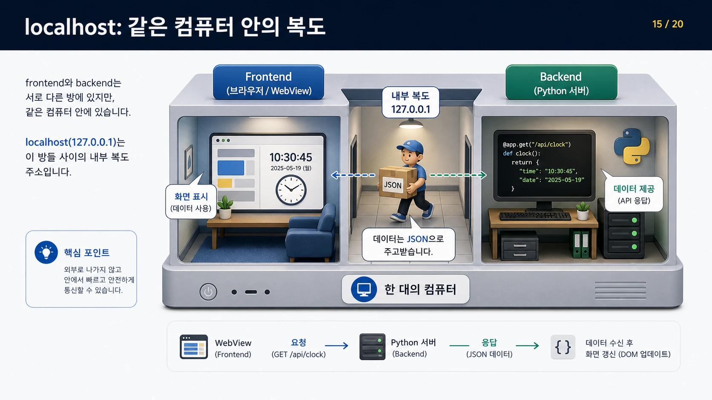
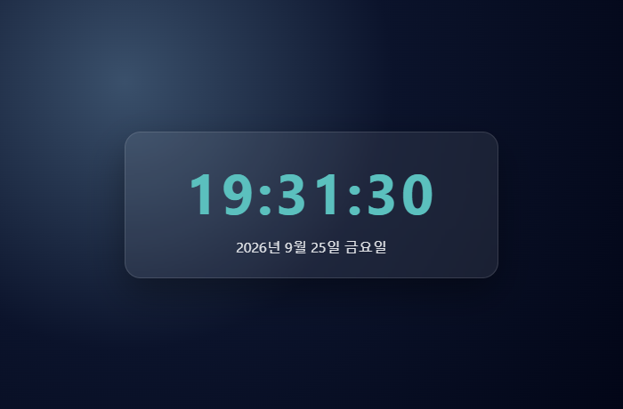
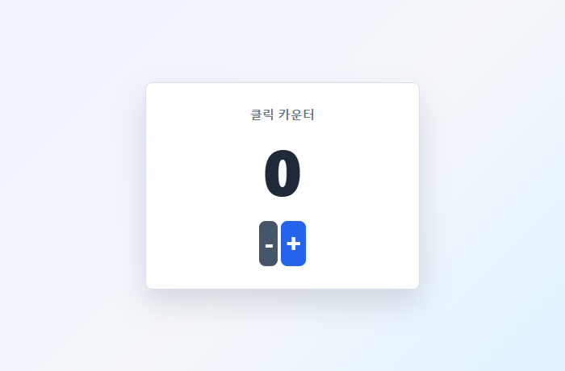
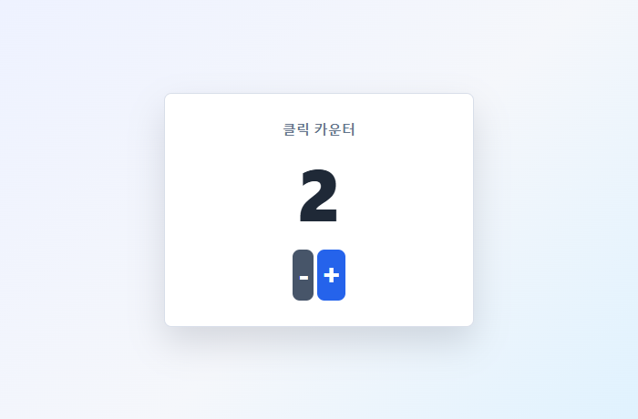
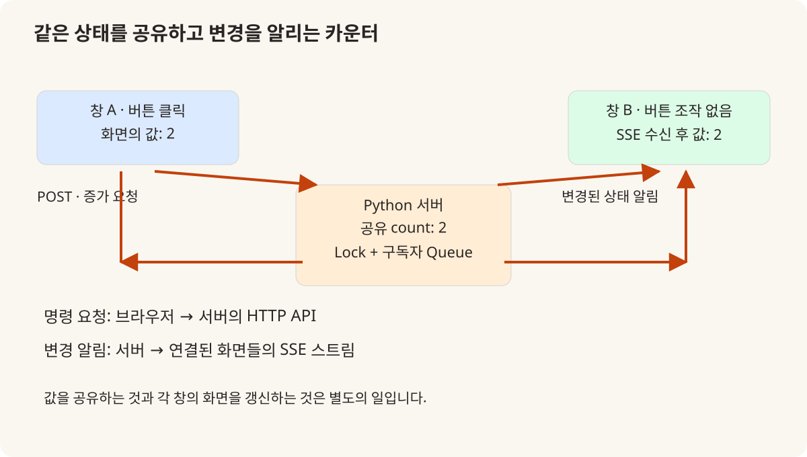
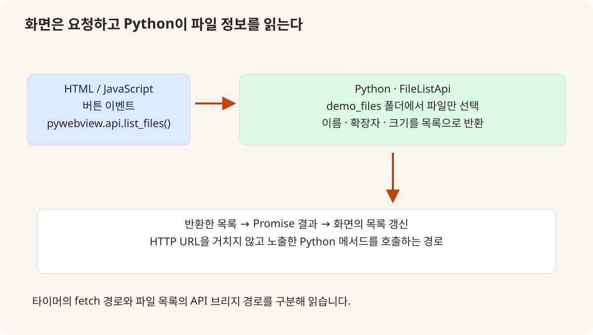

# 2026년의 변화: Python에서 웹 화면을 가진 데스크톱 앱으로

2026.05.21–05.28 · 핵심 실습 05.28

2026년 Python 수업에서 달라진 부분은 라이브러리 이름 하나가 추가됐다는 데 있지 않다. Python이 처리한 값을 HTML·CSS·JavaScript 화면으로 보여 주고, 여러 창이 같은 상태를 읽도록 만드는 연결이 수업의 구체적인 실습이 됐다. 2025년과 겹치는 문법 설명은 기존 글에 맡기고, 날짜별 진행 기록과 강사 예제에서 확인되는 화면 개발의 변화를 따라간다.

## 2025년과 2026년 비교

| 항목 | 2025 | 2026 |
|---|---|---|
| 응용 실습의 중심 | 2025.05.15: Sprite·Game·Ball·UI로 Pygame 응용 구성 | 2026.05.28: 타이머·카운터·파일 목록을 웹 UI와 연결 |
| 이미 있던 기반 | 함수·클래스·C 확장·가상환경·Flask·비동기 소개 | 기존 기반을 다시 다루므로 모두 새 내용으로 세지 않음 |
| 화면과 처리의 관계 | 게임 객체의 update와 draw, 입력 이벤트 처리 | JSON API·SSE·Python API 브리지라는 서로 다른 연결 경로 |
| 실제 수업과 확장 자료 | 날짜별 진행 기록과 강사 예제로 범위 확인 | 후속 CRUD·SQLite·패키징 데모는 존재하지만 5월 28일 완료로 간주하지 않음 |

## 2025 → 2026 | 새로운 것은 문법보다 프로그램의 경계

2025년 Python 기록은 C 확장과 패키지, 가상환경·컨테이너·Flask를 거쳐 Pygame으로 마무리된다. 마지막 실습의 Game은 이벤트를 받고 Ball의 상태를 갱신하며 UI를 그린다. 이미 함수·객체·화면이 함께 동작하는 응용을 다뤘으므로, 2026년에 처음 프로그램 구조를 배웠다고 설명하는 것은 맞지 않는다. [1]

2026년 5월 28일에는 webview 설치와 WSL의 GTK 환경 설정, 타이머, 버튼 이벤트, SSE, 파일 연동이 교시별로 남아 있다. Python의 계산과 파일 접근을 유지하면서 화면의 표현은 HTML·CSS·JavaScript가 맡는 방향으로 응용의 경계가 달라졌다. 같은 값을 만드는 코드라도 표시와 요청·응답을 분리하는 경험이 추가된 것이다. [2]

따라서 두 해의 차이를 GUI가 있었는가 없었는가로 나누지 않는다. 2025년에도 Pygame과 프로젝트별 Tkinter 같은 화면이 있었다. 이번 변화는 웹 UI를 데스크톱 창 안에서 사용하고, 백엔드 상태와 여러 화면의 갱신을 명시적인 통신 경로로 연결한 데 있다.

## 05.21–05.27 | 웹뷰 전에 쌓은 Python 기반

5월 21~22일에는 변수·문자열·반복·함수와 리스트, 모듈·패키지를 다뤘고 uv를 이용한 패키지 설치와 wheel 생성·설치가 기록돼 있다. 26일에는 클래스·속성·상속, 파일과 pickle, 예외, 명령행 인자를 다뤘다. 화면을 붙이는 마지막 실습은 이 흐름 위에 놓여 있다. [2]

27일에는 로깅과 CSV 시각화, 네이티브 앱 도구, 데코레이터, 제너레이터·이터레이터, threading·asyncio를 설명했다. 긴 처리를 화면 이벤트와 분리하는 관점, 파일의 데이터를 읽어 표시하는 관점이 이후 웹뷰 실습을 읽는 배경이 된다. 기록은 해당 주제의 설명·예제 범위를 보여 주며, 모든 항목으로 완성 앱을 만들었다는 뜻은 아니다.

C·C++ 확장과 Rust 바인딩, pyo3 예제 설명도 새해 기록에서 확인된다. 다만 C 확장은 2025년에도 있었고 Rust는 이 날짜의 소개·예제 설명으로 남아 있다. 그래서 이를 별도 장기 심화 과목이나 전원 구현 성과로 부풀리지 않고, Python과 다른 언어를 연결하는 설명 범위가 넓어진 부분으로 정리했다.

강사 교안의 AI 생성 설명 그림. 파일명 slide_12.png의 그림이며 화면 속 날짜·수치는 예시입니다. [4]

## 05.28 · 타이머 | 페이지 전체 대신 시간 데이터만 갱신하기

타이머 예제의 main.py는 ClockApiServer를 시작하고 그 주소를 webview.create_window에 전달한다. 화면의 index.html·style.css·app.js와 Python 백엔드가 별도 파일로 나뉘어 있다. 단순한 시계지만 부팅 코드, 데이터 생성, 화면 표시라는 세 역할을 읽을 수 있는 구성이다. [3]

app.js는 /api/clock을 1초마다 fetch하고 응답의 time·date를 해당 DOM 요소의 textContent로 바꾼다. 전체 문서를 반복해서 새로 읽는 구조가 아니다. 교안은 전체 리로드에서 생기는 깜빡임과 상태 초기화 문제를 거쳐, 필요한 데이터만 요청하는 구조를 설명한다. 데이터 갱신과 화면 재생성을 구분하는 것이 이 작은 예제의 학습 지점이다. [4]

이 글의 시계 캡처는 강사 저장소의 Flask 백엔드와 프론트엔드를 이번 편집에서 실행한 화면이다. 현재 날짜가 보이는 이유도 그 때문이다. 실제 수업일의 사진이나 pywebview 네이티브 창 검증으로 대신하지 않고, HTTP 응답과 JavaScript 표시가 이어지는 부분을 확인한 재현으로 남긴다.

이번 편집에서 원본 백엔드·프론트엔드를 브라우저로 실행했습니다. 2026년 수업 현장이나 네이티브 창 캡처가 아닙니다. [3]

## 05.28 · 카운터 | 같은 값을 저장하는 것과 같은 화면을 보는 것

버튼을 누를 때 JavaScript 변수만 증가시키면 창마다 별도의 숫자를 가질 수 있다. 카운터 예제는 Python 서버가 _count를 보관하고, 화면은 증가·감소 API에 POST 요청을 보낸다. 계산을 서버에 모으면 상태의 기준점이 하나로 정리되지만, 다른 창에 이미 그려진 숫자까지 저절로 바뀌지는 않는다. [5]

이때 SSE가 두 번째 문제를 다룬다. 프론트엔드는 EventSource로 /api/counter/events에 연결한다. 서버는 연결마다 Queue를 만들고 값이 바뀌면 구독 중인 화면으로 JSON 이벤트를 보낸다. 화면은 이 이벤트를 받아 숫자를 다시 그린다. 버튼의 요청과 변경 알림은 방향도, 역할도 다른 두 경로다.

이번 재현에서는 두 브라우저 창을 같은 원본 카운터 서버에 연결했다. 첫 창에서 증가 버튼을 두 번 누른 뒤 두 번째 창이 2로 바뀌는 것을 확인했다. 이는 해당 예제의 상태 공유·이벤트 전달을 확인한 결과이며, 네트워크 장애 복구나 다수 사용자의 부하 시험은 아니다.

원본 서버의 값이 0인 상태. 같은 서버에 다른 브라우저 창도 연결했습니다. [5]

두 번째 창은 버튼 조작 없이 SSE 이벤트를 받아 2를 표시했습니다. 이번 편집의 재현 결과입니다. [5]

원본 카운터 코드에 근거한 직접 제작 도해. SSE는 서버에서 화면으로 보내는 이벤트 경로입니다. [5]

## 05.28 · 파일 목록 | HTTP API와 Python API 브리지를 구분하기

파일 목록 예제는 타이머와 다른 연결을 사용한다. webview.create_window의 js_api에 FileListApi 객체를 전달하고, JavaScript는 window.pywebview.api.list_files()를 호출한다. 목록 조회를 위한 별도 HTTP URL 대신 데스크톱 창에 노출한 Python 메서드를 사용하는 경로다. [6]

FileListApi는 정해진 demo_files 폴더를 순회하고 파일만 선택해 이름·확장자·크기를 반환한다. 화면은 파일 내용을 직접 분석하지 않고 받은 목록을 표시한다. 날짜별 기록의 “파일 입출력”을 이 연결된 예제만으로 읽을 때는 파일 목록·메타데이터 조회까지가 확인되는 범위다. 임의 파일 수정과 저장까지 모두 구현했다고 확장하지 않는다.

Python에 노출할 기능을 좁게 정하는 일도 앱 구조의 일부다. 예제처럼 읽을 폴더와 반환 항목을 구분하면 화면에 필요한 정보와 내부 파일 접근을 나누어 설명할 수 있다. 이 글에는 실제 사용자 폴더 목록 대신 호출 관계를 그린 도해를 사용했다.

원본 FileListApi의 역할을 표현한 직접 제작 도해. 사용자 파일·계정은 포함하지 않았습니다. [6]

## 코드 대조 | 교안의 기준 예제와 수업 작성본의 차이

저장소에는 PyWebView 폴더의 정리된 데모와 python_example/webview_example의 수업 예제가 함께 있다. 두 경로를 섞으면 서버 파일명과 포트, 시작·종료 방식이 다른데도 같은 코드처럼 안내할 수 있다. 이 글의 재현은 후자의 timer와 click을 기준으로 하고, 정리된 교안은 학습 순서와 확장 범위를 설명하는 자료로 따로 연결했다. [3][5][7]

예를 들어 수업 카운터 작성본은 고정 포트 11722와 준비 상태 확인으로 기존 서버를 재사용하려 한다. 자기 실행이 만든 서버인지 _owns_server로 구분하고 종료 시 소유한 서버만 정리한다. 반면 타이머는 비어 있는 포트를 받아 각 실행의 서버를 시작한다. 두 예제를 함께 읽으면 여러 창이 같은 서버를 볼 것인지, 독립된 서버를 가질 것인지가 설계 선택임을 알 수 있다.

예제 코드의 존재와 운영 제품의 완성도는 별개다. 서버가 응답하지 않을 때 표시할 상태, 여러 창의 종료 순서, 브리지에 노출할 메서드 같은 점은 후속 구현에서 확인할 항목이다. 날짜별 수업 기록은 이런 연결을 배우는 실습의 범위를 보여 준다.

## 수업 → 프로젝트 | Pico 2W 데이터가 도착할 화면을 준비하기

6월 1일 프로젝트 가이드는 Pico 2W 기반 장치, pywebview 데스크톱 대시보드, 수집·백엔드·화면의 역할 분리를 필수 조건으로 명시했다. 타이머의 시간 데이터를 센서 상태로 바꾸고 카운터의 상태 알림을 장치 이벤트로 넓혀 생각할 수 있는 연결이다. 단, 예제와 프로젝트의 데이터·요구사항은 다르므로 화면 코드만 바꿔 전체 시스템이 완성되는 것은 아니다. [8]

이 가이드의 권장 FastAPI·WebSocket 구조와 5월 28일 실제 Flask·SSE 실습도 구분해야 한다. 같은 화면 갱신을 다루더라도 수업 예제에서 사용한 기술과 프로젝트 설계의 선택지는 다르다. 두 기술을 모두 모든 팀이 완성했다고 묶지 않고 각각의 근거에 맞춰 설명했다.

2026년의 유의미한 변화는 Python 응용의 결과를 사용자가 조작하고 여러 창이 공유할 수 있는 구조로 더 구체화했다는 점이다. 2025년의 문법·객체·통신 기반을 되풀이하는 대신, 상태를 어디서 관리하고 어떤 경로로 화면에 전달하는지 새로운 질문을 더했다.

## 참조 자료

- [1] [2025년 Python 실제 진행 기록](https://github.com/freshmea/kuBig2025/blob/856a133a87d232a8ec714687139644f01f0a6cb9/doc/python.md): C 확장·Flask·Pygame 등 비교 기준.
- [2] [2026년 Python 실제 진행 기록](https://github.com/freshmea/kuBig2026/blob/09a06e6c945d4ecc62b783ddab5b7c4e729f3f93/doc/python_programming.md): 5월 21·22·26·27·28일의 진행 내용.
- [3] [타이머 수업 작성본](https://github.com/freshmea/kuBig2026/blob/09a06e6c945d4ecc62b783ddab5b7c4e729f3f93/python_example/webview_example/timer/main.py): 같은 폴더 backend와 frontend를 함께 대조.
- [4] [타이머 단계별 교안](https://github.com/freshmea/kuBig2026/blob/09a06e6c945d4ecc62b783ddab5b7c4e729f3f93/PyWebView/doc/01_수업자료_웹뷰_단계별_실습.md): 리로드 문제와 JSON API·DOM 갱신의 학습 순서.
- [5] [카운터 서버와 SSE](https://github.com/freshmea/kuBig2026/blob/09a06e6c945d4ecc62b783ddab5b7c4e729f3f93/python_example/webview_example/click/backend/server_flask.py): 공유 상태·Lock·Queue·이벤트 스트림·서버 수명.
- [6] [파일 목록 API 브리지](https://github.com/freshmea/kuBig2026/blob/09a06e6c945d4ecc62b783ddab5b7c4e729f3f93/python_example/webview_example/bridge_file_list/main.py): FileListApi와 js_api 연결, 같은 폴더 app.js 대조.
- [7] [정리된 PyWebView 데모 안내](https://github.com/freshmea/kuBig2026/blob/09a06e6c945d4ecc62b783ddab5b7c4e729f3f93/PyWebView/README.md): 수업 작성본과 경로를 구분. 추가 데모 전체의 수업 완료를 의미하지 않음.
- [8] [2026년 2차 프로젝트 가이드](https://github.com/freshmea/kuBig2026/blob/09a06e6c945d4ecc62b783ddab5b7c4e729f3f93/doc/2nd_project.md): 2026-06-01 커밋의 필수 조건·권장 구조, 실제 완료 보고서와 구분.
