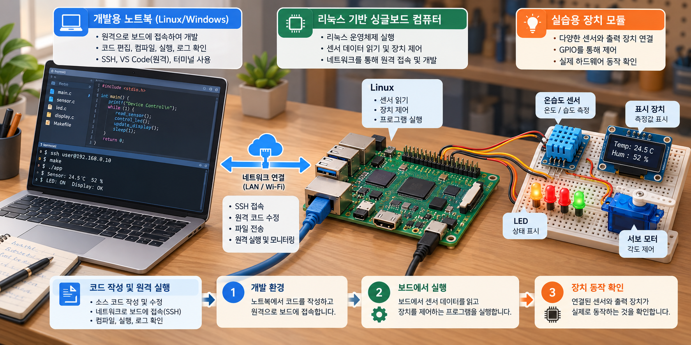
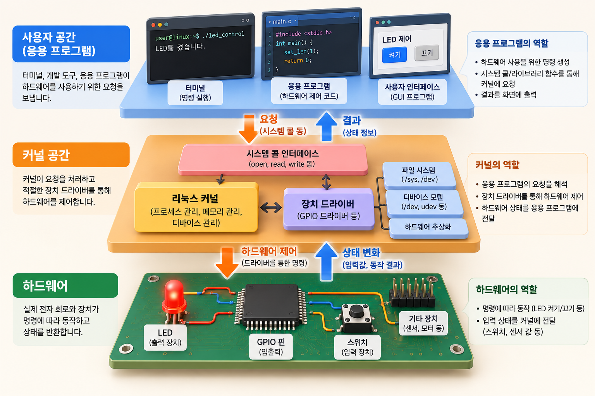
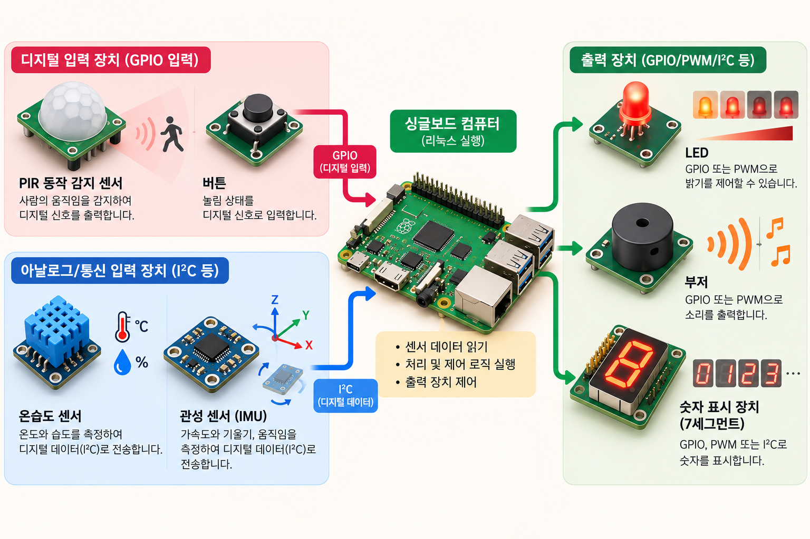
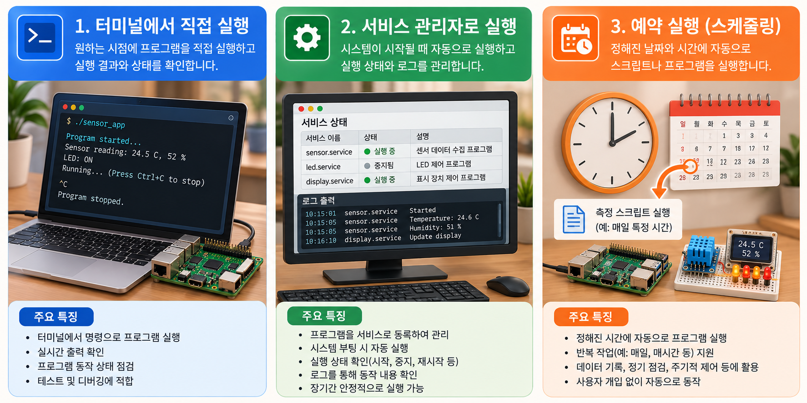

# 라즈베리파이, 리눅스로 장치를 다루는 5일

2025.04.01–04.07 · 고려대학교 세종캠퍼스 · 수업일 5일

## 04.01 | 보드에 운영체제를 올리고 원격으로 접속하기

3월 말의 첫 팀 프로젝트 발표를 마친 뒤, 4월 1일부터 라즈베리파이 수업이 시작됐다. Raspberry Pi OS 이미지를 기록하고 리눅스와 운영체제의 역할을 살펴본 다음, VS Code의 SSH 원격 접속 환경을 구성했다. PC에서 작성한 프로그램을 보드의 리눅스 환경에서 실행하는 작업 흐름을 준비하는 시간이었다.

WiringPi를 설치하고 GPIO 핀 설정과 초기화를 진행했다. helloRaspberry.c와 switch_led.c 실습으로 LED와 스위치를 연결했다. 앞선 ATmega128 수업에서 익힌 입력·출력 관계를 유지하면서, 이번에는 운영체제 위에서 동작하는 프로그램으로 장치를 다뤘다.

이날 수업 기록에는 open·write·close를 이용한 GPIO 제어 시도가 동작하지 않았다는 내용도 남아 있다. 모든 예제가 성공한 것으로 정리하기보다, 같은 입출력이라도 사용한 접근 방식과 실행 환경에 따라 확인할 조건이 달라졌다는 실제 수업 맥락을 함께 기록한다.

이어서 사용자 영역과 커널 영역, 시스템 호출을 설명하고 strace를 실습했다. 기본 커널 모듈과 Makefile을 작성해 insmod·rmmod로 로드·언로드하는 과정까지 이어졌다. 장치를 켜는 결과에서 출발해 그 아래 운영체제가 어떤 역할을 하는지 살펴보기 시작했다.

## 04.02 | 프로그램을 실행하는 것에서 운영하는 것으로

2일에는 여러 프로세스를 다루는 명령을 실습했다. 백그라운드 실행, 작업 전환, 실행 상태 확인과 종료를 다루며 프로그램을 실행한 터미널과 실제 프로세스의 관계를 살폈다. bg·fg·jobs·ps·kill·top 등이 수업 기록에 포함되어 있다.

이후 mydaemon.service와 mydaemon.sh를 작성하고 systemctl을 사용했다. 강사 서비스 예제에서는 실행할 스크립트, 재시작 정책과 로그 출력 위치를 확인할 수 있다. 개별 명령으로 실행하던 프로그램을 서비스 설정으로 관리하는 관점을 접하는 실습이었다.

같은 날 소프트웨어·하드웨어 PWM, 부저와 RGB LED, PCA9685와 서보 제어를 진행했다. 운영체제 수업과 보드 실습이 분리된 것이 아니라, 실제 장치를 움직이는 프로그램을 어떻게 실행하고 관리할지 함께 배우는 구성이었다.

## 04.03 | 커널 모듈과 장치 드라이버의 경계 읽기

3일에는 커널 모듈과 Makefile을 다시 다루고 LED 드라이버를 작성했다. 스위치 인터럽트, 심볼 공유와 GPL 설명에 이어 캐릭터 디바이스 드라이버의 개념과 LED·스위치 드라이버 실습을 진행했다.

이 단계의 핵심은 응용 프로그램과 장치 제어 사이에 있는 계층을 구분하는 데 있다. 사용자 프로그램이 요청하는 동작, 드라이버가 처리하는 장치 접근, 실제 GPIO 상태의 변화를 각각 나누어 읽는 것이다. 익숙한 LED와 스위치를 다시 사용하면서 코드가 실행되는 위치와 인터페이스에 초점을 옮겼다.

강사 저장소에는 led_switch_driver 모듈과 대응하는 사용자 프로그램이 보관되어 있다. 이를 통해 수업에서 어떤 파일 단위로 역할을 나눴는지 살펴볼 수 있다. 이 기록은 드라이버 작성 실습의 범위를 설명하며, 교육생 전원이 독립적인 드라이버 개발 역량을 완성했다는 평가로 확대하지 않는다.

## 04.04 | 표시 장치와 센서를 묶어 반응 만들기

4일은 메모리 매핑과 센서 연동을 함께 다룬 날이었다. ioremap, 라즈베리파이 4B의 입출력 레지스터, 가상·물리 메모리를 설명한 뒤 74HC595의 latch·clock·data 신호와 FND 제어를 실습했다. rgb_switch_fnd.c에서는 RGB LED·스위치·FND를 연결했다.

센서 실습은 연결 방식을 구분해 읽어야 한다. PIR은 GPIO 입력과 인터럽트의 관점에서, 터치 센서·SHT20·MPU6050은 I2C 통신과 데이터시트를 바탕으로 다뤘다. 장치가 달라질 때마다 핀 번호와 인터페이스, 프로그램이 읽는 데이터의 의미를 확인하는 과정이었다.

움직임을 감지해 부저와 LED로 반응하는 예제도 작성했다. 수업 기록의 gyro_detect.c에 대응하는 보관 파일은 gyro_detector.c이며, MPU6050에서 가속도와 자이로 값을 읽는 구조가 담겨 있다. 파일 이름에 자이로가 들어가더라도 실제 처리하는 데이터 항목을 코드에서 구분해 보는 것이 중요하다.

PIR 인터럽트의 핀 충돌 문제도 운영 기록에 남아 있다. 수업 기록에는 핀 중복 가능성이 적혀 있고, 주간 업무일지에는 핀 맵 변경으로 해결한 것으로 정리되어 있다. 센서 값을 받지 못할 때 코드뿐 아니라 핀 배치와 다른 기능의 사용 여부도 점검한 사례다.

## 04.04 | 오디오를 연결하며 실행 환경 확인하기

4일 후반에는 WM8960 오디오 장치를 다뤘다. config.txt 설정과 관련 모듈 설치, aplay -l을 이용한 장치 확인, sound.c의 스피커 출력과 마이크 입력 테스트가 수업 기록에 포함되어 있다.

센서나 LED와 달리 소리를 다루는 실습에서는 프로그램만으로 결과를 설명하기 어렵다. 장치가 운영체제에서 인식되는지, 설정과 모듈이 준비됐는지 확인하는 과정이 함께 필요했다. 이번 수업에서도 하드웨어 연결과 운영체제 설정, 프로그램 실행을 연결해 살폈다.

이는 당시 장비와 환경에서 진행한 교육 기록이다. 현재 환경을 위한 설치 절차나 모든 보드에서 재현되는 구성을 제시하는 글은 아니며, 오디오 성능이나 지연 수치를 별도로 검증한 결과도 포함하지 않는다.

## 04.07 | 반복 작업을 셸 스크립트와 예약 실행으로

마지막 수업일에는 Bash 스크립트를 다뤘다. 변수와 입력·출력, 환경변수, 조건문과 반복문, 함수의 사용법을 살펴보고 여러 명령을 스크립트로 묶었다. C에서 배운 제어 흐름을 운영체제 명령을 조합하는 방식으로 다시 접하는 시간이었다.

cron과 crontab을 이용한 자동 실행도 설명했다. 명령을 직접 입력하는 것, 스크립트에 실행 순서를 담는 것, 정해진 시점에 스크립트를 호출하는 것을 구분하면서 실습 환경의 반복 작업을 자동화하는 관점을 다뤘다.

7일 업무일지에는 과목 마무리와 시험, 멘토 간담회 및 프로젝트 피드백도 기록되어 있다. 공개 수업 기록의 스크립트 수업은 1~4교시로 정리되어 있으므로, 이번 기간을 5일 전체의 동일한 강의 시간으로 환산하지 않았다. 개인별 시험 점수와 상담 내용은 공개하지 않는다.

## 과목의 연결 | 하드웨어 제어와 리눅스 운영을 함께

이번 과목의 흐름은 OS 설치와 SSH 접속에서 시작해 GPIO, 프로세스·서비스, 커널 모듈·드라이버, 센서·오디오, 셸 자동화로 이어졌다. 같은 장치를 다루더라도 사용자 프로그램, 운영체제, 드라이버가 각각 맡는 역할을 구분하는 데 교육의 의미가 있었다.

장기 과정에서는 이후 네트워크와 데이터 처리 프로그램을 보드 위에서 실행하게 된다. 이번 수업은 장치를 연결하는 방법뿐 아니라 프로그램을 원격으로 실행하고 상태를 확인하고 반복 작업을 관리하는 기반을 마련하는 단계였다.

이 글은 4월 1~7일의 실제 과목 기록에 범위를 둔다. 업무일지에 함께 등장하는 별도 ICT 자율주행 과정, ROS2와 Docker 수업 준비 업무는 이 과목의 교육 내용에 포함하지 않았다.

## 참조

- [강사 수업 기록 · Raspberry Pi](https://github.com/freshmea/kuBig2025/blob/856a133a87d232a8ec714687139644f01f0a6cb9/doc/raspberry_pi.md): 날짜별 진행 내용과 실제 실습 중 발생한 문제.
- [서비스 설정 예제](https://github.com/freshmea/kuBig2025/blob/856a133a87d232a8ec714687139644f01f0a6cb9/raspberryPi/mydaemon.service): 실행 대상·재시작·로그 설정의 구조.
- [LED·스위치 커널 드라이버](https://github.com/freshmea/kuBig2025/blob/856a133a87d232a8ec714687139644f01f0a6cb9/raspberryPi/module/led_switch_driver/led_switch_driver.c): 장치 제어 모듈의 코드 구조.
- [RGB·스위치·FND 통합 예제](https://github.com/freshmea/kuBig2025/blob/856a133a87d232a8ec714687139644f01f0a6cb9/raspberryPi/native/rgb_switch_fnd.c): 입력과 여러 표시 장치를 묶는 실습.
- [움직임 감지 예제](https://github.com/freshmea/kuBig2025/blob/856a133a87d232a8ec714687139644f01f0a6cb9/raspberryPi/native/gyro_detector.c): MPU6050 데이터와 부저·LED를 연결하는 실습 코드.

내부 대조: 라즈베리파이 강의계획서(2025.04.01), 주간 업무일지(2025.04.04·04.11). 교육생 식별 정보 미수록.

## 시각자료

사용자가 제공한 AI 생성 설명 이미지. 실제 수업 사진이나 교육생 산출물이 아님.

- 
  장비 배치와 배선, 화면의 코드·주소·측정값은 설명용 예시이며 실제 수업 현장의 기록이나 결선도가 아닙니다.
- 
  리눅스의 계층 구조를 단순화한 그림입니다. udev는 사용자 공간에서 장치 이벤트와 장치 노드를 관리하는 도구이며, 그림 속 커널 공간 표기와는 구분해야 합니다.
- 
  센서의 통신 방식은 모델에 따라 다릅니다. 그림 속 DHT 계열 형태의 온습도 센서를 I2C 센서로 단정할 수 없으며 실제 실습 센서의 사양을 확인해야 합니다. I2C는 디지털 통신이고, 7세그먼트 숫자는 세그먼트 패턴으로 표시하며 PWM 자체가 숫자를 인코딩하는 것은 아닙니다.
- 
  서비스 이름·상태 화면·로그·측정값은 설명용 예시입니다. 부팅 시 자동 실행은 서비스 등록과 활성화 설정이 필요하며, 예약 실행은 별도의 일정 설정에 따릅니다.
